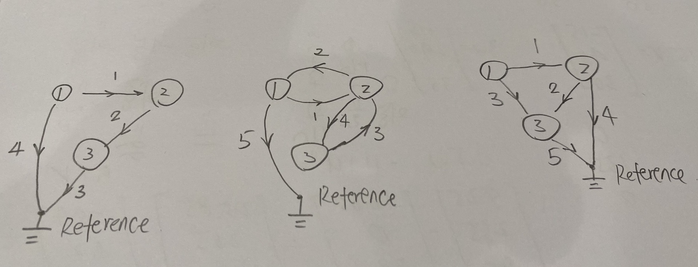

# Chapter 7 Linear Algebra: Matrices, Vectors, Determinants. Linear Systems

## P261 - Problem set 7.1
1. 2x2: $a_{11} \ne b_{11}$, $b_{12} \ne c_{12}$, 2x3: $d_{11} \ne e_{11}$
2. $a_{31} = 10, \ \ a_{13} =81\ \  , a_{26} = 96,\ \  a_{33} = 0$
3. E1: 3x3, 3x4,
E2: 3x7,
E3: 2x2, 2x2, 2x2, 2x3, 2x3,
E5:3x2
4. 1A: 4, 0, 1
3A: $a_{11}, a_{22}$
3B: 4, -1
5. $B = \frac {1}{5} A$,
$B = \frac {1}{10} A$
6. $B = \frac {1}{1.609} A$
7. No. No(1x1 as exception?). Yes. Maybe not in math (how about 1x1?) but OK in python. No.
8. $2A+4B=4B+2A=\begin{bmatrix}
0 & 24 & 16\\
32 & 22 & 26\\
-6 & 16 & -14
\end{bmatrix}$
$B$
$0.4B-4.2A=\begin{bmatrix}
0 & -6.4 & -16\\
-23.2 & -19.8 & -19.4\\
-5 & 1.6 & 11.8
\end{bmatrix}$
9. $3A=\begin{bmatrix}
0 & 6 & 12\\
18 & 15 & 15\\
3 & 0 & -9
\end{bmatrix}$
$0.5B=\begin{bmatrix}
0 & 2.5 & 1\\
2.5 & 1.5 & 2\\
-1 & 2 & -1
\end{bmatrix}$
$3A+0.5B=\begin{bmatrix}
0 & 8.5 & 13\\
20.5 & 16.5 & 17\\
2 & 2 & -10
\end{bmatrix}$
3A+0.5B+C is not defined.
10. $(4\bullet3)A=4(3A)=\begin{bmatrix}
0 & 24 & 48\\
72 & 60 & 60\\
12 & 0 & -36
\end{bmatrix}$
$14B-3B=11B=\begin{bmatrix}
0 & 55 & 22\\
55 & 33 & 44\\
-22 & 44 & -22
\end{bmatrix}$
11. $8C+10D=2(5D+4C)=\begin{bmatrix}
0 & 26\\
34 & 32\\
28 & -10
\end{bmatrix}$
$0.6C-0.6D=0.6(C-D)=\begin{bmatrix}
5.4 & 0.6\\
-4.2 & 2.4\\
-0.6 & 0.6
\end{bmatrix}$
12. $(C+D)+E=(D+E)+C= \begin{bmatrix}
1 & 5\\
6 & 8\\
6 & -2
\end{bmatrix}$
$0(C-E)+4D=4D=\begin{bmatrix}
-16 & 4\\
20 & 0\\
8 & -4
\end{bmatrix}$
$A-0C$: 3x3 can not minus 3x2, not defined
13. $(2\bullet7)C=2(7C)=\begin{bmatrix}
70 & 28\\
-28 & 56\\
14 & 0
\end{bmatrix}$
$-D+0E=-D=\begin{bmatrix}
4 & -1\\
-5 & 0\\
-2 & 1
\end{bmatrix}$
$E-D+C+u$: Since EDC are 3x2 but u is 3x1, not defined.
14. $(5u+5v)-\frac{1}{2}w= \begin{bmatrix}
5\\
30\\
-10
\end{bmatrix}$
$-20(u+v)+2w = -4[(5u+5v)-\frac{1}{2}w]= \begin{bmatrix}
-20\\
-120\\
40
\end{bmatrix}$
$E-(u+v)$: 3x2 can not minus 3x1, not defined
$10(u+v)+w=\begin{bmatrix}
0\\
0\\
0
\end{bmatrix}$
15. $(u+v)-w=u+(v-w)=\begin{bmatrix}
5.5\\
33\\
-11
\end{bmatrix}$
$C+0w$: 3x2 can not minus 3x1, not defined
$0E+u-v$: 3x2 can not minus 3x1, not defined
16. $15v-3w-0u=-3w+15v=\begin{bmatrix}
0\\
135\\
0
\end{bmatrix}$
$D-u+3C$: 3x2 can not minus 3x1, not defined
$8.5w-11.1u+0.4v=\begin{bmatrix}
25.45\\
256.2\\
119.1
\end{bmatrix}$
17. $u+v+w=\begin{bmatrix}
-4.5\\
-27\\
9
\end{bmatrix}$
18. $p=0-u-v-w=\begin{bmatrix}
4.5\\
27\\
-9
\end{bmatrix}$
19. Expand metrics with entries $a_{ij}$, then follow the basic arithmetic rule.
20. b-1: $\begin{bmatrix}
-1 & 1 & 0 & -1 & -1\\
1 & -1 & 0 & 0 & 0\\
0 & 0 & 1 & 0 & 1
\end{bmatrix}$

b-2: $\begin{bmatrix}
1 & 0 & 0 & 0 & -1 & 1 & -1\\
-1 & 1 & 0 & 0 & 0 & 0 & 0\\
0 & -1 & 1 & 0 & 0 & -1 & 1\\
0 & 0 & 0 & 1 & 1 & 0 & 0\\
\end{bmatrix}$

c: 
## P270 - Problem set 7.2
Example13. In the final stable situation(limit),
$I+C+R=100$
$0.7C+0.1I=C$
$0.2C+0.9I+0.2R=I$
$0.1C+0.8R=R$
So we can get C=200/9, I=200/3, R=100/9.
Will revisit it after Sec. 8.2

1. Per definition, the number of the entries in the columns of the second matrix have to be same as the number of the entries in the rows of the first matrix. In short, if mxn matrix multiple pxq, then n=p. Or you won't be able to perform the dot product.
2. All entries or components are 0
3. No. All rows are proportional.
4. Min is 1 which is 0, and max is $n(n-1)+1$
Take 3x3 as example, $\begin{bmatrix}
0 & a & b\\
-a & 0 & c\\
-b & -c & 0 \\
\end{bmatrix}$
5. Min is 1 which is 0, and max is $\frac {n(n+1)}{2}$
Take 3x3 as example, $\begin{bmatrix}
a & b & c\\
b & d & e\\
c & e & f\\
\end{bmatrix}$
6. $U_1+U_2, U_1U_2, U_1^2$ are upper triangular matrices.$L_1+L_2$ is lower triangular.
7. $\begin{bmatrix}
0 & 0\\
0 & 0\\
\end{bmatrix}$ $\begin{bmatrix}
0 & 0\\
0 & 1\\
\end{bmatrix}$ $\begin{bmatrix}
1 & 0\\
0 & 0\\
\end{bmatrix}$ $\begin{bmatrix}
1 & 0\\
0 & 1\\
\end{bmatrix}$
8. $\begin{bmatrix}
0 & 0\\
0 & 0\\
\end{bmatrix}$ for any $m\ge1, m\in N$. $\begin{bmatrix}
0 & 1\\
0 & 0\\
\end{bmatrix} $ and $\begin{bmatrix}
0 & 0\\
1 & 0\\
\end{bmatrix}$ for any $m\ge2, m\in N$.
9. Expand metrics with entries $a_{ij}$, then follow the basic arithmetic rule.
10. Expand metrics with entries $a_{ij}$, then follow the basic arithmetic rule.
11. $AB=AB^T=\begin{bmatrix}
10 & -14 & -6\\
-5 & 7 & -12\\
-5 & -1 & -4\\
\end{bmatrix}$
$BA=B^TA=\begin{bmatrix}
10 & -5 & -15\\
-14 & 7 & -3\\
-2 & -4 & -4\\
\end{bmatrix}$

12. $AA^T=\begin{bmatrix}
29 & 8 & 6\\
8 & 41 & 12\\
6 & 12 & 9\\
\end{bmatrix}$, $A^2=\begin{bmatrix}
23 & -4 & 6\\
-4 & 17 & 12\\
2 & 4 & 19\\
\end{bmatrix}$, $BB^T=B^2=\begin{bmatrix}
10 & -6 & 0\\
-6 & 10 & 0\\
0 & 0 & 4\\
\end{bmatrix}$

13. $CC^T=\begin{bmatrix}
1 & 2 & 0\\
2 & 13 & -6\\
0 & -6 & 4\\
\end{bmatrix}$, $BC=\begin{bmatrix}
-9 & -5\\
3 & -1\\
4 & 0\\
\end{bmatrix}$, $CB$ not defined, $C^TB=\begin{bmatrix}
-9 & 3 & 4\\
-5 & -1 & 0\\
\end{bmatrix}$

14. $3A-2B=\begin{bmatrix}
10 & 0 & 9\\
0 & 1 & 18\\
3 & 6 & 10\\
\end{bmatrix}$, $(3A-2B)^T=3A^T-2B^T=\begin{bmatrix}
10 & 0 & 3\\
0 & 1 & 6\\
9 & 18 & 10\\
\end{bmatrix}$,
$(3A-2B)^Ta^T=\begin{bmatrix}
10\\
-2\\
-27\\
\end{bmatrix}$

15. $Aa$ not defined, $Aa^T=\begin{bmatrix}
8\\
-4\\
-3\\
\end{bmatrix}$, $(Ab)^T=b^TA^T=\begin{bmatrix}
7 & -11 & 3\\
\end{bmatrix}$

16. $BC=Problem 13.2=\begin{bmatrix}
-9 & -5\\
3 & -1\\
4 & 0\\
\end{bmatrix}$, $BC^T$ not defined, $Bb=\begin{bmatrix}
0\\
-8\\
2\\
\end{bmatrix}$, $b^TB=\begin{bmatrix}
0 & -8 & 2\\
\end{bmatrix}$

17. $ABC=\begin{bmatrix}
-30 & -18\\
45 & 9\\
5 & -7\\
\end{bmatrix}$, $ABa$ not defined, $ABb=\begin{bmatrix}
22\\
4\\
-12\\
\end{bmatrix}$, $Ca^T$= not defined.

18. $ab=1$, $ba=\begin{bmatrix}
3 & -6 & 0\\
1 & -2 & 0\\
-1 & 2 & 0\\
\end{bmatrix}$, $aA=\begin{bmatrix}
8 & -4 & -9\\
\end{bmatrix}$, $Bb=problem 16.3=\begin{bmatrix}
0\\
-8\\
2\\
\end{bmatrix}$

19. $1.5a+3.0b$ not defined. $1.5a^T+3.0b=\begin{bmatrix}
4.5\\
-2\\
-1\\
\end{bmatrix}$, $(A-B)b=Ab-Bb=\begin{bmatrix}
7\\
-3\\
1\\
\end{bmatrix}$

20. $b^TAb$=7, $aBa^T$=17, $aCC^T=\begin{bmatrix}
-3 & -24 & 12\\
\end{bmatrix}$, $C^Tba=\begin{bmatrix}
5 & -10 & 0\\
5 & -10 & 0\\
\end{bmatrix}$

21. Expand metrics with entries $a_{ij}$, then follow the basic arithmetic rule.

22. $A=\begin{bmatrix}
a_1\\
a_2\\
a_3\\
\end{bmatrix}$, $B=\begin{bmatrix}
b_1 & b_2 & b_3\\
\end{bmatrix}$, $AB=\begin{bmatrix}
a_1b_1 & a_1b_2 & a_1b_3\\
a_2b_1 & a_2b_2 & a_2b_3\\
a_3b_1 & a_3b_2 & a_3b_3\\
\end{bmatrix}$

23. $AB=A\begin{bmatrix}
b_1 & b_2 & b_3\\
\end{bmatrix}=\begin{bmatrix}
Ab_1 & Ab_2 & Ab_3\\
\end{bmatrix}$

24. $AB=BA$, $\begin{bmatrix}
a_{11} & a_{12}\\
a_{21} & a_{22}\\
\end{bmatrix}\begin{bmatrix}
2 & 3\\
3 & 4\\
\end{bmatrix}=\begin{bmatrix}
2 & 3\\
3 & 4\\
\end{bmatrix}\begin{bmatrix}
a_{11} & a_{12}\\
a_{21} & a_{22}\\
\end{bmatrix}$,
$2a_{11}+3a_{12}=2a_{11}+3a_{21}$=> $a_{12}=a_{21}$
$3a_{11}+4a_{12}=2a_{12}+3a_{22}$=> $3a_{11}+2a_{12}=3a_{22}$
$2a_{21}+3a_{22}=3a_{11}+4a_{21}$,
$3a_{21}+4a_{22}=3a_{12}+4a_{22}$
Let $A=\begin{bmatrix}
x & y\\
y & \frac{3x+2y}{3}\\
\end{bmatrix}$,
Check: $AB=BA=\begin{bmatrix}
2x+3y & 3x+4y\\
3x+4y & 4x+5 {2\over3}y \\
\end{bmatrix}$

25. a) Obvious.
b) $C=[c_{ij}], C^T=[c_{ji}]$
$D=C+C^T=[d_{ij}]=[c_{ij}+c_{ji}] = [c_{ji}+c_{ij}]=[d_{ji}]$, so D is symmetric
$E=C-C^T=[e_{ij}]=[c_{ij}-c_{ji}] = -[c_{ji}-c_{ij}]=-[e_{ji}]$, so E is skew-symmetric.
Let $S = {1 \over 2} D, T = {1 \over 2} E$
$S+T= {1 \over 2} (D+E) = {1 \over 2} (C+C^T+C-C^T)=C$
$A = \begin{bmatrix}
4 & -2 & 3\\
-2 & 1 & 6\\
1 & 2 & 2\\
\end{bmatrix}, A^T = \begin{bmatrix}
4 & -2 & 1\\
-2 & 1 & 2\\
3 & 6 & 2\\
\end{bmatrix}$,
$S={1\over2}(A+A^T)=\begin{bmatrix}
4 & -2 & 2\\
-2 & 1 & 4\\
2 & 4 & 2\\
\end{bmatrix}, T={1\over2}(A-A^T)=\begin{bmatrix}
0 & 0 & 1\\
0 & 0 & 2\\
-1 & -2 & 0\\
\end{bmatrix}$
$B = \begin{bmatrix}
1 & -3 & 0\\
-3 & 1 & 0\\
0 & 0 & -2\\
\end{bmatrix}, B^T = \begin{bmatrix}
1 & -3 & 0\\
-3 & 1 & 0\\
0 & 0 & -2\\
\end{bmatrix}$
$S={1\over2}(B+B^T)=B=\begin{bmatrix}
1 & -3 & 0\\
-3 & 1 & 0\\
0 & 0 & -2\\
\end{bmatrix}, T={1\over2}(B-B^T)=\begin{bmatrix}
0 & 0 & 0\\
0 & 0 & 0\\
0 & 0 & 0\\
\end{bmatrix}$

c) symmetric: $A=[a_{ij}]=[a_{ji}], B=[b_{ij}]=[b_{ji}],... ,M=[m_{ij}]=[m_{ji}]$
$aA+bB+...+mM = a[a_{ij}] + b[b_{ij}] +... +m[m_{ij}]= a[a_{ji}] + b[b_{ji}] + +... +m[m_{ji}]$.
Skew-symmetric: $A=[a_{ij}]=-[a_{ji}], B=[b_{ij}]=-[b_{ji}],... ,M=[m_{ij}]=-[m_{ji}]$
$aA+bB+...+mM = a[a_{ij}] + b[b_{ij}] +... +m[m_{ij}]= -(a[a_{ji}] + b[b_{ji}] + +... +m[m_{ji}])$.

d) $A=[a_{ij}]=[a_{ji}], B=[b_{ij}]=[b_{ji}]$
$AB=[a_pb_q]$, if AB is symmetric, then $AB=[a_pb_q] = [a_qb_p]=[b_pa_q]=BA$
vice verse.

e)$A=[a_{ij}]=-[a_{ji}], B=[b_{ij}]=-[b_{ji}]$
$AB=[a_pb_q]$, if AB is skew-symmetric, then $AB=[a_pb_q] = -[a_qb_p]= -[b_pa_q]=-BA$
vice verse.

26. First day, status = $\begin{bmatrix}
N \\
T \\
\end{bmatrix}=\begin{bmatrix}
1 \\
0 \\
\end{bmatrix} $, stochastic matrix =$\begin{bmatrix}
0.8 & 0.5\\
0.2 & 0.5\\
\end{bmatrix}$
Second day = $\begin{bmatrix}
0.8 & 0.5\\
0.2 & 0.5\\
\end{bmatrix}\begin{bmatrix}
1 \\
0 \\
\end{bmatrix}=\begin{bmatrix}
0.8 \\
0.2 \\
\end{bmatrix} $
Two days after today = $\begin{bmatrix}
0.8 & 0.5\\
0.2 & 0.5\\
\end{bmatrix} \begin{bmatrix}
0.8 \\
0.2 \\
\end{bmatrix} =\begin{bmatrix}
0.74 \\
0.26 \\
\end{bmatrix} $
Three days after today = $\begin{bmatrix}
0.8 & 0.5\\
0.2 & 0.5\\
\end{bmatrix}\begin{bmatrix}
0.74 \\
0.26 \\
\end{bmatrix} = \begin{bmatrix}
0.722 \\
0.278 \\
\end{bmatrix} $
The limit of N is ${5\over7}$

27. Leave for future

28. Present = $\begin{bmatrix}
Subs. \\
Not \\
\end{bmatrix}=\begin{bmatrix}
1200 \\
98800 \\
\end{bmatrix} $, stochastic matrix = $\begin{bmatrix}
0.9 & 0.002\\
0.1 & 0.998\\
\end{bmatrix}$
After 1 season = $\begin{bmatrix}
Subs. \\
Not \\
\end{bmatrix}=\begin{bmatrix}
0.9 & 0.002\\
0.1 & 0.998\\
\end{bmatrix}\begin{bmatrix}
1200 \\
98800 \\
\end{bmatrix} = \begin{bmatrix}
1278 \\
98722 \\
\end{bmatrix} $, increase

After 2 seasons = $\begin{bmatrix}
Subs. \\
Not \\
\end{bmatrix}=\begin{bmatrix}
0.9 & 0.002\\
0.1 & 0.998\\
\end{bmatrix}\begin{bmatrix}
1278 \\
98722 \\
\end{bmatrix} = \begin{bmatrix}
1344 \\
98656 \\
\end{bmatrix} $, increase

After 3 seasons = $\begin{bmatrix}
Subs. \\
Not \\
\end{bmatrix}=\begin{bmatrix}
0.9 & 0.002\\
0.1 & 0.998\\
\end{bmatrix}\begin{bmatrix}
1344 \\
98656 \\
\end{bmatrix} = \begin{bmatrix}
1407 \\
98593 \\
\end{bmatrix} $, increase

29. $p = \begin{bmatrix}
35\\
62\\
30\\
\end{bmatrix}$

$v=Ap=\begin{bmatrix}
24,920\\
25,940\\
\end{bmatrix}$

30.$y=Ax$
$y_1=x_1\cos\theta -x_2\sin\theta, y_2=x_1\sin\theta +x_2\cos\theta $
$|y|^2=(x_1\cos\theta -x_2\sin\theta)^2+(x_1\sin\theta +x_2\cos\theta)^2 = x_1^2+x_2^2=|x|^2$
$\cos\alpha = \frac {x*y}{|x||y|} = \frac {x_1^2\cos\theta+x_2^2\cos\theta}{x_1^2+x_2^2}=\cos\theta$
so x and y have the same length, and from x to y is counterclockwise rotate of $\theta$

b)$AA=\begin{bmatrix}
\cos\theta & -\sin\theta\\
\sin\theta & \cos\theta\\
\end{bmatrix}\begin{bmatrix}
\cos\theta & -\sin\theta\\
\sin\theta & \cos\theta\\
\end{bmatrix}=\begin{bmatrix}
\cos^2\theta-\sin^2\theta & -2\sin\theta\cos\theta\\
2\sin\theta\cos\theta & \cos^2\theta-\sin^2\theta \\
\end{bmatrix}=\begin{bmatrix}
\cos2\theta & -\sin2\theta\\
\sin2\theta & \cos2\theta\\
\end{bmatrix}$

c)$\begin{bmatrix}
\cos\alpha & -\sin\alpha\\
\sin\alpha & \cos\alpha\\
\end{bmatrix}\begin{bmatrix}
\cos\beta & -\sin\beta\\
\sin\beta & \cos\beta\\
\end{bmatrix}=\begin{bmatrix}
\cos\alpha\cos\beta - \sin\alpha\sin\beta & -\cos\alpha\sin\beta- \sin\alpha\cos\beta\\
\sin\alpha\cos\beta+ \cos\alpha\sin\beta & - \sin\alpha\sin\beta+\cos\alpha\cos\beta \\
\end{bmatrix}=\begin{bmatrix}
\cos(\alpha+\beta) & -\sin(\alpha+\beta)\\
\sin(\alpha+\beta) & \cos(\alpha+\beta)\\
\end{bmatrix}$

d)$[x_1, x_2, x_3]\begin{bmatrix}
3 & 0 & 0\\
0 & 1 & 0\\
0 & 0 & {1\over2}\\
\end{bmatrix}=[3x_1, x_2, {1\over2}x_3]$

$[x_1, x_2, x_3]\begin{bmatrix}
c & 0 & 0\\
0 & c & 0\\
0 & 0 & c\\
\end{bmatrix}=[cx_1, cx_2, cx_3]$, Scalar matrix will amplify or squeeze the picture by c.

e) $[x_1, x_2, x_3]\begin{bmatrix}
1 & 0 & 0\\
0 & \cos\theta & -\sin\theta\\
0 & \sin\theta & \cos\theta\\
\end{bmatrix}=[x_1, x_2\cos\theta+x_3\sin\theta, -x_2\sin\theta+x_3\cos\theta]$
 $x_1$remain the same. counterclockwise rotation of the Cartesian coordinate system $x_2x_3$ in the plane about the origin by angle of $\theta$

$[x_1, x_2, x_3]\begin{bmatrix}
\cos\varphi & 0 & -\sin\varphi\\
0 & 1 & 0\\
\sin\varphi & 0 & \cos\varphi\\
\end{bmatrix}=[x_1\cos\varphi + x_3\sin\varphi, x_2, -x_1\sin\varphi + x_3\cos\varphi]$
$x_2$remain the same. counterclockwise rotation of the Cartesian coordinate system $x_1x_3$ in the plane about the origin by angle of $\varphi$

$[x_1, x_2, x_3]\begin{bmatrix}
\cos\psi  & -\sin\psi & 0\\
\sin\psi & \cos\psi & 0 \\
0 & 0 & 1 \\
\end{bmatrix}=[x_1\cos\psi + x_2\sin\psi, -x_1\sin\psi + x_2\cos\psi, x_3]$
$x_3$remain the same. counterclockwise rotation of the Cartesian coordinate system $x_1x_2$ in the plane about the origin by angle of $\psi$

## P280 - Problem set 7.3
