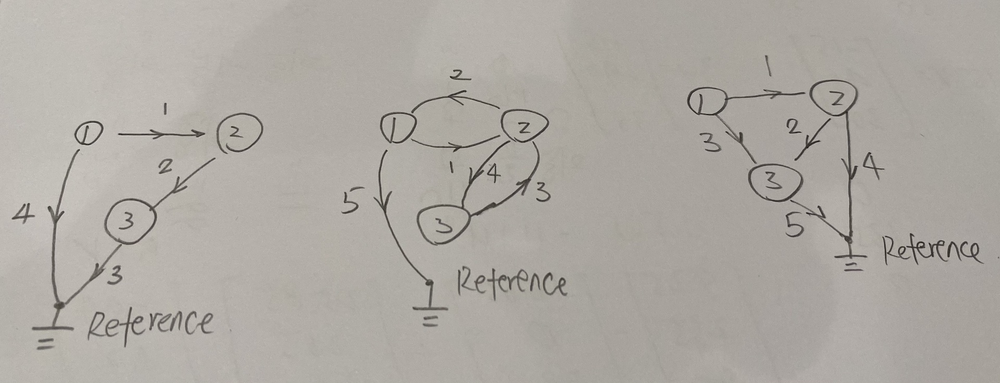

# Chapter 7 Linear Algebra: Matrices, Vectors, Determinant. Linear Systems

## P261 - Problem set 7.1
1. 2x2: $a_{11} \ne b_{11}$, $b_{12} \ne c_{12}$, 2x3: $d_{11} \ne e_{11}$
2. $a_{31} = 10, \ \ a_{13} =81\ \  , a_{26} = 96,\ \  a_{33} = 0$
3. E1: 3x3, 3x4,
E2: 3x7,
E3: 2x2, 2x2, 2x2, 2x3, 2x3,
E5:3x2
4. 1A: 4, 0, 1
3A: $a_{11}, a_{22}$
3B: 4, -1
5. $B = \frac {1}{5} A$,
$B = \frac {1}{10} A$
6. $B = \frac {1}{1.609} A$
7. No. No(1x1 as exception?). Yes. Maybe not in math (how about 1x1?) but OK in python. No.
8. $2A+4B=4B+2A=\begin{bmatrix}
0 & 24 & 16\\
32 & 22 & 26\\
-6 & 16 & -14
\end{bmatrix}$
$B$
$0.4B-4.2A=\begin{bmatrix}
0 & -6.4 & -16\\
-23.2 & -19.8 & -19.4\\
-5 & 1.6 & 11.8
\end{bmatrix}$
9. $3A=\begin{bmatrix}
0 & 6 & 12\\
18 & 15 & 15\\
3 & 0 & -9
\end{bmatrix}$
$0.5B=\begin{bmatrix}
0 & 2.5 & 1\\
2.5 & 1.5 & 2\\
-1 & 2 & -1
\end{bmatrix}$
$3A+0.5B=\begin{bmatrix}
0 & 8.5 & 13\\
20.5 & 16.5 & 17\\
2 & 2 & -10
\end{bmatrix}$
3A+0.5B+C is not defined.
10. $(4\bullet3)A=4(3A)=\begin{bmatrix}
0 & 24 & 48\\
72 & 60 & 60\\
12 & 0 & -36
\end{bmatrix}$
$14B-3B=11B=\begin{bmatrix}
0 & 55 & 22\\
55 & 33 & 44\\
-22 & 44 & -22
\end{bmatrix}$
11. $8C+10D=2(5D+4C)=\begin{bmatrix}
0 & 26\\
34 & 32\\
28 & -10
\end{bmatrix}$
$0.6C-0.6D=0.6(C-D)=\begin{bmatrix}
5.4 & 0.6\\
-4.2 & 2.4\\
-0.6 & 0.6
\end{bmatrix}$
12. $(C+D)+E=(D+E)+C= \begin{bmatrix}
1 & 5\\
6 & 8\\
6 & -2
\end{bmatrix}$
$0(C-E)+4D=4D=\begin{bmatrix}
-16 & 4\\
20 & 0\\
8 & -4
\end{bmatrix}$
$A-0C$: 3x3 can not minus 3x2, not defined
13. $(2\bullet7)C=2(7C)=\begin{bmatrix}
70 & 28\\
-28 & 56\\
14 & 0
\end{bmatrix}$
$-D+0E=-D=\begin{bmatrix}
4 & -1\\
-5 & 0\\
-2 & 1
\end{bmatrix}$
$E-D+C+u$: Since EDC are 3x2 but u is 3x1, not defined.
14. $(5u+5v)-\frac{1}{2}w= \begin{bmatrix}
5\\
30\\
-10
\end{bmatrix}$
$-20(u+v)+2w = -4[(5u+5v)-\frac{1}{2}w]= \begin{bmatrix}
-20\\
-120\\
40
\end{bmatrix}$
$E-(u+v)$: 3x2 can not minus 3x1, not defined
$10(u+v)+w=\begin{bmatrix}
0\\
0\\
0
\end{bmatrix}$
15. $(u+v)-w=u+(v-w)=\begin{bmatrix}
5.5\\
33\\
-11
\end{bmatrix}$
$C+0w$: 3x2 can not minus 3x1, not defined
$0E+u-v$: 3x2 can not minus 3x1, not defined
16. $15v-3w-0u=-3w+15v=\begin{bmatrix}
0\\
135\\
0
\end{bmatrix}$
$D-u+3C$: 3x2 can not minus 3x1, not defined
$8.5w-11.1u+0.4v=\begin{bmatrix}
25.45\\
256.2\\
119.1
\end{bmatrix}$
17. $u+v+w=\begin{bmatrix}
-4.5\\
-27\\
9
\end{bmatrix}$
18. $p=0-u-v-w=\begin{bmatrix}
4.5\\
27\\
-9
\end{bmatrix}$
19. Expand metrics with entries $a_{ij}$, then follow the basic arithmetic rule.
20. b-1: $\begin{bmatrix}
-1 & 1 & 0 & -1 & -1\\
1 & -1 & 0 & 0 & 0\\
0 & 0 & 1 & 0 & 1
\end{bmatrix}$

b-2: $\begin{bmatrix}
1 & 0 & 0 & 0 & -1 & 1 & -1\\
-1 & 1 & 0 & 0 & 0 & 0 & 0\\
0 & -1 & 1 & 0 & 0 & -1 & 1\\
0 & 0 & 0 & 1 & 1 & 0 & 0\\
\end{bmatrix}$

c: 
## P270 - Problem set 7.2
Example13. In the final stable situation(limit),
$I+C+R=100$
$0.7C+0.1I=C$
$0.2C+0.9I+0.2R=I$
$0.1C+0.8R=R$
So we can get C=200/9, I=200/3, R=100/9.
Will revisit it after Sec. 8.2

1. Per definition, the number of the entries in the columns of the second matrix have to be same as the number of the entries in the rows of the first matrix. In short, if mxn matrix multiple pxq, then n=p. Or you won't be able to perform the dot product.
2. All entries or components are 0
3. No. All rows are proportional.
4. Min is 1 which is 0, and max is $n(n-1)+1$
Take 3x3 as example, $\begin{bmatrix}
0 & a & b\\
-a & 0 & c\\
-b & -c & 0 \\
\end{bmatrix}$
5. Min is 1 which is 0, and max is $\frac {n(n+1)}{2}$
Take 3x3 as example, $\begin{bmatrix}
a & b & c\\
b & d & e\\
c & e & f\\
\end{bmatrix}$
6. $U_1+U_2, U_1U_2, U_1^2$ are upper triangular matrices.$L_1+L_2$ is lower triangular.
7. $\begin{bmatrix}
0 & 0\\
0 & 0\\
\end{bmatrix}$ $\begin{bmatrix}
0 & 0\\
0 & 1\\
\end{bmatrix}$ $\begin{bmatrix}
1 & 0\\
0 & 0\\
\end{bmatrix}$ $\begin{bmatrix}
1 & 0\\
0 & 1\\
\end{bmatrix}$
$~\\$
8. $\begin{bmatrix}
0 & 0\\
0 & 0\\
\end{bmatrix}$ for any $m\ge1, m\in N$. $\begin{bmatrix}
0 & 1\\
0 & 0\\
\end{bmatrix} $ and $\begin{bmatrix}
0 & 0\\
1 & 0\\
\end{bmatrix}$ for any $m\ge2, m\in N$.
9. Expand metrics with entries $a_{ij}$, then follow the basic arithmetic rule.
10. Expand metrics with entries $a_{ij}$, then follow the basic arithmetic rule.
11. $AB=AB^T=\begin{bmatrix}
10 & -14 & -6\\
-5 & 7 & -12\\
-5 & -1 & -4\\
\end{bmatrix}$

$BA=B^TA=\begin{bmatrix}
10 & -5 & -15\\
-14 & 7 & -3\\
-2 & -4 & -4\\
\end{bmatrix}$

12. $AA^T=\begin{bmatrix}
29 & 8 & 6\\
8 & 41 & 12\\
6 & 12 & 9\\
\end{bmatrix}$, $A^2=\begin{bmatrix}
23 & -4 & 6\\
-4 & 17 & 12\\
2 & 4 & 19\\
\end{bmatrix}$, $BB^T=B^2=\begin{bmatrix}
10 & -6 & 0\\
-6 & 10 & 0\\
0 & 0 & 4\\
\end{bmatrix}$
$~\\$

13. $CC^T=\begin{bmatrix}
1 & 2 & 0\\
2 & 13 & -6\\
0 & -6 & 4\\
\end{bmatrix}$, $BC=\begin{bmatrix}
-9 & -5\\
3 & -1\\
4 & 0\\
\end{bmatrix}$, $CB$ not defined, $C^TB=\begin{bmatrix}
-9 & 3 & 4\\
-5 & -1 & 0\\
\end{bmatrix}$

14. $3A-2B=\begin{bmatrix}
10 & 0 & 9\\
0 & 1 & 18\\
3 & 6 & 10\\
\end{bmatrix}$, $(3A-2B)^T=3A^T-2B^T=\begin{bmatrix}
10 & 0 & 3\\
0 & 1 & 6\\
9 & 18 & 10\\
\end{bmatrix}$,
$(3A-2B)^Ta^T=\begin{bmatrix}
10\\
-2\\
-27\\
\end{bmatrix}$

15. $Aa$ not defined, $Aa^T=\begin{bmatrix}
8\\
-4\\
-3\\
\end{bmatrix}$, $(Ab)^T=b^TA^T=\begin{bmatrix}
7 & -11 & 3\\
\end{bmatrix}$

16. $BC=Problem 13.2=\begin{bmatrix}
-9 & -5\\
3 & -1\\
4 & 0\\
\end{bmatrix}$, $BC^T$ not defined, $Bb=\begin{bmatrix}
0\\
-8\\
2\\
\end{bmatrix}$, $b^TB=\begin{bmatrix}
0 & -8 & 2\\
\end{bmatrix}$

17. $ABC=\begin{bmatrix}
-30 & -18\\
45 & 9\\
5 & -7\\
\end{bmatrix}$, $ABa$ not defined, $ABb=\begin{bmatrix}
22\\
4\\
-12\\
\end{bmatrix}$, $Ca^T$= not defined.

18. $ab=1$, $ba=\begin{bmatrix}
3 & -6 & 0\\
1 & -2 & 0\\
-1 & 2 & 0\\
\end{bmatrix}$, $aA=\begin{bmatrix}
8 & -4 & -9\\
\end{bmatrix}$, $Bb=problem 16.3=\begin{bmatrix}
0\\
-8\\
2\\
\end{bmatrix}$

19. $1.5a+3.0b$ not defined. $1.5a^T+3.0b=\begin{bmatrix}
4.5\\
-2\\
-1\\
\end{bmatrix}$, $(A-B)b=Ab-Bb=\begin{bmatrix}
7\\
-3\\
1\\
\end{bmatrix}$

20. $b^TAb$=7, $aBa^T$=17, $aCC^T=\begin{bmatrix}
-3 & -24 & 12\\
\end{bmatrix}$, $C^Tba=\begin{bmatrix}
5 & -10 & 0\\
5 & -10 & 0\\
\end{bmatrix}$

21. Expand metrics with entries $a_{ij}$, then follow the basic arithmetic rule.

22. $A=\begin{bmatrix}
a_1\\
a_2\\
a_3\\
\end{bmatrix}$, $B=\begin{bmatrix}
b_1 & b_2 & b_3\\
\end{bmatrix}$, $AB=\begin{bmatrix}
a_1b_1 & a_1b_2 & a_1b_3\\
a_2b_1 & a_2b_2 & a_2b_3\\
a_3b_1 & a_3b_2 & a_3b_3\\
\end{bmatrix}$

23. $AB=A\begin{bmatrix}
b_1 & b_2 & b_3\\
\end{bmatrix}=\begin{bmatrix}
Ab_1 & Ab_2 & Ab_3\\
\end{bmatrix}$

24. $AB=BA$, $\begin{bmatrix}
a_{11} & a_{12}\\
a_{21} & a_{22}\\
\end{bmatrix}\begin{bmatrix}
2 & 3\\
3 & 4\\
\end{bmatrix}=\begin{bmatrix}
2 & 3\\
3 & 4\\
\end{bmatrix}\begin{bmatrix}
a_{11} & a_{12}\\
a_{21} & a_{22}\\
\end{bmatrix}$,
$2a_{11}+3a_{12}=2a_{11}+3a_{21}$=> $a_{12}=a_{21}$
$3a_{11}+4a_{12}=2a_{12}+3a_{22}$=> $3a_{11}+2a_{12}=3a_{22}$
$2a_{21}+3a_{22}=3a_{11}+4a_{21}$,
$3a_{21}+4a_{22}=3a_{12}+4a_{22}$
Let $A=\begin{bmatrix}
x & y\\
y & \frac{3x+2y}{3}\\
\end{bmatrix}$,
Check: $AB=BA=\begin{bmatrix}
2x+3y & 3x+4y\\
3x+4y & 4x+5 {2\over3}y \\
\end{bmatrix}$

25. a) Obvious.
b) $C=[c_{ij}], C^T=[c_{ji}]$
$D=C+C^T=[d_{ij}]=[c_{ij}+c_{ji}] = [c_{ji}+c_{ij}]=[d_{ji}]$, so D is symmetric
$E=C-C^T=[e_{ij}]=[c_{ij}-c_{ji}] = -[c_{ji}-c_{ij}]=-[e_{ji}]$, so E is skew-symmetric.
Let $S = {1 \over 2} D, T = {1 \over 2} E$
$S+T= {1 \over 2} (D+E) = {1 \over 2} (C+C^T+C-C^T)=C$
$A = \begin{bmatrix}
4 & -2 & 3\\
-2 & 1 & 6\\
1 & 2 & 2\\
\end{bmatrix}, A^T = \begin{bmatrix}
4 & -2 & 1\\
-2 & 1 & 2\\
3 & 6 & 2\\
\end{bmatrix}$,
$S={1\over2}(A+A^T)=\begin{bmatrix}
4 & -2 & 2\\
-2 & 1 & 4\\
2 & 4 & 2\\
\end{bmatrix}, T={1\over2}(A-A^T)=\begin{bmatrix}
0 & 0 & 1\\
0 & 0 & 2\\
-1 & -2 & 0\\
\end{bmatrix}$
$B = \begin{bmatrix}
1 & -3 & 0\\
-3 & 1 & 0\\
0 & 0 & -2\\
\end{bmatrix}, B^T = \begin{bmatrix}
1 & -3 & 0\\
-3 & 1 & 0\\
0 & 0 & -2\\
\end{bmatrix}$
$S={1\over2}(B+B^T)=B=\begin{bmatrix}
1 & -3 & 0\\
-3 & 1 & 0\\
0 & 0 & -2\\
\end{bmatrix}, T={1\over2}(B-B^T)=\begin{bmatrix}
0 & 0 & 0\\
0 & 0 & 0\\
0 & 0 & 0\\
\end{bmatrix}$

c) symmetric: $A=[a_{ij}]=[a_{ji}], B=[b_{ij}]=[b_{ji}],... ,M=[m_{ij}]=[m_{ji}]$
$aA+bB+...+mM = a[a_{ij}] + b[b_{ij}] +... +m[m_{ij}]= a[a_{ji}] + b[b_{ji}] + +... +m[m_{ji}]$.
Skew-symmetric: $A=[a_{ij}]=-[a_{ji}], B=[b_{ij}]=-[b_{ji}],... ,M=[m_{ij}]=-[m_{ji}]$
$aA+bB+...+mM = a[a_{ij}] + b[b_{ij}] +... +m[m_{ij}]= -(a[a_{ji}] + b[b_{ji}] + +... +m[m_{ji}])$.

d) $A=[a_{ij}]=[a_{ji}], B=[b_{ij}]=[b_{ji}]$
$AB=[a_pb_q]$, if AB is symmetric, then $AB=[a_pb_q] = [a_qb_p]=[b_pa_q]=BA$
vice verse.

e)$A=[a_{ij}]=-[a_{ji}], B=[b_{ij}]=-[b_{ji}]$
$AB=[a_pb_q]$, if AB is skew-symmetric, then $AB=[a_pb_q] = -[a_qb_p]= -[b_pa_q]=-BA$
vice verse.

26. First day, status = $\begin{bmatrix}
N \\
T \\
\end{bmatrix}=\begin{bmatrix}
1 \\
0 \\
\end{bmatrix} $, stochastic matrix =$\begin{bmatrix}
0.8 & 0.5\\
0.2 & 0.5\\
\end{bmatrix}$
Second day = $\begin{bmatrix}
0.8 & 0.5\\
0.2 & 0.5\\
\end{bmatrix}\begin{bmatrix}
1 \\
0 \\
\end{bmatrix}=\begin{bmatrix}
0.8 \\
0.2 \\
\end{bmatrix} $
Two days after today = $\begin{bmatrix}
0.8 & 0.5\\
0.2 & 0.5\\
\end{bmatrix} \begin{bmatrix}
0.8 \\
0.2 \\
\end{bmatrix} =\begin{bmatrix}
0.74 \\
0.26 \\
\end{bmatrix} $
Three days after today = $\begin{bmatrix}
0.8 & 0.5\\
0.2 & 0.5\\
\end{bmatrix}\begin{bmatrix}
0.74 \\
0.26 \\
\end{bmatrix} = \begin{bmatrix}
0.722 \\
0.278 \\
\end{bmatrix} $
The limit of N is ${5\over7}$

27. Reserve for future

28. Present = $\begin{bmatrix}
Subs. \\
Not \\
\end{bmatrix}=\begin{bmatrix}
1200 \\
98800 \\
\end{bmatrix} $, stochastic matrix = $\begin{bmatrix}
0.9 & 0.002\\
0.1 & 0.998\\
\end{bmatrix}$
After 1 season = $\begin{bmatrix}
Subs. \\
Not \\
\end{bmatrix}=\begin{bmatrix}
0.9 & 0.002\\
0.1 & 0.998\\
\end{bmatrix}\begin{bmatrix}
1200 \\
98800 \\
\end{bmatrix} = \begin{bmatrix}
1278 \\
98722 \\
\end{bmatrix} $, increase

After 2 seasons = $\begin{bmatrix}
Subs. \\
Not \\
\end{bmatrix}=\begin{bmatrix}
0.9 & 0.002\\
0.1 & 0.998\\
\end{bmatrix}\begin{bmatrix}
1278 \\
98722 \\
\end{bmatrix} = \begin{bmatrix}
1344 \\
98656 \\
\end{bmatrix} $, increase

After 3 seasons = $\begin{bmatrix}
Subs. \\
Not \\
\end{bmatrix}=\begin{bmatrix}
0.9 & 0.002\\
0.1 & 0.998\\
\end{bmatrix}\begin{bmatrix}
1344 \\
98656 \\
\end{bmatrix} = \begin{bmatrix}
1407 \\
98593 \\
\end{bmatrix} $, increase

29. $p = \begin{bmatrix}
35\\
62\\
30\\
\end{bmatrix}$

$v=Ap=\begin{bmatrix}
24,920\\
25,940\\
\end{bmatrix}$

30.$y=Ax$
$y_1=x_1\cos\theta -x_2\sin\theta, y_2=x_1\sin\theta +x_2\cos\theta $
$|y|^2=(x_1\cos\theta -x_2\sin\theta)^2+(x_1\sin\theta +x_2\cos\theta)^2 = x_1^2+x_2^2=|x|^2$
$\cos\alpha = \frac {x*y}{|x||y|} = \frac {x_1^2\cos\theta+x_2^2\cos\theta}{x_1^2+x_2^2}=\cos\theta$
so x and y have the same length, and from x to y is counterclockwise rotate of $\theta$

b)$AA=\begin{bmatrix}
\cos\theta & -\sin\theta\\
\sin\theta & \cos\theta\\
\end{bmatrix}\begin{bmatrix}
\cos\theta & -\sin\theta\\
\sin\theta & \cos\theta\\
\end{bmatrix}=\begin{bmatrix}
\cos^2\theta-\sin^2\theta & -2\sin\theta\cos\theta\\
2\sin\theta\cos\theta & \cos^2\theta-\sin^2\theta \\
\end{bmatrix}=\begin{bmatrix}
\cos2\theta & -\sin2\theta\\
\sin2\theta & \cos2\theta\\
\end{bmatrix}$

c)$\begin{bmatrix}
\cos\alpha & -\sin\alpha\\
\sin\alpha & \cos\alpha\\
\end{bmatrix}\begin{bmatrix}
\cos\beta & -\sin\beta\\
\sin\beta & \cos\beta\\
\end{bmatrix}=\begin{bmatrix}
\cos\alpha\cos\beta - \sin\alpha\sin\beta & -\cos\alpha\sin\beta- \sin\alpha\cos\beta\\
\sin\alpha\cos\beta+ \cos\alpha\sin\beta & - \sin\alpha\sin\beta+\cos\alpha\cos\beta \\
\end{bmatrix}=\begin{bmatrix}
\cos(\alpha+\beta) & -\sin(\alpha+\beta)\\
\sin(\alpha+\beta) & \cos(\alpha+\beta)\\
\end{bmatrix}$

d)$[x_1, x_2, x_3]\begin{bmatrix}
3 & 0 & 0\\
0 & 1 & 0\\
0 & 0 & {1\over2}\\
\end{bmatrix}=[3x_1, x_2, {1\over2}x_3]$

$[x_1, x_2, x_3]\begin{bmatrix}
c & 0 & 0\\
0 & c & 0\\
0 & 0 & c\\
\end{bmatrix}=[cx_1, cx_2, cx_3]$, Scalar matrix will amplify or squeeze the picture by c.

e) $[x_1, x_2, x_3]\begin{bmatrix}
1 & 0 & 0\\
0 & \cos\theta & -\sin\theta\\
0 & \sin\theta & \cos\theta\\
\end{bmatrix}=[x_1, x_2\cos\theta+x_3\sin\theta, -x_2\sin\theta+x_3\cos\theta]$
 $x_1$remain the same. counterclockwise rotation of the Cartesian coordinate system $x_2x_3$ in the plane about the origin by angle of $\theta$

$[x_1, x_2, x_3]\begin{bmatrix}
\cos\varphi & 0 & -\sin\varphi\\
0 & 1 & 0\\
\sin\varphi & 0 & \cos\varphi\\
\end{bmatrix}=[x_1\cos\varphi + x_3\sin\varphi, x_2, -x_1\sin\varphi + x_3\cos\varphi]$
$x_2$remain the same. counterclockwise rotation of the Cartesian coordinate system $x_1x_3$ in the plane about the origin by angle of $\varphi$

$[x_1, x_2, x_3]\begin{bmatrix}
\cos\psi  & -\sin\psi & 0\\
\sin\psi & \cos\psi & 0 \\
0 & 0 & 1 \\
\end{bmatrix}=[x_1\cos\psi + x_2\sin\psi, -x_1\sin\psi + x_2\cos\psi, x_3]$
$x_3$remain the same. counterclockwise rotation of the Cartesian coordinate system $x_1x_2$ in the plane about the origin by angle of $\psi$

## P280 - Problem set 7.3
1. $\begin{bmatrix}
1 & 0 & -2\\
0 & 1& 1\over2\\
\end{bmatrix}$
$~\\$

2. $\begin{bmatrix}
1 & 0 & 2\over5\\
0 & 1& 6\over5\\
\end{bmatrix}$
$~\\$

3. $\begin{bmatrix}
1 & 0 & 0 & 1\\
0 & 1 & 0 & 3\\
0 & 0 & 1 & -5\\
\end{bmatrix}$
$~\\$

4. $\begin{bmatrix}
1 & -4 & 1 & -2\\
0 & 17 & -4 & 12\\
0 & -34 & 8 & -13\\
\end{bmatrix}$ = No solution
$~\\$

5. $\begin{bmatrix}
1 & 33 & -225\\
0 & 139 & -973\\
0 & -376 & 2632\\
\end{bmatrix}=\begin{bmatrix}
1 & 0 & 6\\
0 & 1 & -7\\
0 & 1 & -7\\
\end{bmatrix}$
$~\\$

6. $\begin{bmatrix}
1 & -2 & 2 & 9\\
0 & 0 & 1 & 4\\
0 & 0 & -5 & -20\\
\end{bmatrix}=\begin{bmatrix}
2t+1\\
t\\
4\\
\end{bmatrix}$
$~\\$

7. $\begin{bmatrix}
1 & 5 & -1 & 0\\
0 & 2 & -1 & 0\\
0 & 2 & -1 & 0\\
\end{bmatrix}=\begin{bmatrix}
-3t\\
t\\
2t\\
\end{bmatrix}$
$~\\$

8. $\begin{bmatrix}
1 & 2 & 1 & 3\\
0 & 4 & 3 & 8\\
0 & 4 & 3 & 4\\
\end{bmatrix}$ = No solution
$~\\$

9. $\begin{bmatrix}
3 & 4 & -5 & 13\\
0 & 1 & 1 & 4\\
\end{bmatrix} = \begin{bmatrix}
3t-1\\
4-t\\
t\\
\end{bmatrix}$
$~\\$

10.  $\begin{bmatrix}
5 & -7 & 3 & 17\\
5 & -7 & 3 & -50/3\\
\end{bmatrix}$ = No solution
$~\\$

11.  $\begin{bmatrix}
2 & -3 & -3 & 6 & 2\\
0 & 1 & 1 & -2 & 0\\
0 & 0 & 0 & 0 & 0\\
\end{bmatrix}$, so we can get $\begin{bmatrix}
1\\
2m-n\\
n\\
m\\
\end{bmatrix}$
$~\\$

12.  $\begin{bmatrix}
1 & -1 & 2 & 0 & 0\\
1 & -1 & 2 & 0 & 0\\
1 & -1 & 2 & -5/3 & -5\\
\end{bmatrix}$, so we can get $\begin{bmatrix}
n-2m\\
n\\
m\\
3\\
\end{bmatrix}$
$~\\$

13. $\begin{bmatrix}
0 & 10 & 4 & -2 & -4\\
-3 & -17 & 1 & 2 & 2\\
1 & 1 & 1 & 0 & 6\\
8 & -34 & 16 & -10 & 4\\
\end{bmatrix}=\begin{bmatrix}
1 & 1 & 1 & 0 & 6\\
0 & 10 & 4 & -2 & -4\\
0 & -14 & 4 & 2 & 20\\
0 & 21 & -4 & 5 & 22\\
\end{bmatrix}$
$=\begin{bmatrix}
1 & 1 & 1 & 0 & 6\\
0 & 1 & -12 & 9 & 30\\
0 & 0 & -41 & 32 & 110\\
0 & 0 & -31 & 23 & 76\\
\end{bmatrix}=\begin{bmatrix}
1 & 0 & 0 & 0 & 4\\
0 & 1 & 0 & 0 & 0\\
0 & 0 & 1 & 0 & 2\\
0 & 0 & 0 & 1 & 6\\
\end{bmatrix}$
$~\\$

14. $\begin{bmatrix}
1 & -1 & 3 & -3 & 3\\
2 & 3 & 1 & -11 & 1\\
5 & -2 & 5 & -4 & 5\\
3 & 4 & -7 & 2 & -7\\
\end{bmatrix} = \begin{bmatrix}
1 & -1 & 3 & -3 & 3\\
0 & 1 & -1 & -1 & -1\\
0 & 3 & -10 & 11 & -10\\
0 & 7 & -16 & 11 & -16\\
\end{bmatrix} = \begin{bmatrix}
1 & -1 & 3 & -3 & 3\\
0 & 1 & -1 & -1 & -1\\
0 & 0 & 1 & -2 & 1\\
0 & 0 & 1 & -2 & 1\\
\end{bmatrix}$
so we can get $\begin{bmatrix}
0\\
3t\\
1+2t\\
t\\
\end{bmatrix}$
$~\\$

15. Expand metrics with entries $a_{ij}$, then follow the basic arithmetic rule.

16. Reserve for future

17. $\begin{bmatrix}
1 & 1 & -1 & 0\\
4 & 0 & 1 & 16\\
0 & 4 & 1 & 32\\
\end{bmatrix} = \begin{bmatrix}
1 & 1 & -1 & 0\\
0 & 4 & 1 & 32\\
0 & 0 & 6 & 48\\
\end{bmatrix}$
so we can get $\begin{bmatrix}
2\\
6\\
8\\
\end{bmatrix}$

18. I am highly unsure about this one. Need a physical book
$\begin{bmatrix}
1 & -1 & -1 & 0\\
0 & 4 & 1 & 9\\
0 & 0 & 5 & -3\\
\end{bmatrix}$
so we can get $\begin{bmatrix}
9/5\\
12/5\\
-3/5\\
\end{bmatrix}$
$\textcolor{red}{Mark}$

19. $\begin{bmatrix}
{E_0 \over R_2}+{E_0 \over R_1}\\
-{E_0 \over R_1}\\
E_0 \over R_2\\
\end{bmatrix}$

20. $I_3=I_x, I_1=I_2$
$I_1R_1=I_xR_x, I_3R_3=I_2R_2$, so we can get
$R_x=R_3R_1/R_2$

21. $\begin{bmatrix}
1 & 1 & 0 & 0 & 1600\\
1 & 0 & 0 & 1 & 1000\\
0 & 1 & 1 & 0 & 2200\\
0 & 0 & 1 & 1 & 1600\\
\end{bmatrix} = \begin{bmatrix}
1 & 1 & 0 & 0 & 1600\\
0 & 1 & 0 & -1 & 600\\
0 & 0 & 1 & 1 & 1600\\
0 & 0 & 1 & 1 & 1600\\
\end{bmatrix}$

Rank(3) < N (4), So the solutin is not unique.

22. $40-2P_1-P2=4P_1-P_2+4, 6P_1=36, P_1=6$
$5P_1-2P_2+16=3P_2-4, P_1=P_2-4, P_2=2$

23. $\begin{bmatrix}
3 & 0 & -1 & 0 & 0\\
8 & 0 & 0 & -2 & 0\\
0 & 2 & -2 & -1 & 0\\
\end{bmatrix} = \begin{bmatrix}
1 & 0 & -3 & 2 & 0\\
0 & 2 & -2 & -1 & 0\\
0 & 0 & 4 & -3 & 0\\
\end{bmatrix} $
so we can get $\begin{bmatrix}
t\\
5t\\
3t\\
4t\\
\end{bmatrix}$
The smallest positive integers are 1, 5, 3, 4

24. a) $\begin{bmatrix}
1 & 0 & 0 & 0\\
0 & 0 & 1 & 0\\
0 & 1 & 0 & 0\\
0 & 0 & 0 & 1\\
\end{bmatrix} \begin{bmatrix}
1 & 2 & 3\\
4 & 5 & 6\\
7 & 8 & 9\\
10 & 11 & 12\\
\end{bmatrix} = \begin{bmatrix}
1 & 2 & 3\\
7 & 8 & 9\\
4 & 5 & 6\\
10 & 11 & 12\\
\end{bmatrix}$

$A=\begin{bmatrix}
a_{11} & a_{12}\\
a_{21} & a_{22}\\
a_{31} & a_{32}\\
a_{41} & a_{42}\\
\end{bmatrix}$
$B=\begin{bmatrix}
a_{11} & a_{12}\\
a_{31} & a_{32}\\
-5a_{11}+a_{21} & -5a_{12}+a_{22}\\
8a_{41} & 8a_{42}\\
\end{bmatrix}$
$C=\begin{bmatrix}
a_{11} & a_{12}\\
-5a_{11}+a_{31} & -5a_{12}+a_{32}\\
a_{21} & a_{22}\\
8a_{41} & 8a_{42}\\
\end{bmatrix}$
So $B \ne C$

b)Natually.
Row switch: reference E1
Row multiplication: reference E3 (replace by c)
Row addition and subtraction: reference E2.
Expand metrics with entries $a_{ij}$, then follow the basic arithmetic rule.

## P287 - Problem Set 7.4
1. $\begin{bmatrix}
2 & -1 & 3\\
0 & 0 & 0\\
\end{bmatrix}$, Rank=1, $\{[2, -1, 3]\}$

$A^T=\begin{bmatrix}
2 & -1\\
0 & 0\\
0 & 0\\
\end{bmatrix}$,$\{[2, -1]^T\}$

2. $\begin{bmatrix}
a & b \\
a & \frac{a^2}{b} \\
\end{bmatrix}$,
if $a=b=0$, rank = 0, $\{0\}$, $\{0\}$
if $b=\pm a$, rank = 1, $\{[1, -1]\}$, $\{[1, -1]^T\}$
The rest, rank = 2, $\{[a, b], [b, a]\}$, $\{[a, b]^T, [b, a]^T\}$
$~\\$

3. $\begin{bmatrix}
1 & 0 & 2\\
0 & 3 & 5\\
0 & 5 & 6\\
\end{bmatrix}=\begin{bmatrix}
1 & 0 & 2\\
0 & 1 & 5/3\\
0 & 0 & 1\\
\end{bmatrix}$, rank = 3, $\{[1,0,0], [0, 1, 0], [0, 0, 1]\}$,$\{[1,0,0]^T, [0, 1, 0]^T, [0, 0, 1]^T\}$,
$~\\$

4. $\begin{bmatrix}
2 & 0 & 1\\
0 & 1 & 3\\
6 & -4 & 0\\
\end{bmatrix}=\begin{bmatrix}
2 & 0 & 1\\
0 & 1 & 3\\
0 & 0 & 1\\
\end{bmatrix}$, rank = 3, $\{[1,0,0], [0, 1, 0], [0, 0, 1]\}$,$\{[1,0,0]^T, [0, 1, 0]^T, [0, 0, 1]^T\}$,
$~\\$

5. $\begin{bmatrix}
1 & 0 & -21\\
0 & 11 & -3\\
2 & -1 & 4\\
\end{bmatrix}=\begin{bmatrix}
1 & 0 & -21\\
0 & 11 & -3\\
0 & 0 & 1\\
\end{bmatrix}$, rank = 3, $\{[1,0,0], [0, 1, 0], [0, 0, 1]\}$,$\{[1,0,0]^T, [0, 1, 0]^T, [0, 0, 1]^T\}$,
$~\\$

6. $\begin{bmatrix}
1 & 1 & 4\\
0 & 1 & 0\\
0 & 4 & 0\\
\end{bmatrix}=\begin{bmatrix}
1 & 1 & 4\\
0 & 1 & 0\\
0 & 0 & 0\\
\end{bmatrix}$, rank = 2, $\{[1,1,4], [0, 1, 0]\}$,
$A^T=\begin{bmatrix}
0 & -1 & 0\\
1 & 0 & 4\\
0 & -4 & 0\\
\end{bmatrix}=\begin{bmatrix}
1 & -1 & 4\\
0 & 1 & 0\\
0 & 0 & 0\\
\end{bmatrix}$,
$\{[1,-1,4]^T, [0, 1, 0]^T, \}$,
$~\\$

7. $\begin{bmatrix}
2 & 0 & 1 & 0\\
0 & 1 & 0 & 2\\
0 & 0 & 0 & 0\\
\end{bmatrix}$, rank = 2, $\{[2, 0, 1, 0], [0, 1, 0, 2]\}$,
$A^T=\begin{bmatrix}
8 & 0 & 4\\
0 & 2 & 0\\
4 & 0 & 2\\
0 & 4 & 0\\
\end{bmatrix}=\begin{bmatrix}
2 & 0 & 1\\
0 & 1 & 0\\
0 & 0 & 0\\
0 & 0 & 0\\
\end{bmatrix}$, $\{[2, 0, 1]^T, [0, 1, 0]^T\}$,

8. $\begin{bmatrix}
1 & 2 & 4 & 8\\
0 & 12 & 30 & 63\\
0 & 0 & 0 & 1\\
0 & 6 & 0 & -6\\
\end{bmatrix}=\begin{bmatrix}
1 & 2 & 4 & 8\\
0 & 1 & 0 & -1\\
0 & 12 & 30 & 63\\
0 & 0 & 0 & 1\\
\end{bmatrix}=\begin{bmatrix}
1 & 2 & 4 & 8\\
0 & 1 & 0 & -1\\
0 & 0 & 30 & 75\\
0 & 0 & 0 & 1\\
\end{bmatrix}$, rank = 4, $\{[1, 0, 0, 0], [0, 1, 0, 0], [0, 0, 1, 0], [0, 0, 0, 1]\}$,
$\{[1, 0, 0, 0]^T, [0, 1, 0, 0]^T, [0, 0, 1, 0]^T, [0, 0, 0, 1]^T\}$

9. $\begin{bmatrix}
1 & 1 & 1 & 1\\
0 & 0 & 1 & 0\\
0 & 0 & 1 & 0\\
9 & 0 & 1 & 0\\
\end{bmatrix}=\begin{bmatrix}
1 & 1 & 1 & 1\\
0 & 9 & 8 & 9\\
0 & 0 & 1 & 0\\
0 & 0 & 1 & 0\\
\end{bmatrix}$, rank = 3, $\{[1, 1, 1, 1], [0, 9, 8, 9], [0, 0, 1, 0]\}$,

$A^T=\begin{bmatrix}
9 & 0 & 1 & 0\\
0 & 0 & 1 & 0\\
1 & 1 & 1 & 1\\
0 & 0 & 1 & 0\\
\end{bmatrix}$, $\{[9, 0, 1, 0]^T, [0, 0, 1, 0]^T, [1, 1, 1, 1]^T \}$

10. $\begin{bmatrix}
1 & -4 & -11 & 2\\
0 & 1 & 2 & 0\\
5 & -2 & 1 & 0\\
-2 & 0 & -4 & 1\\
\end{bmatrix}=\begin{bmatrix}
1 & -4 & -11 & 2\\
0 & 1 & 2 & 0\\
0 & 0 & 2 & -1\\
0 & 0 & 2 & -1\\
\end{bmatrix}$, rank = 3, $\{[1, -4, -11, 2], [0, 1, 2, 0], [0, 0, 2, -1]\}$,

$A^T=A$, $\{[1, -4, -11, 2]^T, [0, 1, 2, 0]^T, [0, 0, 2, -1]^T\}$

11. New row 1 = row 2 - row 1 = [1, 1, ... , 1]
Add new row 1 to row k will get row k+1. so rank = 2, base is row 1 and row 2.
b) Same
c) All rows similar to row 1, just matter of factor 2^k. So rank = 1

12. $Rank(AB)=Rank[(AB)^T]=Rank(B^TA^T)$

13. $\begin{bmatrix}
1 & 0\\
0 & 0\\
\end{bmatrix}\begin{bmatrix}
1 & 0\\
0 & 0\\
\end{bmatrix}=\begin{bmatrix}
1 & 0\\
0 & 0\\
\end{bmatrix}$

$\begin{bmatrix}
0 & 1\\
0 & 0\\
\end{bmatrix}\begin{bmatrix}
0 & 1\\
0 & 0\\
\end{bmatrix}=\begin{bmatrix}
0 & 0\\
0 & 0\\
\end{bmatrix}$

14. Let A is a $m \times n$ matrix, and assume $m \gt n$
$Rank(A) \le n \lt m$. so A is linearly dependent on the row vectors
verse vise, L.D on the column vectors

15. n = Rank of row = rank of column

16. Matrix A, B, AB.
Let A as the base of the vector space V(A), then V(AB) is the subset of V(A).
$Rank(A)=dim[V(A)] \ge dim[V(AB)] = Rank(AB)$
If B is nonsingular, then Rank(A)=Rank(AB)
Vise verse on B.

17.  $\begin{bmatrix}
1 & 16 & -12 & -22\\
3 & 4 & 0 & 2\\
2 & -1 & 3 & 7\\
\end{bmatrix} = \begin{bmatrix}
1 & 16 & -12 & -22\\
0 & 11 & -9 & -17\\
0 & 33 & -37 & -51\\
\end{bmatrix}=\begin{bmatrix}
1 & 16 & -12 & -22\\
0 & 11 & -9 & -17\\
0 & 0 & 10 & 0\\
\end{bmatrix} $
Linear independent.

18. $\begin{bmatrix}
1 & 1/2 & 1/3 & 1/4\\
30 & 20 & 15 & 12\\
20 & 15 & 12 & 10\\
105 & 84 & 70 & 60\\
\end{bmatrix} = \begin{bmatrix}
1 & 1/2 & 1/3 & 1/4\\
0 & 1 & 1 & 0.9\\
0 & 15 & 16 & 15\\
0 & 126 & 140 & 135\\
\end{bmatrix}=\begin{bmatrix}
1 & 1/2 & 1/3 & 1/4\\
0 & 1 & 1 & 0.9\\
0 & 0 & 1 & 0.1\\
0 & 0 & 14 & 21.6\\
\end{bmatrix} $
Rank = 4, Linear independent.

19. $\begin{bmatrix}
1 & 1 & 1\\
0 & 1 & 1\\
0 & 0 & 1\\
\end{bmatrix}$
Rank = 3, Linear independent.

20. $\begin{bmatrix}
1 & 2 & 3 & 4\\
1 & 1 & 1 & 1\\
0 & 0 & 0 & 0\\
0 & 0 & 0 & 0\\
\end{bmatrix}$
Rank = 2, Linear Dependent.

21. $\begin{bmatrix}
2 & 0 & 0 & 7\\
2 & 0 & 0 & 8\\
2 & 0 & 0 & 9\\
2 & 0 & 1 & 0\\
\end{bmatrix}=\begin{bmatrix}
2 & 0 & 0 & 7\\
0 & 0 & 0 & 1\\
0 & 0 & 0 & 1\\
0 & 0 & 1 & -7\\
\end{bmatrix}$
Rank = 3, Linear Dependent.

22. V1 * 30/4 = V3, rank=1. Linear Dependent.

23. $\begin{bmatrix}
9 & 8 & 7 & 6 & 5\\
0 & 1 & 2 & 3 & 4\\
\end{bmatrix}$
Rank = 2, Linear independent.

24. 4 rows 3 column, Linear Dependent.

25. $\begin{bmatrix}
1 & 1 & 1 & 1\\
6 & 0 & -1 & 3\\
2 & 2 & 5 & 0\\
\end{bmatrix} = \begin{bmatrix}
1 & 1 & 1 & 1\\
0 & 6 & 7 & 3\\
0 & 0 & 3 & 0\\
\end{bmatrix}$
Rank = 3, Linear independent.

26. $V_4=2V_1$, discard $V_4$
$\begin{bmatrix}
3 & 0 & 1 & 2\\
6 & 1 & 0 & 0\\
12 & 1 & 2 & 4\\
9 & 0 & 1 & 2\\
\end{bmatrix} = \begin{bmatrix}
3 & 0 & 1 & 2\\
0 & 1 & -2 & -4\\
0 & 1 & -2 & -4\\
0 & 0 & -2 & -4\\
\end{bmatrix}
discard $V_3$

27. Yes, dimension=2, {[-2, 0, 1], [0, 2, 1]}

28. k=0, Yes, dimension=2,  {[1, 0, 0], [0, 1, -3]}
if k!=0, No. 2*V is not in the set.

29. No. -1*V not in the set.

30. n = 2, dimension = 1, {0}.
$n\gt 2$. dimension = 2, {[0, 0 ... 1, 0], [0, 0 ... 0, 1]}

31. No. -1 * V not include in the set.

32. Yes, dimension=1, {[-5/4, 1, -23/4]}

33. Yes, dimension=1, {[1, 10/3, 3]}

34. No. 2 * V not in the set.

35. Yes, dimension=1, {[1, 1/2, 1/3, 1/4]}

## P300 - Problem set 7.7
Theorems 1-a: we change from right handed to the left handed, so we get -1?

1. Theorems 1-a) $\begin{vmatrix}
1 & 0\\
0 & 1\\
\end{vmatrix} = 1-0=1$
$\begin{vmatrix}
0 & 1\\
1 & 0\\
\end{vmatrix} = 0-1=-1$

Theorems 1-b) $\begin{vmatrix}
1 & 0\\
c & 1\\
\end{vmatrix} = 1-0=1$

Theorems 1-c) $\begin{vmatrix}
1 & 0\\
0 & c\\
\end{vmatrix} = c-0=c$

Theorems 2-a) $\begin{vmatrix}
0 & 1\\
1 & 0\\
\end{vmatrix} = 0-1=-1$

Theorems 2-b)$\begin{vmatrix}
1 & c\\
0 & 1\\
\end{vmatrix} = 1-0=1$

Theorems 2-c)$\begin{vmatrix}
1 & 0\\
0 & c\\
\end{vmatrix} = c-0=c$

Theorems 2-d) In this example, $A=A^T=1$

Theorems 2-e) $\begin{vmatrix}
1 & 0\\
0 & 0\\
\end{vmatrix} = 0-0=0$

Theorems 2-f) $\begin{vmatrix}
1 & 2\\
a & 2a\\
\end{vmatrix} = 2a-2a=0$

2. $\begin{vmatrix}
a_{11} & a_{12}\\
a_{21} & a_{22}\\
\end{vmatrix}$
$= a_{11}|a_{22}|-a_{12}|a_{21}| = a_{11}a_{22}-a_{12}a_{21}$
$= a_{11}|a_{22}|-a_{21}|a_{12}| = a_{11}a_{22}-a_{12}a_{21}$
$= a_{22}|a_{11}|-a_{12}|a_{21}| = a_{11}a_{22}-a_{12}a_{21}$
$= a_{22}|a_{11}|-a_{21}|a_{12}| = a_{11}a_{22}-a_{12}a_{21}$

3. My guess is Example 2 but not Theoream 2? $\textcolor{red}{Mark}$

4. Gauss elimination obviously a better option. It takes $n^3$ (I heard it can improve), which is way better than $n!$

5. $\begin{vmatrix}
1 & 0\\
0 & 1\\
\end{vmatrix} = 1-0=1, \begin{vmatrix}
k & 0\\
0 & k\\
\end{vmatrix} = k^2-0=k^2$

6. My guess is Example 2 but not Example 1? $\textcolor{red}{Mark}$

7. $\cos\alpha \cos\beta - \sin\alpha \sin\beta = \cos(\alpha + \beta)$
8. -7.87
9. $\cos(n\theta) \cos(n\theta) + \sin(n\theta) \sin(n\theta) = \cos(n\theta - n\theta) = 1$
10. $\cosh t \cosh t - \sinh t \sinh t = \cosh(t-t) = \frac{1}{2}(e^0+e^{-0})=1$
11. 40
12. $a^3+b^3+c^3-3abc$
13. $0 \cdot (0+6+-6-0-0-0) - 4 \cdot (0+-15+2-0-0-4) + (-1) \cdot (0+0+-4--30-0--8) - 5\cdot (-12+0+6-45-0-0) = 0 - 4\cdot (-17) + (-1)\cdot (34) - 5 \cdot (-51) = 289$
14. Question: I feel we can do it in the below way, with certain condition. Can not remember what exactly it is, and it does not apply for 13. The result is same while I expand the 4th order Determinant.
$\begin{vmatrix}
4 & 7\\
2 & 8\\
\end{vmatrix}\begin{vmatrix}
1 & 5\\
-2 & 2\\
\end{vmatrix} = (32-14)(2+10)=216$
$\textcolor{red}{Mark}$
P.S: it is called block matrices. for upper (lower) triangular block matrix, diagonal blocks $A_1, A_2.. A_n$, and we will get $det=det(A_1)det(A_2)..det(A_n)$.

15. $\begin{vmatrix}
1 & 2 & 0 & 0\\
2 & 4 & 2 & 0\\
0 & 2 & 9 & 2\\
0 & 0 & 2 & 16\\
\end{vmatrix} = \begin{vmatrix}
1 & 2 & 0 & 0\\
0 & 0 & 2 & 0\\
0 & 2 & 9 & 2\\
0 & 0 & 2 & 16\\
\end{vmatrix} = -\begin{vmatrix}
1 & 2 & 0 & 0\\
0 & 2 & 9 & 2\\
0 & 0 & 2 & 0\\
0 & 0 & 2 & 16\\
\end{vmatrix}= -\begin{vmatrix}
1 & 2 & 0 & 0\\
0 & 2 & 9 & 2\\
0 & 0 & 2 & 0\\
0 & 0 & 0 & 16\\
\end{vmatrix} = -64$

16. $\begin{vmatrix}
0 & 1\\
1 & 0\\
\end{vmatrix} = 0-1=-1$
$\begin{vmatrix}
0 & 1 & 1\\
1 & 0 & 1\\
1 & 1 & 0\\
\end{vmatrix} = 2$
$\begin{vmatrix}
0 & 1 & 1 & 1\\
1 & 0 & 1 & 1\\
1 & 1 & 0 & 1\\
1 & 1 & 1 & 0\\
\end{vmatrix} = -3$

So I would assume this special n order matrix have Determinant $(-1)^{n-1}(n-1)$

Try to prove it by induction - $\textcolor{red}{Mark}$
Incidence Matrices ?? $\textcolor{red}{Mark}$

17. $\begin{vmatrix}
4 & 9\\
-8 & -6\\
\end{vmatrix} = -24+72 \ne 0$
$\begin{bmatrix}
4 & 9\\
0 & 12\\
0 & 24\\
\end{bmatrix}$, rank = 2

18. $\begin{vmatrix}
4 & 4 & 4\\
4 & 0 & 10\\
-6 & 10 & 0\\
\end{vmatrix}= 0+(-240)+(-240)-0-0-0 \gt 0$
$\begin{bmatrix}
4 & 4 & 4\\
4 & 0 & 10\\
-6 & 10 & 0\\
\end{bmatrix}=\begin{bmatrix}
4 & 4 & 4\\
0 & 4 & -6\\
0 & 16 & 6\\
\end{bmatrix}=\begin{bmatrix}
4 & 4 & 4\\
0 & 4 & -6\\
0 & 0 & 30\\
\end{bmatrix}$, rank=3

19. $\begin{vmatrix}
1 & 5 & 2\\
1 & 3 & 2\\
4 & 0 & 8\\
\end{vmatrix}= 24+40+0-24-40-0=0$
$\begin{vmatrix}
5 & 2 & 2\\
3 & 2 & 6\\
0 & 8 & 48\\
\end{vmatrix}= 480+0+48-0-48*5-48*6=0$
$\begin{vmatrix}
1 & 5 \\
1 & 3 \\
\end{vmatrix}= 3-5=-2\ne 0$
$\begin{bmatrix}
1 & 5 & 2 & 2\\
1 & 3 & 2 & 6\\
4 & 0 & 8 & 48\\
\end{bmatrix}=\begin{bmatrix}
1 & 5 & 2 & 2\\
0 & 2 & 0 & -4\\
0 & 20 & 0 & -40\\
\end{bmatrix}$, rank=2

20. b) $\begin{cases}
ax+by+cz+d*1=0\\
ax_1+by_1+cz_1+d*1=0\\
ax_2+by_2+cz_2+d*1=0\\
ax_3+by_3+cz_3+d*1=0\\
\end{cases}$
$\textcolor{red}{Mark}$

21. $D=\begin{vmatrix}
3 & -5 \\
6 & 16 \\
\end{vmatrix}= 78$
$x=\frac{1}{78}\begin{vmatrix}
15.5 & -5 \\
5 & 16 \\
\end{vmatrix}=3.5$
$y=\frac{1}{78}\begin{vmatrix}
3 & 15.5\\
6 & 5\\
\end{vmatrix}=-1$
$\begin{bmatrix}
3 & -5 & 15.5\\
6 & 16 & 5\\
\end{bmatrix}= \begin{bmatrix}
3 & -5 & 15.5\\
0 & 26 & -26\\
\end{bmatrix} = \begin{bmatrix}
1 & 0 & 3.5\\
0 & 1 & -1\\
\end{bmatrix}$

22. $D=\begin{vmatrix}
2 & -4 \\
5 & 2 \\
\end{vmatrix}= 24$
$x=\frac{1}{24}\begin{vmatrix}
-24 & -4 \\
0 & 2 \\
\end{vmatrix}=-2$
$y=\frac{1}{24}\begin{vmatrix}
2 & -24\\
5 & 0\\
\end{vmatrix}=5$
$\begin{bmatrix}
2 & -4 & -24\\
5 & 2 & 0\\
\end{bmatrix}= \begin{bmatrix}
1 & -2 & -12\\
0 & 1 & 5\\
\end{bmatrix} = \begin{bmatrix}
1 & 0 & -2\\
0 & 1 & 5\\
\end{bmatrix}$

23. $D=\begin{vmatrix}
0 & 3 & -4 \\
2 & -5 & 7 \\
-1 & 0 & -9\\
\end{vmatrix}= 0-21+0-(-20)-0-(-54)= 53$
$x=\frac{1}{53}\begin{vmatrix}
16 & 3 & -4 \\
-27 & -5 & 7 \\
9 & 0 & -9\\
\end{vmatrix}=\frac{1}{53}(80*9+21*9+0-20*9-0-81*9)=0$
$y=\frac{1}{53}\begin{vmatrix}
0 & 16 & -4 \\
2 & -27 & 7 \\
-1 & 9 & -9\\
\end{vmatrix}= \frac{1}{53}(0-112-72+108-0+288)=212/53=4$
$z=\frac{1}{53}\begin{vmatrix}
0 & 3 & 16 \\
2 & -5 & -27 \\
-1 & 0 & 9\\
\end{vmatrix}= \frac{1}{53}(0-+81+0-80-0-54)=-1$
$\begin{bmatrix}
0 & 3 & -4 & 16\\
2 & -5 & 7 & -27\\
-1 & 0 & -9 & 9\\
\end{bmatrix}= \begin{bmatrix}
1 & 3 & 5 & 7\\
0 & 11 & 3 & 41\\
0 & 3 & -4 & 16\\
\end{bmatrix} = \begin{bmatrix}
1 & 3 & 5 & 7\\
0 & 2 & 15 & -7\\
0 & 0 & 53 & -53\\
\end{bmatrix}=\begin{bmatrix}
1 & 0 & 0 & 0\\
0 & 1 & 0 & 4\\
0 & 0 & 1 & -1\\
\end{bmatrix}$

24. $\textcolor{red}{Mark}$ Leave for the future.

25. $\textcolor{red}{Mark}$ Leave for the future.

## P308 - Problem set 7.8

1. $[A \ I]=\begin{bmatrix}
1.8 & -2.32 & 1 & 0\\
-0.25 & 0.6 & 0 & 1\\
\end{bmatrix} = \begin{bmatrix}
1 & -58/45 & 15/9 & 0\\
-0.25 & 0.6 & 0 & 1\\
\end{bmatrix} = \begin{bmatrix}
1 & -58/45 & 15/9 & 0\\
0 & 10/9 & 5/9 & 4\\
\end{bmatrix}= \begin{bmatrix}
1 & -58/45 & 15/9 & 0\\
0 & 1 & 1/2 & 18/5\\
\end{bmatrix}= \begin{bmatrix}
1 & 0 & 6/5 & 116/25\\
0 & 1 & 1/2 & 18/5\\
\end{bmatrix} = [I \ A^{-1}]$
$\begin{bmatrix}
1.8 & -2.32\\
-0.25 & 0.6\\
\end{bmatrix}\begin{bmatrix}
6/5 & 116/25\\
1/2 & 18/5\\
\end{bmatrix} = \begin{bmatrix}
6/5 & 116/25\\
1/2 & 18/5\\
\end{bmatrix}\begin{bmatrix}
1.8 & -2.32\\
-0.25 & 0.6\\
\end{bmatrix}=\begin{bmatrix}
1 & 0\\
0 & 1\\
\end{bmatrix}$
$~\\$

2. $\begin{bmatrix}
\cos2\theta & \sin2\theta & 1 & 0\\
-\sin2\theta & \cos2\theta & 0 & 1\\
\end{bmatrix} = \begin{bmatrix}
1 & s/c & 1/c & 0\\
0 & 1/c & s/c & 1\\
\end{bmatrix} = \begin{bmatrix}
1 & s/c & 1/c & 0\\
0 & 1 & s & c\\
\end{bmatrix} = \begin{bmatrix}
1 & 0 & c & -s\\
0 & 1 & s & c\\
\end{bmatrix} = \begin{bmatrix}
1 & 0 & \cos2\theta & -\sin2\theta\\
0 & 1 & \sin2\theta & \cos2\theta\\
\end{bmatrix}$
$~\\$

3. $\begin{bmatrix}
0.3 & -0.1 & 0.5 & 1 & 0 & 0\\
2 & 6 & 4 & 0 & 1 & 0\\
5 & 0 & 9 & 0 & 0 & 1\\
\end{bmatrix} = \begin{bmatrix}
1 & -1/3 & 5/3 & 10/3 & 0 & 0\\
0 & 1 & 1/10 & -1 & 3/20 & 0\\
0 & 0 & 1 & -30 & -1/2 & 2\\
\end{bmatrix} = \begin{bmatrix}
1 & -1/3 & 5/3 & 10/3 & 0 & 0\\
0 & 1 & 0 & 2 & 1/5 & -1/5\\
0 & 0 & 1 & -30 & -1/2 & 2\\
\end{bmatrix} = \begin{bmatrix}
1 & 0 & 0 & -54 & 9/10 & -17/5\\
0 & 1 & 0 & 2 & 1/5 & -1/5\\
0 & 0 & 1 & -30 & -1/2 & 2\\
\end{bmatrix}$
$~\\$

4. $\begin{bmatrix}
0 & 0 & 0.1 & 1 & 0 & 0\\
0 & -0.4 & 0 & 0 & 1 & 0\\
2.5 & 0 & 0 & 0 & 0 & 1\\
\end{bmatrix} = \begin{bmatrix}
2.5 & 0 & 0.1 & 1 & 0 & 1\\
0 & 1 & 0 & 0 & -5/2 & 0\\
2.5 & 0 & 0 & 0 & 0 & 1\\
\end{bmatrix} = \begin{bmatrix}
2.5 & 0 & 0.1 & 1 & 0 & 1\\
0 & 1 & 0 & 0 & -5/2 & 0\\
0 & 0 & 0.1 & 1 & 0 & 0\\
\end{bmatrix} = \begin{bmatrix}
1 & 0 & 0 & 0 & 0 & 2/5\\
0 & 1 & 0 & 0 & -5/2 & 0\\
0 & 0 & 1 & 10 & 0 & 0\\
\end{bmatrix}$
$~\\$

5. $\begin{bmatrix}
1 & 0 & 0 & 1 & 0 & 0\\
2 & 1 & 0 & 0 & 1 & 0\\
5 & 4 & 1 & 0 & 0 & 1\\
\end{bmatrix} = \begin{bmatrix}
1 & 0 & 0 & 1 & 0 & 0\\
0 & 1 & 0 & -2 & 1 & 0\\
0 & 4 & 1 & -5 & 0 & 1\\
\end{bmatrix} = \begin{bmatrix}
1 & 0 & 0 & 1 & 0 & 0\\
0 & 1 & 0 & -2 & 1 & 0\\
0 & 0 & 1 & 3 & -4 & 1\\
\end{bmatrix}$
$~\\$

6. $\begin{bmatrix}
-4 & 0 & 0 & 1 & 0 & 0\\
0 & 8 & 13 & 0 & 1 & 0\\
0 & 3 & 5 & 0 & 0 & 1\\
\end{bmatrix} = \begin{bmatrix}
1 & 0 & 0 & -1/4 & 0 & 0\\
0 & 1 & 2 & 0 & -1 & 3\\
0 & 0 & 1 & 0 & -3 & 8\\
\end{bmatrix} = \begin{bmatrix}
1 & 0 & 0 & -1/4 & 0 & 0\\
0 & 1 & 0 & 0 & 5 & -13\\
0 & 0 & 1 & 0 & -3 & 8\\
\end{bmatrix}$
$~\\$

7.$\begin{bmatrix}
0 & 1 & 0\\
1 & 0 & 0\\
0 & 0 & 1\\
\end{bmatrix}$ We can exchange 2 lines in Matrix. Determinant will * -1.
$~\\$

8. $R_3-R_2=R_2-R_1$, Rank<3. Inverse matrix does not exist.

9. $\begin{bmatrix}
0 & 0 & 1/2\\
1/8 & 0 & 0\\
0 & 1/4 & 0\\
\end{bmatrix}$

10. $\begin{bmatrix}
2 & 1 & 2 & 3 & 0 & 0\\
-2 & 2 & 1 & 0 & 3 & 0\\
1 & 2 & -2 & 0 & 0 & 3\\
\end{bmatrix} = \begin{bmatrix}
1 & 2 & -2 & 0 & 0 & 3\\
0 & 1 & -2 & -10 & 0 & 2\\
0 & 0 & 3 & 2 & 1 & -2\\
\end{bmatrix} = \begin{bmatrix}
1 & 0 & 0 & 2/3 & -2/3 & 1/3\\
0 & 1 & 0 & 1/3 & 2/3 & 2/3\\
0 & 0 & 1 & 2/3 & 1/3 & -2/3\\
\end{bmatrix}$
$~\\$

11. $AA = \begin{bmatrix}
1.8 & -2.32 \\
-0.25 & 0.6 \\
\end{bmatrix}\begin{bmatrix}
1.8 & -2.32 \\
-0.25 & 0.6 \\
\end{bmatrix} = \begin{bmatrix}
3.82 & -5.568 \\
-0.6 & 0.94 \\
\end{bmatrix}$
$[(AA)^{-1} \ I]= \begin{bmatrix}
3.82 & -5.568 & 1 & 0\\
-0.6 & 0.94 & 0 & 1\\
\end{bmatrix} = \begin{bmatrix}
1 & 0 & 3.76 & 22.272\\
0 & 1 & 2.4 & 15.28\\
\end{bmatrix}$
$(A^{-1})^2 = \begin{bmatrix}
6/5 & 116/25\\
1/2 & 18/5\\
\end{bmatrix}\begin{bmatrix}
6/5 & 116/25\\
1/2 & 18/5\\
\end{bmatrix} = \begin{bmatrix}
94/25 & 2784/25\\
12/5 & 382/25\\
\end{bmatrix}$

12. $A^{-1}=A^{-1}I=A^{-1}(AA)(AA)^{-1}=A(AA)^{-1}$ multiple $A^{-1}$ on both side
$A^{-1}A^{-1}=A^{-1}A(AA)^{-1}$, so $(A^{-1})^2=(A^2)^{-1}$

13. $A=\begin{bmatrix}
1.8 & -2.32 \\
-0.25 & 0.6 \\
\end{bmatrix}$, $A^{-1}=\begin{bmatrix}
1.2 & 4.64 \\
0.5 & 3.6 \\
\end{bmatrix}$,
$A^T=\begin{bmatrix}
1.8 & -0.25 \\
-2.32 & 0.6 \\
\end{bmatrix}$, $(A^T)^{-1}=\begin{bmatrix}
1.2 & 4.64 \\
0.5 & 3.6 \\
\end{bmatrix}$

14. $(A^T)^{-1}A^T=I=I^T=(AA^{-1})^T=(A^{-1})^TA^T$, multiply $(A^T)^{-1}$ on both side,
$(A^T)^{-1}A^T(A^T)^{-1}=(A^{-1})^TA^T(A^T)^{-1}$
$(A^T)^{-1}=(A^{-1})^T$

15. $(A^{-1})^{-1}=(A^{-1})^{-1}I=(A^{-1})^{-1}(A^{-1}A)=A$
16. $\begin{bmatrix}
\cos \theta & -\sin \theta \\
\sin \theta & \cos \theta \\
\end{bmatrix}$ rotate the matrix $[x_1, x_2]^T$ by $\theta$
so $\begin{bmatrix}
\cos \theta & \sin \theta \\
-\sin \theta & \cos \theta \\
\end{bmatrix}$ rotate the matrix $[x_1, x_2]^T$ by $-\theta$
So $\begin{bmatrix}
\cos \theta & -\sin \theta \\
\sin \theta & \cos \theta \\
\end{bmatrix}\begin{bmatrix}
\cos \theta & \sin \theta \\
-\sin \theta & \cos \theta \\
\end{bmatrix}I=I$ and $\begin{bmatrix}
\cos \theta & \sin \theta \\
-\sin \theta & \cos \theta \\
\end{bmatrix}\begin{bmatrix}
\cos \theta & -\sin \theta \\
\sin \theta & \cos \theta \\
\end{bmatrix}I=I$

17. Take upper triangular as an example. We can use the back substution from the last row and move up, all the transation will not impact the 0 in the lower part in the Unix matrix. So the inverse matrix is also an upper triangular Matrix.

18. ?? $\textcolor{red}{Mark}$

19. $det(A)=\begin{vmatrix}
0.3 & -0.1 & 0.5 \\
2 & 6 & 4 \\
5 & 0 & 9\\
\end{vmatrix} = 16.2+(-2)+0-15-0-(-1.8)=1$
$A^{-1}=\frac{1}{det(A)} [C_{jk}]^T$
$C_{11}=\begin{vmatrix}
6 & 4 \\
0 & 9\\
\end{vmatrix}=54$
$C_{12}=-\begin{vmatrix}
2 & 4 \\
5 & 9\\
\end{vmatrix}=-(18-20)=2$
$C_{13}=\begin{vmatrix}
2 & 6 \\
5 & 0\\
\end{vmatrix}=-30$
$C_{21}=-\begin{vmatrix}
-0.1 & 0.5 \\
0 & 9\\
\end{vmatrix}=0.9$
$C_{22}=\begin{vmatrix}
0.3 & 0.5 \\
5 & 9\\
\end{vmatrix}=2.7-2.5=0.2$
$C_{23}=-\begin{vmatrix}
0.3 & -0.1 \\
5 & 0\\
\end{vmatrix}=-0.5$
$C_{31}=\begin{vmatrix}
-0.1 & 0.5 \\
6 & 4\\
\end{vmatrix}=-0.4-3=-3.4$
$C_{32}=-\begin{vmatrix}
0.3 & 0.5 \\
2 & 4\\
\end{vmatrix}=-0.2$
$C_{33}=\begin{vmatrix}
0.3 & -0.1 \\
2 & 6\\
\end{vmatrix}=2$
So $A^{-1}=\begin{bmatrix}
-54 & 0.9 & -3.4\\
2 & 0.2 & -0.2\\
-30 & -0.5 & 2\\
\end{bmatrix}$

20. $\textcolor{red}{Mark}$ Same as 19. Leave for the future.

## P318 - Problem set 7.9
1. {[1, 0]， [0, 1]}, {[2, 0]， [0, 1]}, {[2, 0]， [1, 1]}

2. $a_{(1)}, ..., a_{(n)}$ are linearly indepdent.
If $v=c_1a_{(1)}+...+c_na_{(n)} = d_1a_{(1)}+...+d_na_{(n)}$
$(c_1-d_1)a_{(1)}+...+(c_n-d_n)a_{(n)}=0$
per page 311 (1), impliess $(c_1-d_1)=0, ... (c_n-d_n)=0.$

3. The solution to the 2 equations is: [t, 11t, -7t]. so it is a vector space, the dimention is 1 and basis is $[t, 11t, -7t]^T, t \ne 0$

4. All skew-symmetric can present as $\begin{bmatrix}
0 & a & b\\
-a & 0 & c\\
-b & -c & 0
\end{bmatrix}$ , so dimentino is 3 and a basis could be $\begin{bmatrix}
0 & a & 0\\
-a & 0 & 0\\
0 & 0 & 0
\end{bmatrix}$$\begin{bmatrix}
0 & 0 & b\\
0 & 0 & 0\\
-b & 0 & 0
\end{bmatrix}$$\begin{bmatrix}
0 & 0 & 0\\
0 & 0 & c\\
0 & -c & 0
\end{bmatrix}$, $(a, b, c \ne 0)$

5. No. -1*v not in the set.

6. If we consider the function as the object in the vector space, then it is dimention 2, ${\cos (2x), \sin (2x)}$ is a set of basis.

If we evalute each function's vector space, then
if $a=b=0$, it is a {0}, with dimention 0 (I would assume)
if one of a b equals 0, assume a=0, then it is a vector space. dimension =1 and basis is $\sin (2x)$
if none of a b is 0, then $|y(x)| < |a|+|b|$, so it has upper and lower limit. Not a vector space.

7. dimension = 2, $\{xe^{-x}, x\}$

8. No.
$\begin{bmatrix}
1 & 0 \\
1 & 0\\
\end{bmatrix}+\begin{bmatrix}
0 & 0 \\
1 & 1\\
\end{bmatrix}=\begin{bmatrix}
1 & 0 \\
2 & 1\\
\end{bmatrix}$, which has determinant 1

9. Yes. $\begin{bmatrix}
a & b \\
c & -a\\
\end{bmatrix}$, so dimention=3, $\{\begin{bmatrix}
a & 0 \\
0 & -a\\
\end{bmatrix}, \begin{bmatrix}
0 & b \\
0 & 0\\
\end{bmatrix}, \begin{bmatrix}
0 & 0 \\
c & 0\\
\end{bmatrix}\}$, $(a, b, c \ne 0)$

10. $\textcolor{red}{Mark：}$ The first column is a 3x1 vector, can not multiply with a 3x1 vector.
If it means the objects in the first column multiple the 3, 0, -5 separately, then it means a matrix as
$\begin{bmatrix}
a & b \\
0 & c\\
d & e\\
\end{bmatrix}$, and a, b, c, d, e $\in R$. it is a vector space. with a set of basis
$\begin{bmatrix}
a & 0 \\
0 & 0\\
0 & 0\\
\end{bmatrix}, \begin{bmatrix}
0 & b \\
0 & 0\\
0 & 0\\
\end{bmatrix}, \begin{bmatrix}
0 & 0 \\
0 & c\\
0 & 0\\
\end{bmatrix}, \begin{bmatrix}
0 & 0 \\
0 & 0\\
d & 0\\
\end{bmatrix}, \begin{bmatrix}
0 & 0 \\
0 & 0\\
0 & e\\
\end{bmatrix}$, and a, b, c, d, e $\ne 0$
$~\\$

11. $\begin{bmatrix}
0.5 & -0.5 & 1 & 0\\
1.5 & -2.5 & 0 & 1\\
\end{bmatrix} = \begin{bmatrix}
1 & -1 & 2 & 0\\
0 & 1 & 3 & -1\\
\end{bmatrix} = \begin{bmatrix}
1 & 0 & 5 & -1\\
0 & 1 & 3 & -1\\
\end{bmatrix} $
$x_1=5y_1-y_2$
$x_2=3y_1-y_2$
$~\\$

12. $\begin{bmatrix}
3 & 2 & 1 & 0\\
4 & 1 & 0 & 1\\
\end{bmatrix} = \begin{bmatrix}
1 & -1 & -1 & 1\\
0 & 5 & 4 & -3\\
\end{bmatrix} = \begin{bmatrix}
1 & 0 & -1/5 & 2/5\\
0 & 1 & 4/5 & -3/5\\
\end{bmatrix}$
$~\\$

13. $\begin{bmatrix}
5 & 3 & -3 & 1 & 0 & 0\\
3 & 2 & -2 & 0 & 1 & 0\\
2 & 01 & 2 & 0 & 0 & 1\\
\end{bmatrix} = \begin{bmatrix}
1 & 1 & -1 & -1 & 2 & 0\\
0 & 1 & -1 & -3 & 5 & 0\\
0 & 3 & -4 & -12 & 4 & 1\\
\end{bmatrix} = \begin{bmatrix}
1 & 0 & 0 & 2 & -3 & 0\\
0 & 1 & 0 & -10 & 16 & 1\\
0 & 0 & 1 & -7 & 11 & 1\\
\end{bmatrix}$
$~\\$

14. $\begin{bmatrix}
0.2 & -0.1 & 0 & 1 & 0 & 0\\
0 & -0.2 & 0.1 & 0 & 1 & 0\\
0.1 & 0 & 0.1 & 0 & 0 & 1\\
\end{bmatrix} = \begin{bmatrix}
1 & -0.5 & 0 & 5 & 0 & 10\\
0 & 1 & -0.5 & 0 & -5 & 0\\
1 & 0 & 1 & 0 & 0 & 10\\
\end{bmatrix} = \begin{bmatrix}
1 & 0 & 0 & 4 & -2 & 1\\
0 & 1 & 0 & -2 & -4 & 2\\
0 & 0 & 1 & -4 & 2 & 4\\
\end{bmatrix}$
$~\\$

15. $\sqrt{26}$
16. $\sqrt{26}/6$
17. $\sqrt 5$
18. 9
19. 1
20. 1
21. -20
22. $2x+z=0$, Yes, it is a vector space
23. $||(a,b)|| = ||-12+8+4|| = 0$
$||a||+||b||= \sqrt{26} + 9$
24. $|(a,b)| = 1/3+2/9-1/6 = 7/18$
$||a|| \ ||b||= \sqrt 26/6$
$7/18 = \sqrt{49}/18 \lt \sqrt{26*9}/18 = \sqrt{26}/6$

25. $64+25+1+4+1+9 = 2(25+9+4+9+4+1) = 104$

## P318 - Chapter 7, Review questions and problems
Maybe leave for the practice before the mid-term exam. It is pretty time consuming and I should move on
