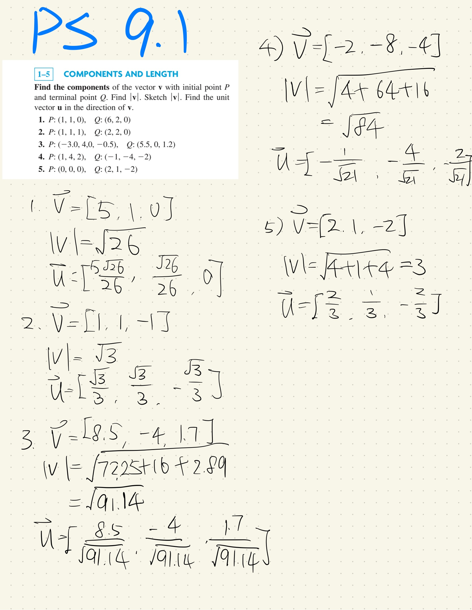

# Chapter 9 Vector Differential Calculus. Grad, Div, Curl

## P360 - Problem set 9.1
Problem 1-5

6. Q=[4, 2, 13], |v|=4
7. Q=[4, 0. 1/2], |v|=$\sqrt{149}/4$
8. Q=[13.1, 0.8, -2.0], |v|=$\sqrt{171.61+0.64+4}$=$\sqrt{176.25}$
9. Q=[0, 0, 0], |v|=$\sqrt{53}$
10. Q=[0, 0, 0], |v|=$3\sqrt{2}$
11. 2a=[6, 4, 0], 1/2a=[3/2, 1, 0], -a = [-3, -2, 0]
12. (a+b)+c=a+(b+c)=[4, 7, 8] $\textcolor{red}{b \ is \ not \ consistant. }$
13. b+c=c+b = [1, 5, 8]
14. 3c-6d=3(c-2d)=[15, -3, 0]
15. 7(c-b)=7c-7b=7*[9, -7, 8]=[63, -49, 56]
16. $\frac{9}{2}a-3c$=$9(\frac{1}{2}a-\frac{1}{3}c)$=[-3/2, 12, -24]
17. (7-3)a=7a-3a=4a=[12, 8, 0]
18. 4a+3b = [0, 26, 0], -4a-3b=-(4a+3b)=[0, -26, 0]
19. 12-associative, 13-commutative, 14-16 scalar multiplication is distributive.
20. $a+b=[a_1, a_2, ..., a_n]+[b_1, b_2, ..., b_n]=[a_1+b_1, a_2+b_2, ..., a_n+b_n]=[b_1+a_1, b_2+a_2, ..., b_n+a_n]=b+a$
The rest can be approved in a simliar way.

## P367 - Problem set 9.2

