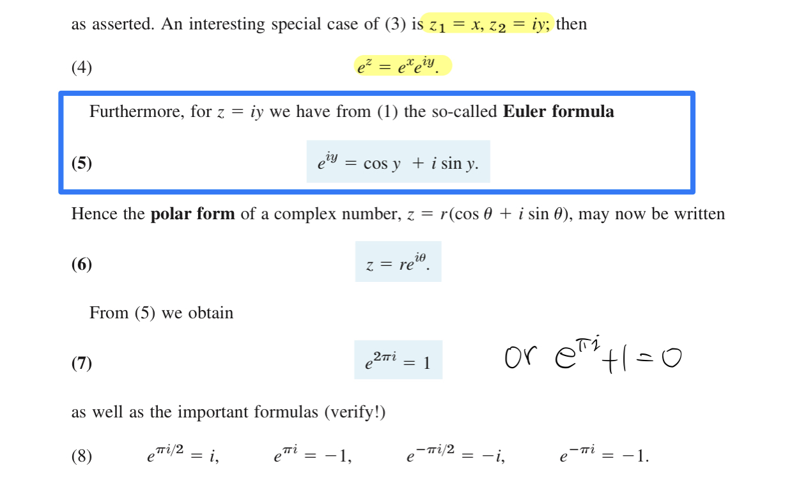

# About this course

Textbook: [Advanced Engineering Mathematics, 10th Edition, by Erwin Kreyszig](http://webpages.iust.ac.ir/jazbi/books/10Edition-ErwinKreyszig-AdvancedEngineeringMathematics.pdf)

This course mainly covers Linear algebra, multivariable calculus, and complex analysis.
Better to warm up with calculus 1 and 2.

It will be the most challenging course for me due to various reasons such as mathematic terminology, different education system, especially to the fact that I haven't work on my math for so many years. As long as I can conquer this one, I should be able to handle all of the rest. Meanwhile, never underestimate the difficulty of the top school.

# About this repo

I plan to publish my notes and exercise here. It might not worth it to finish all of the problem sets for the sake of time, but I will try my best and at least scan through them. Especially for the linear algebra problem sets, I plan to finish most of them. This repo will not include the quiz and exam since they belong to the school.

Plan to reduce the mistakes by:

* Cross-check with my classmates,  
* Check the odd-number answers in the textbook appendix,
* Double-check if I get enough time

I will be delighted to receive suggestions and feedback to improve them and eventually benefit others. So if you have any suggestions, please do let me know. Thanks.

# Watch out
* **Always check your work**
* Read the question again.
* Check Matrix Size
* Basic arithmetic calculation. Write them down.
* Careful on the terminology. E.g: Solution sets means 0, 1, or infinity. It does not mean a basis set. or a solution.
* **Think from the new viewpoint**. Linear Algebra deal with a GROUP of equations, instead on individual.

# Thought for the week

* “Obvious is the most dangerous word in mathematics.”  —  Eric Temple Bell
* “The advancement and perfection of mathematics are intimately connected with the prosperity of the State.”  — Napoleon
* “Besides language and music, mathematics is one of the primary manifestations of the free creative power of the human mind.” — Hermann Weyl
* “Do not worry too much about your difficulties in mathematics, I can assure you that mine are still greater.” — Albert Einstein
* “Learning without thought is labor lost; thought without learning is perilous." — Confucius
* "Mathematics is not a spectator sport. " — George Polya
* "True pleasure lies not in the discovery of truth, but in the search for it." — Tolstoy
* "Those who ask questions are fools for the moment; those who do not ask questions remain fools forever."— Confucius
* "The length of your education is less important than its breadth, and the length of your life is less important than its depth." — Marilyn vos Savant
* “A mind is a fire to be kindled, not a vessel to be filled" — Plutarch
* “A mathematician who is not also something of a poet will never be a complete mathematician." — Karl Weierstrass
* "I have no particular talent. I am only inquisitive." — Albert Einstein

# Typo and error in textbook

* Chapter 7

  * 7-2: 11, 15, 29
  * 7-3: 19
  * 7-7: 3 (Example 2 but not theorem 2)
  * 7.9: 10. First column is 3x1, can not multiply with 3x1 vector. if the elements multiply with the vector elements accordingly, then rank=5.

* Chapter 8

  * 8.2 - 7, the answer forget to work out the limit.
  * 8.2 - 15: I got a different result. Need to cross-check
  * 8.3 - 1: Answer is wrong
  * 8.4 - 1: A typo in the question. The second A lacks a hat. For the answer, I would simplify it to [-1, 2]^T. Not a mistake.

* Chapter 9

  * 9.1 - 11-18: Typo, b=[-4, 6, 0]
  * 9.1 - 34-35: Seem by default the angle is 45.
  * 9.2 - 17-20: Typo
  * 9.2 - 35: Diamond.
  * 9.3 - 27
  * 9.3 - 31
  * 9.5 - 24-28: in question, unit tangent vector should be u(t)
  * 9.5 - 31: |a|, because a might be negative.

* Chapter 9 - Not to finish all the exercises.

  * 9,8 - 1, typo in the question
  * 9.9 - 15, curl v is 0

* Chapter 10

  * P421: I = f(1, -1, 7) - f(0, 1, 2) = 1-7 - (0+2) = -8
  * 10.2 - 13, independent, answer missed -1.
  * 10.3 P426: ... at almost every point ... : Consider a rectangle, 50% of the tangent are infinity. How we explain this?
  * 10.5 - 9: F=$[e^y/x, e^y\ lnx +2x]$, this is the worst typo I have ever met, wasted me many hours.
  * 10.7, P456 typo: S: r=[2cosvcosu, 2cosvsinu, **2sinv**]
  * 10.8, P460 typo: ... in some domain D **in** space.

* Chapter 13

  * 13.4 - 15: c is imaginary, not real.  
  * 13.4 - 21: Typo in question, it should be y not v. The answer is wrong, $a=\pm \pi$​​​​
  * 13.5 P632 Example 1: Typo, 0.6 not 1.6
  * 13.5 - 3: The first = should be =>
  * 13.5 - 17: missed $Im(exp(z^3)) = ie^{x^3-3xy^2}\sin(3x^2y-y^3)$
  * 13.6 - 17: missed $\pi$ in answer

# Notes

It is good to practice LaTex, but it is time-consuming. From chapter 8, I will focus on understanding and exercise. I may turn them into LaTex if I have time. Update: GoodNotes5 is a better option, save my time.

2021-06-05 W1 Reflect:

* Professor: calculator calculates, human think. I plan to use tools instead of pen and paper after Chapter 8 or 9. It worth carefully think about the education philosophy difference and max out the benefit.
* Put the limited time on the most valuable things. => Reduce exercise, more reading, and coding.
* Scalable: Share Note (mindmap + caution + important theorem + application?)
* I should practice how to turn math into code. Explore [scipy.linalg turtorial](https://github.com/BrianYang2013/JHU_AI_Journey/blob/main/50%20-%20Coding/EN%20625.250%20-%20Linear%20Algeba.ipynb)

2021-06-12 W2 Reflect:

* Chapter 7, Problem set 7.7, Problem 20: Linear Algebra focus on a GROUP of equations, but not a particular equation.
* Chapter 7: solution (basis) lives in the null space. The number of basis means dimension of the null space.
* Chapter 7: KCL: just simply think from the loop perspective. Identify the current direction.
* Maybe I should allow a few empty box in the github contribution. Busy day with full of meetings happens. I should not bother by those little green boxes. If you really want a full year green, write a program and submit empty content every day.  

2021-06-19 W3 Reflect:

* I made quit a few mistakes in Quiz 1, and it is good to best leverage the exam time to do a few more round checks.
* Shopping tomorrow, and camping at the weekend. Happy father's day!
* Reflect might same as rotation for a vector, but not for a curve or a 3-D object.

2021-06-26 W4 Reflect:

* June: 80+ hours screen time on GoodNotes. Need be more efficient, score 95 means OK, 99-100 also means a little bit waste time. Plan on coding, and focus on delivery.
* Very rare to use the physical books

2021-07-04 W5 Reflect:

* Keep swimming. Sorry Hawaii, I will visit you next time.
* Based on my performance of Linear Algebra, I am working with Professor to waive my Linear Algebra pre-requisite. My transcripts indicates I have finished this course (with a different name, as Advanced Algebra), and my performance shows I have warmed up with this topic.  Better save my time for probability, statistics, and coding.

2021-07-11 W6 Reflect:

* Quiz 4 part B is not easy. I wasted too much time on T/F questions until I reached to the calculation part. I thought it is similar as the previous 3 weekly tests. Barely finished them in 2 hours, cross my fingers.
* As a result, screen time increased: June 27-July 4, 14 hours. July 5-11 23 hours.

2021-07-18 W7 Reflect:

* Lucky on the Quiz 4, I got a good result. One major mistake on the Part B Q2: I should calculate from Y direction but not X. And careful on my book keeping. While I realized it, I quickly figured out the right answer.
* It might worth to list down all the key concepts, equation, examples in calculus 3 before the mid-term exam.
* I am a little bit lost, maybe flooded by the concepts within short time period.
  * Summarize the key concepts, and leave the minor things aside. => Read extensivly while you studying, and Focus on the key scope while preparing exam. They are different.
  * Gain the insight via: go through the proof part,  reference other reading materials, go through key examples etc.
* Finished mid term test. A few thoughts
  * 80 T/F. Although I find a trick later on but no way to concentrate continously for 3.5 hours
  * Made a mistake on the first calculation. My intuitive told me something is wrong, and I try to calm down via finish the rest part first. Tried another approach and get a different result. A few data point shows the first approach definitly wrong.
  * I might be good at exam, but still not reach the core and insight yet.
  * It is a good example of Dysfunctional Belif: Imposter Syndrome / The perfectionist
    * It is about 3 hours and 20 minutes. Can I finish it in 120 minutes? (Maybe the 120 minutes is the default test hours, not apply to this one... 80 T/F + 4 Calculation are too much)
    * Can I put all knowledge in heart without refernce the textbook? It is not required, and you can always pick it up while you need it. There are different levels of "understanding": Heard it, know the basic idea, know how to calculate via follow the example, have a good feeling (i am here), good at all kinds of tricks, and finally use it like magic.
    * It takes a lot of time to achieve perfection or proficiency. Not the best way of using the limited time. It is important to be able to pick up quickly and apply to real problems. For specialized area: know the history, motivation, the course of development of this topic, all related theorems, application, tricks, special cases ... then with practice of course.
* Goodnotes - 15.5 Hours

2021-07-25 W8 Reflect:

* Mid-term: Read the question carefully. The problem is asking for a basis for column vector, but not the basis for the null space (for solution). Previously we are all focus on the null space, and this time it just simplier.   
* Euler formula: Whoever looks at this formula will be shocked by Euler's genius and the beauty of mathematics!

* Goodnotes - 14.5 Hours.

2021-08-01 W9 Reflect:

2021-08-08 W10 Reflect:

- Cauchy's integral formula: Follow the definition. It is on line integral, a closed path, Don't over think. Although there might be something related 

Wrap up this course: 

- Roles and responsibility
  - School, Program: provide a structured courses
  - Teacher: Pick up textbook, tune the learning curve, set the deadline, suggest the reference, answer questions such as motivation and application behind the theory. 
  - Student: Everything. 
- I think we lack discussion. Casual chat, talks about various topics, our doubts, our mistakes, and our questions. 
- Quit interesting topics, study the Euler formular in textbook rather than a popular science book, varisou theorems, first time to enter into the complex analysis world
- Lots of area to explore, but you need to move on. There are more interesting things ahead, and settle in somewhere which can make impact

# Reference

* [Precalculus through Data and Modelling Specialization](https://www.coursera.org/specializations/precalculus-data-modelling).  A good math warm up.
* I haven't try them, but I would assume they are good for Calculus warm up.

  * [Differential Calculus through Data and Modeling Specialization](https://www.coursera.org/specializations/differential-calculus-data-modeling)
  * [Integral Calculus through Data and Modeling Specialization](https://www.coursera.org/specializations/integral-calculus-data-modeling)
* [Calculus I with Precalculus: A One-Year Course](https://www.amazon.com/Calculus-I-Precalculus-One-Year-Course-dp-0618568069/dp/0618568069/ref=mt_other?_encoding=UTF8&me=&qid=1621531863). I happen to have this book. Anything similar will be good for warm up.
* [Khan: Multivariable calculus](https://www.khanacademy.org/math/multivariable-calculus). It is not easy to get 100%, and It is pity that I don't have time to finish all of them.
* [Simple Parallel Circuits](https://www.allaboutcircuits.com/textbook/direct-current/chpt-5/simple-parallel-circuits/): Reference materials, if want to explore more on KCL, KVL in chapter 7.
* [Mathematics Calculus III](https://scientificsentence.net/Equations/CalculusIII/index.php?key=yes&Integer=stokes_theorem): A well organized summary with examples. Be aware of the mistakes, and the parametric representation might slightly different from the textbook. Such as sphere.
* [Can your computer do complex analysis?](http://citeseerx.ist.psu.edu/viewdoc/download?doi=10.1.1.8.6363&rep=rep1&type=pdf): In complex analysis, the logarithm and power/exponential functions are considered to be multiple-valued functions that are made single-valued by choosing a branch of the logarithm. (principle branch)
* [More examples on Cauchy’s integral formula from MIT](https://math.mit.edu/~jorloff/18.04/notes/topic4.pdf)
