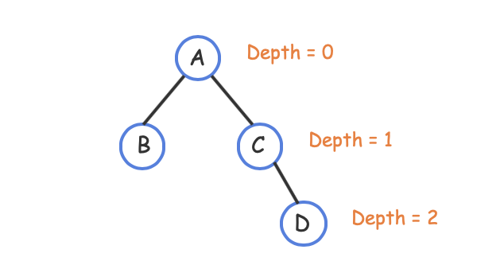
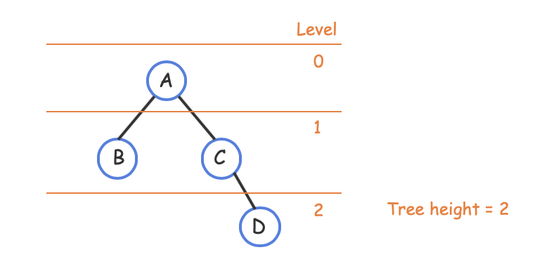
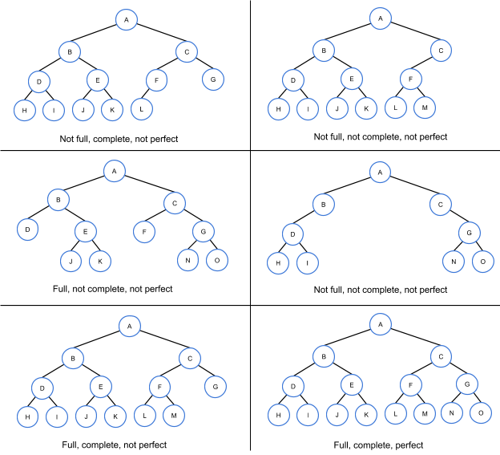

# Module 7 - Graphs and Trees

## Course Module

### Lecture

#### Basic Graph Theory

- Binary trees: A special case of graphs. Modelling tool. 
- G = (V, E), an order pair. 
- Order: A -> B: B is adjacent to A, but not reverse. 
- **Simple path**, without repeated vertices or edges.
- A cycle or closed path begins and ends at the same vertex.
- The **degree** of a vertex is the number of incident edges. A connection to vertex itself counts 2 (both in and out)
- Degree are same for all vertex: regular graph
- In-degre and out-degree。 Source: in-degrre =0 AND out-degree >0; Sink: out-degree = 0. 

#### Binary Trees

- V = E + 1. Acyclic. 
- Use degree and adjacent vertex to check whether 2 trees are same. 
- m-ary tree
  - **Regular**: All nodes have 0 or m children. 
  - **Complete**: Regular + all leaves at the same level
  - A complete binary tree of height k: leaves: $2^k$, nodes: $2^{k+1}-1$

- Heap
  - Strickly almost complete tree: missing values only allowed at right end of "bottom" level.
  - Max heap: No child is larger than their parent. (equal is ok)
  - For priority queues

## ZyBooks

### 6.1 - 6.4 Graph

A **graph** is a data structure for representing connections among items, and consists of vertices connected by edges. 

- A **vertex** (or node) represents an item in a graph. 
- An **edge** represents a connection between two vertices in a graph.

In a graph: 

- Two vertices are **adjacent** if connected by an edge. 
- A **path** is a sequence of edges leading from a source (starting) vertex to a destination (ending) vertex. The **path length** is the number of edges in the path. 
- The **distance** between two vertices is the number of edges on the shortest path between those vertices.

In an **adjacency matrix** graph representation, each vertex is assigned to a matrix row and column, and a matrix element is 1 if the corresponding two vertices have an edge or is 0 otherwise.

In an **adjacency list** graph representation, each vertex has a list of adjacent vertices, each list item representing an edge: size of O(V + E)

A **sparse graph** has far fewer edges than the maximum possible.

A **directed graph**, or **digraph**, consists of vertices connected by directed edges. A **directed edge** is a connection between a starting vertex and a terminating vertex. In a directed graph, a vertex Y is **adjacent** to a vertex X, if there is an edge from X to Y.

- A **path** is a sequence of directed edges leading from a source (starting) vertex to a destination (ending) vertex.
- A **cycle** is a path that starts and ends at the same vertex. A directed graph is **cyclic** if the graph contains a cycle, and **acyclic** if the graph does not contain a cycle.

Identify the vertices (if any) that are adjacent to: From this vertices X to other vertices. 

### 6.5 - 6.6 BFS, DFS

An algorithm commonly must visit every vertex in a graph in some order, known as a **graph traversal**. 

A **breadth-first search** (BFS) is a traversal that visits a starting vertex, then all vertices of distance 1 from that vertex, then of distance 2, and so on, without revisiting a vertex.

A **depth-first search** (DFS) is a traversal that visits a starting vertex, then visits every vertex along each path starting from that vertex to the path's end before backtracking.

### 6.7 Weighted graphs

A **weighted graph** associates a weight, or cost,  with each edge. A weighted graph may be directed or undirected.

In a weighted graph, the **path length** is the sum of the edge weights in the path. Shortest path length

The **cycle length** is the sum of the edge weights in a cycle. A **negative edge weight cycle** has a cycle length less than 0. A shortest path does not exist in a graph with a negative edge weight cycle. 

### 6.12 Heaps using arrays

**Heaps** are typically stored using arrays. Given a tree representation of a heap, the heap's array form is produced by traversing the tree's levels from left to right and top to bottom. The root node is always the entry at index 0 in the array, the root's left child is the entry at index 1, the root's right child is the entry at index 2, and so on.

Table 6.12.1: Parent and child indices for a heap.

| Node index | Parent index | Child indices        |
| ---------- | ------------ | -------------------- |
| 0          | N/A          | 1, 2                 |
| 1          | 0            | 3, 4                 |
| 2          | 0            | 5, 6                 |
| 3          | 1            | 7, 8                 |
| 4          | 1            | 9, 10                |
| 5          | 2            | 11, 12               |
| ...        | ...          | ...                  |
| i          | ⌊(i−1)/2⌋    | 2 * i + 1, 2 * i + 2 |

For example, index 12 has parent in index 5, ⌊((12−1)/2⌋ = ⌊5.5⌋ = 5

### 6.13 Binary trees

In a **binary tree**, each node has up to two children, known as a *left child* and a *right child*. 

- **Leaf**: A tree node with no children.
- **Internal node**: A node with at least one child.
- **Parent**: A node with a child is said to be that child's parent. A node's **ancestors** **include the node's parent,** the parent's parent, etc., up to the tree's root. 
- **Root**: The one tree node with no parent (the "top" node).

More concept

- The link from a node to a child is called an **edge**.
- A node's **depth** is the number of edges on the path from the root to the node. **The root node thus has depth 0**. 
- All nodes with the same depth form a tree **level**. 
- A tree's **height** is the largest depth of any node. A tree with just one node has height 0.

Special types of binary trees

- A binary tree is **full** if every node contains 0 or 2 children.
- A binary tree is **complete** if all levels, except possibly the last level, contain all possible nodes and all nodes in the last level are as far left as possible.
- A binary tree is **perfect**, if all internal nodes have 2 children and all leaf nodes are at the same level.

