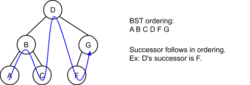
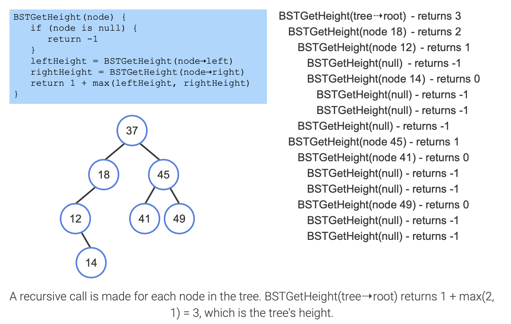
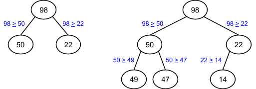
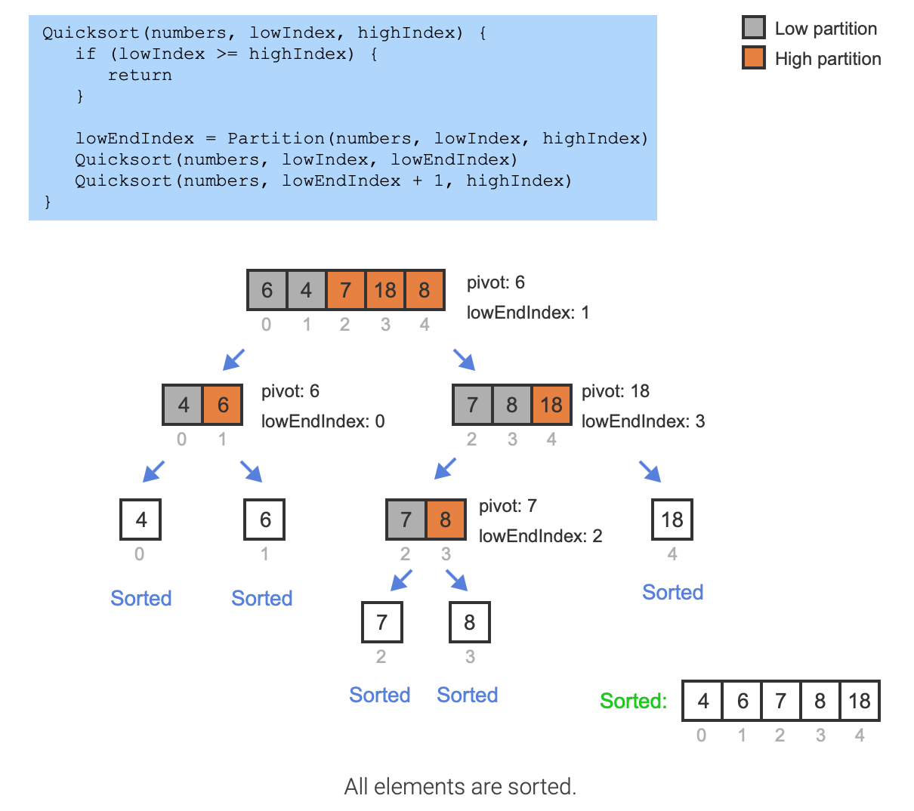

# Module 9 - More on Trees and Sorting

## Course Module

### Lecture

Sorting: Trade off

#### Binary Trees

- Recursive binary trees. Root, Left subtree (LST), right subtree(RST)
- Many tree algorithms are recursive. 
- Traversal: 6 in all, prefer LST before RST so we have three: 
  - Preorder: Root, LST, RST
  - Inorder: LST, Root, RST
  - Postoder: LST, RST, Root

##### Threaded Trees:

- The right child pointer of the leaf is always empty. So use it direct to the inorder successor. (add a bool to indicate the right child pointer is a thread or a real child)
- Tree can be right-threaded for preorder and postorder. 
- Or left threaded or even both. 

##### Binry Op-trees

- Operands as the leaves and operators as internal nodes. 

##### Binary Search Trees

#### Huffman Encoding

- Ciphers: Letters frequence and word pattern. 
- Huffman encoding: 
  - binary code. 0, and 1
  - Avoids frequency patterns
  - Avoid word patterns
- Build a Huffman encoding
  - Start with the least frequent
  - Set tie breaker: for example, simple on left, combined on the right. Same frequence leaves: alphabet. 

### Sorting

- External (load in batch, sort and merge) & Internal (can bring into memory at once)

- Points to consider: Size, Order, distribution, reuse of existing code, Programmer time, frequency of sorting, How data used, Efficiency of sorts available, Space

- Type: 

  - Exchange: Bubble, QuickSort
    - QuickSort, Pivot: Random (first, middle), median of first-last-middle, mean of all values in file (MeanSort)
  - Selection: Straight, Binary Tree Sort, Simple BT Sort, HeapSort, Quadratic Selection Sort
  - Insertion: Simple Insertion Sort, Shell Sort, Address Calculation Sort
  - Merge:Straight Merge, Natural Merge 
  - Radix

  

## ZyBooks

### 7.1 Binary Search Trees

**binary search tree** (BST), which has an ordering property that any node's left subtree keys ≤ the node's key, and the right subtree's keys ≥ the node's key. That property enables fast searching for an item

A binary tree's height can be minimized by keeping all levels full, except possibly the last level. Such an "all-but-last-level-full" binary tree's height is $H=⌊log2N⌋$.

**The worst case** (largest) number of comparisons given a BST with N nodes is $H=⌊log2N⌋+1$.

A BST node's **successor** is the node that comes after in the BST ordering, so in A B C, A's successor is B, and B's successor is C. A BST node's **predecessor** is the node that comes before in the BST ordering. 

A perfect binary tree search is $O(H)$, so $O(logN)$.

## 7.2 BST: Recursion

## 7.3 Applications of trees

File systems

**Binary space partitioning** (**BSP**) is a technique of repeatedly separating a region of space into 2 parts and cataloging objects contained within the regions. A **BSP tree** is a binary tree used to store information for binary space partitioning. Each node in a BSP tree contains information about a region of space and which objects are contained in the region.

## 7.4 Minimum spanning tree assignment

## 7.5 BST height and insertion order

Inserting in random order keeps tree height near the minimum. Inserting in sorted order yields the maximum.

### 7.6 BST parent node pointers

A BST implementation often includes a parent pointer inside each node. **A balanced BST**, such as an **AVL tree or red-black tree**, may utilize the parent pointer to traverse up the tree from a particular node to find a node's parent, grandparent, or siblings. 

### 7.7 BST insert algorithm

Given a new node, a BST **insert** operation inserts the new node in a proper location obeying the BST ordering property. A simple BST insert algorithm compares the new node with the current node (initially the root). 

- *Insert as left child*: If the new node's key is less than the current node, and the current node's left child is null, the algorithm assigns that node's left child with the new node. 
- *Insert as right child*: If the new node's key is greater than or equal to the current node, and the current node's right child is null, the algorithm assigns the node's right child with the new node. 
- *Search for insert location*: If the left (or right) child is not null, the algorithm assigns the current node with that child and continues searching for a proper insert location.

BST insert algorithm complexity

- The BST insert algorithm traverses the tree from the root to a leaf node to find the insertion location. One node is visited per level. A BST with N nodes has at least log2N levels and at most N levels. Therefore, the runtime complexity of insertion is best case O(logN) and worst case O(N).

- The space complexity of insertion is O(1) because only a single pointer is used to traverse the tree to find the insertion location.

BST remove algorithm complexity

- The BST remove algorithm traverses the tree from the root to find the node to remove. When the node being removed has two children, the node's successor is found and a recursive call is made. One node is visited per level, and in the worst case scenario the tree is traversed twice from the root to a leaf. A BST with N nodes has at least log2N levels and at most N levels. So removal's worst case time complexity is O(logN) for a BST with log2N levels and worst case O(N) for a tree with N levels.

- Two pointers are used to traverse the tree during removal. When the node being removed has two children, a third pointer and a copy of one node's data are also used, and one recursive call is made. So removal's space complexity is always O(1).

### 7.8 BST search algorithm

### 7.9 BST remove algorithm

Given a key, a BST **remove** operation removes the first-found matching node, restructuring the tree to preserve the BST ordering property. The algorithm first searches for a matching node just like the search algorithm. If found (call this node X), the algorithm performs one of the following sub-algorithms: 

- *Remove a leaf node:* If X has a parent (so X is not the root), the parent's left or right child (whichever points to X) is assigned with null. Else, if X was the root, the root pointer is assigned with null, and the BST is now empty.
- *Remove an internal node with single child:* If X has a parent (so X is not the root), the parent's left or right child (whichever points to X) is assigned with X's single child. Else, if X was the root, the root pointer is assigned with X's single child. 
- *Remove an internal node with two children:* This case is the hardest. First, the algorithm locates X's successor (the leftmost child of X's right subtree), and copies the successor to X. Then, the algorithm recursively removes the successor from the right subtree. (Successor = Inorder successor. )

### 7.10 BST inorder traversal

A **tree traversal** algorithm visits all nodes in the tree once and performs an operation on each node. An **inorder traversal** visits all nodes in a BST from smallest to largest, which is useful for example to print the tree's nodes in sorted order. Starting from the root, the algorithm recursively prints the left subtree, the current node, and the right subtree.

### 7.11 Heaps

A **max-heap** is a complete binary tree that maintains the simple property that a node's key is greater than or equal to the node's childrens' keys. (Actually, a max-heap may be any tree, but is commonly a binary tree)

A max-heap's root must have the maximum key.

An **insert** into a max-heap starts by inserting the node in the tree's last level, and then swapping the node with its parent until no max-heap property violation occurs. Inserts fill a level (left-to-right) before adding another level, so the tree's height is always the minimum possible. The upward movement of a node in a max-heap is called **percolating**. 

A **remove** from a max-heap is always a removal of the root, and is done by replacing the root with the last level's last node, and swapping that node with its greatest child until no max-heap property violation occurs. Because upon completion that node will occupy another node's location (which was swapped upwards), the tree height remains the minimum possible.

**Inset and Remove: add/remove the last node, then percolating.** 

N nodes, the height of a max-heap is $⌊logN⌋$

A **min-heap** is similar to a max-heap, but a node's key is less than or equal to its children's keys.

### 7.12 Tries

### 7.13 Treaps

### 7.14 Sorting: Introduction

### 7.15 Bubble sort

### 7.16 Quicksort

**Quicksort** is a sorting algorithm that repeatedly partitions the input into low and high parts (each part unsorted), and then recursively sorts each of those parts.

The **pivot** can be any value within the array being sorted, commonly the value of the middle array element. 

Elements in [begining, highindex] are <= pivot. (highindex, end] are >= pivot

Once partitioned, each partition needs to be sorted. Quicksort is typically implemented as a recursive algorithm using calls to quicksort to sort the low and high partitions. This recursive sorting process continues until a partition has one or zero elements, and thus is already sorted.

### Quicksort runtime

The quicksort algorithm's runtime is typically $O(N log N)$. Quicksort has several partitioning levels, the first level dividing the input into 2 parts, the second into 4 parts, the third into 8 parts, etc. At each level, the algorithm does at most N comparisons moving the lowIndex and highIndex indices. If the pivot yields two equal-sized parts, then there will be $log N$ levels, requiring the $N * log N$ comparisons.

Best case: $Log_2n$ level 

### Worst case runtime

For typical unsorted data, such equal partitioning occurs. However, partitioning may yield unequally sized parts in some cases. If the pivot selected for partitioning is the smallest or largest element, one partition will have just 1 element, and the other partition will have all other elements. If this unequal partitioning happens at every level, there will be N - 1 levels, yielding N + N-1 + N-2 + ... + 2 + 1 = (N+1)⋅(N/2), which is $O(N2)$. So the worst case runtime for the quicksort algorithm is O(N2). Fortunately, this worst case runtime rarely occurs.

In the worst case, it will call $1 + 2*(n-1)$ or $2n-1$ times of Quicksort() function. 

Worst case: $n-1$ level 
