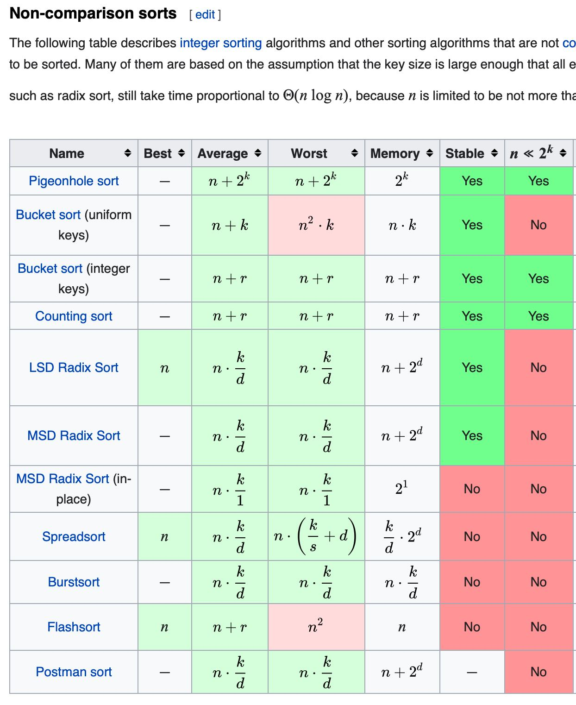
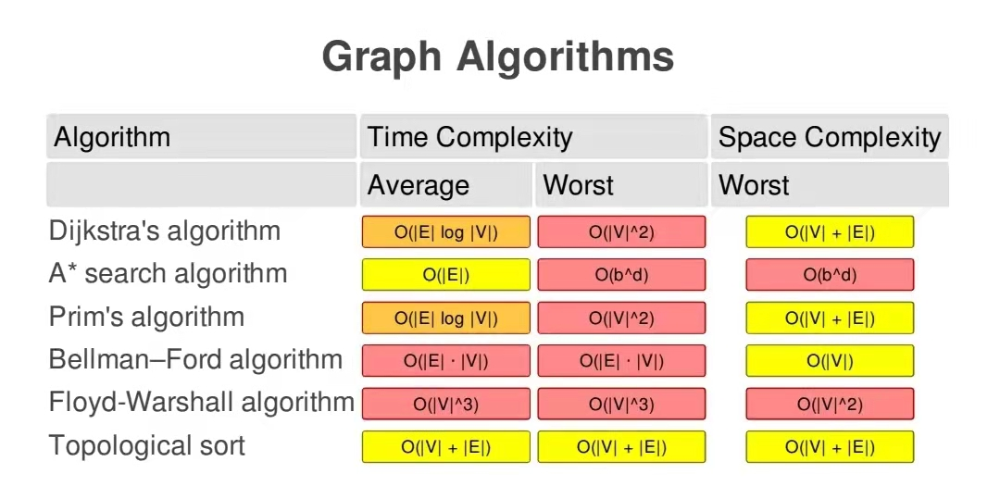
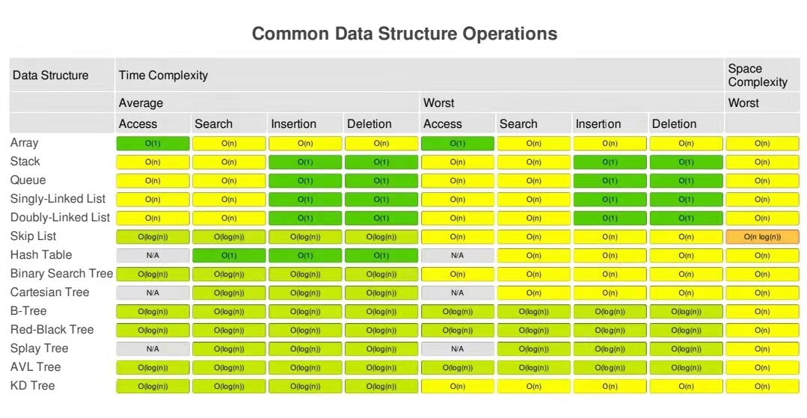
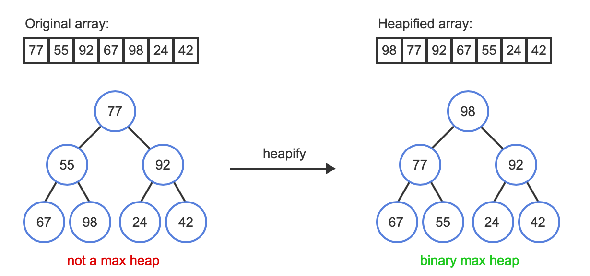
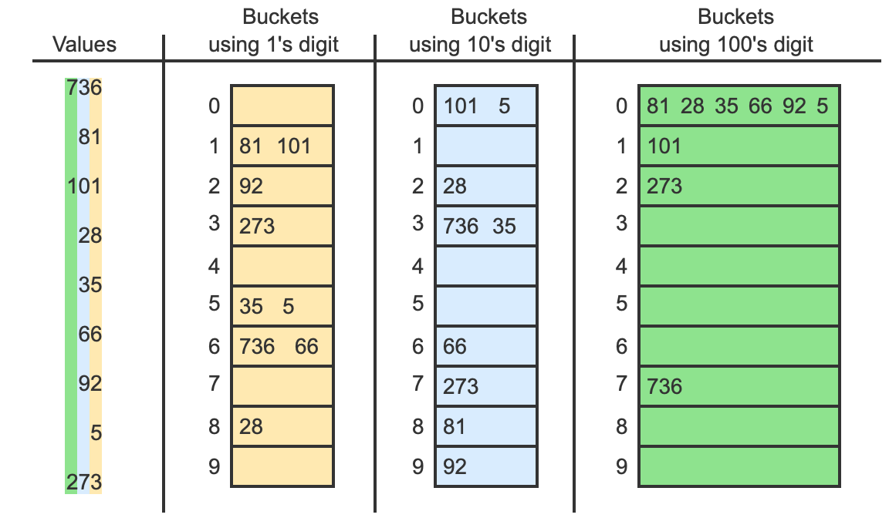
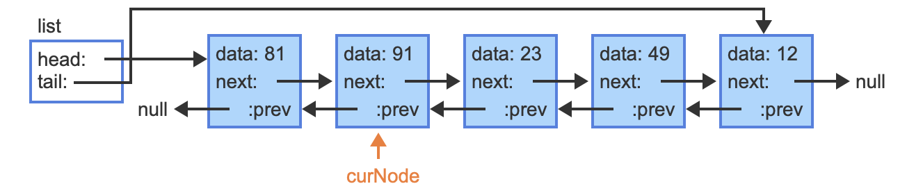
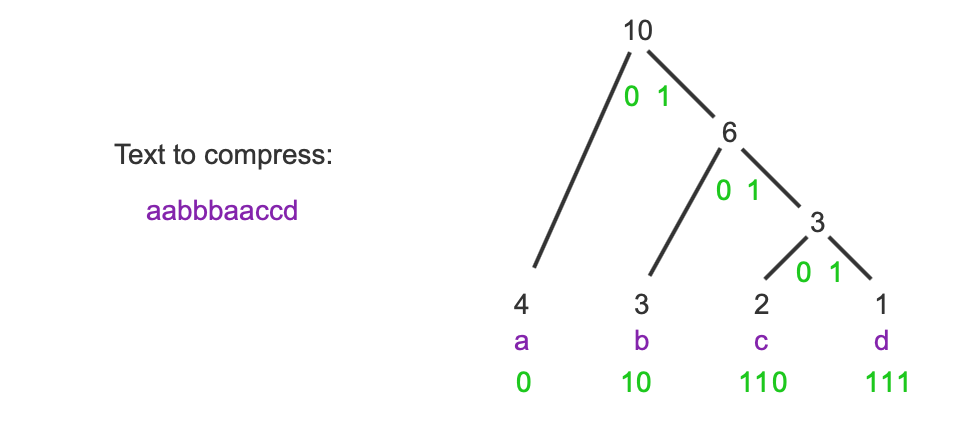

# Module 10 - Sorting and Huffman Encoding

## Course Module

### Summary

Stable: same elements will keep the original positions. 

QuickSort: 

- Divide and conque. Prefer Recursive. Find a pivot, separate into left and right. till 1 data. Top down. 
- Time: 
  - Best case: If divide into 2 equal 2 part, then we go $O(nlogn)$. 
  - Worst case: Order data, then hard to get equal partition. then we go $O(n^2)$
  - Overall: Most ase $O(nlogn)$. In extreme case we will get $O(n^2)$
- Space: O(1), in-place algorithm
- Not stable (Same value will not garantee the seqquence). 

Merge: 

- Divide and conque. Prefer Recursive. Break down to 8, 4, 2, 1 then sort and merge back. Botton up. 
- Time: Best / Worst / Overall: Very **stable**, always $O(nlogn)$. But with higher constant factor. 
- Space:  $O(n)$
- NOT in-place algorithm. 
- Stable. Same value will keep the original seqquence

in-place algorithm: The input is usually overwritten by the output as the algorithm executes. Less than $O(logn)$space or pointers. Bubble, Selection, Insert, Heap, Shell

Stable: radix, bubble, simple insert, merge

Not stable: Heap, quicksort, shell, straight(simple) selection

## Cheatsheet

### Lecture

Straight (simple) Selection sort

- Compare with bubble sort (same O(n^2) complexity)
  - Bubble: Compare and swap every time
  - Selection sort: find the smallest (biggest) one and swap to the right position. 
- Binary Trees Search: Sort of selection sort. Create tree, create the sorted list by doing the inorder transversal
- HeapSort: Another typical selection sort. **Typically not as good as quicksort.** 
- Quadratic Selection Sort: Need extra space. Separate into k sections, find the biggest of each, put into temporary space in order. Find the biggest from the temporary space, and fill that spot by the second largest of the correspondence sections. Complexity: (k + n/k )*n, prefer $k = \sqrt{n}$, it turn out $2n^{3/2}$ Or $O(n^{3/2})$

Simple Insertion Sort

- Shell Sort: Multiply pass. 
  - K: 2^i - 1, from i = $log_2n$ till i = 1 (k = 1)
  - Knuth: h(1) = 1, h(n) = 3 h(n-1)+ 1. So we get 1, 4, 13, 40, 121, 364, 1093 ... until you pass the n. remove the 2 biggest number and reverse this sequence, for the k value set. for example, 16 we should use 1 and 4 (40 is the one bigger than n=16, remove 13 and 40)
  - Prime number sequence which close to Knuth: 1, 5, 13, 41, 119 ... not easy to generate this series. 
  - In place sort, do not need extra space.

Address Calculation Sort

- Bucket Sort

Straight 2-way Merge 

- Merge always need extra space. 

- Straight merge: merge 2 of 1 into 2, 4, 8, ... merge all. 
- Natrual Merge: find the items in order as much as possible. Separate them. 
  - Uses replacement selection
  - Merging part is still the same
  - Exploits order in data

Sorting without comparision: Counting sort

- Fixed range of value from 0 to k
- mark value in the aux array
- count item before it
- O(n), and stable. 

## Searching

Terminology

- Record
- File (of size n)
- Key

Consideration

- Size
- Distribution
- Reuse of existing code
- Programmer time
- Frequency of searching
- Number of search types
- Exploit the file organization
- Not in file  
- or remove duplicates. 

Strategy: 

- Sequential: O(n/2) on average
- Binary: O(logn) on average
- Interploation: O(loglogn), to O(n). 
- Indexed sequential: Extra space, Optimize sequential search. O((k^2+n)/2k), prefer $k = sqrt(n)$ and increase if n is really big. 
- Search trees
- Maintain sorted order when doing inserts or deletes. 

## ZyBooks

## 8.1 Selection sort

**Selection sort** is a sorting algorithm that treats the input as two parts, a sorted part and an unsorted part, and repeatedly selects the proper next value to move from the unsorted part to the end of the sorted part.

The selection sort algorithm **runtime** is$ (N−1)⋅N/2$, or $O(N2)$

## 8.2 Quickselect

**Quickselect** is an algorithm that selects the kth smallest element in a list. Ex: Running quickselect on the list (15, 73, 5, 88, 9) with k = 0, returns the smallest element in the list, or 5. It will partition into x and n-x part, then recursively process it until found the kth 

Low：Less or equal to pivot. High: the rest. Final number: All. 

The best case and average runtime complexity of quickselect are both O(N). In the worst case, quickselect may sort the entire list, resulting in a **runtime** of O(N2).

## 8.3 Insertion sort

**Insertion sort** is a sorting algorithm that treats the input as two parts, a sorted part and an unsorted part, and repeatedly inserts the next value from the unsorted part into the correct location in the sorted part.

The insertion sort algorithm runtime is$ (N−1)⋅N/2$, or $O(N2)$

The **runtime** for nearly sorted inputs is $O((N - C) * 1 + C * N) = O(N)$.

## 8.4 Shell sort

**Shell sort** is a sorting algorithm that treats the input as a collection of interleaved lists, and sorts each list individually with a variant of the insertion sort algorithm. Shell sort uses gap values to determine the number of interleaved lists. A **gap value** is a positive integer representing the distance between elements in an interleaved list. For each interleaved list, if an element is at index i, the next element is at index i + gap value.

Try to eliminate the long distance, to make it near sorted. Then apply insertion sort 

Gap value = how many sub groups. 

Technicallhy will not divide into "gap value" groups but use x+k as the next item. 

**A common option is to choose powers of 2 minus 1**, in **descending** order. Ex: For an array of size 100, gap values would be 63, 31, 15, 7, 3, and 1. This gap selection technique results in shell sort's **time complexity** being no worse than $O(N3/2)$.

## 8.5 Merge sort

**Merge sort** is a sorting algorithm that divides a list into two halves, recursively sorts each half, and then merges the sorted halves to produce a sorted list. The recursive partitioning continues until a list of 1 element is reached, as a list of 1 element is already sorted.

**Merge sort partitioning**: three index variables: i for the first element in the list, k for the last element.  j = (i + k)/2 for divide the list into two halves. 

The merge sort algorithm's **runtime** is $O(N log N)$. log N partitioning levels * N comparisons selecting and copying elements. 

Merge sort requires $O(N)$ additional space

Partitioning levels: $log_2n$

MergeSort(numbers, 0, 6) is called. The next two calls to MergeSort() are: MergeSort(numbers, 0, 3) and MergeSort(numbers, 0, 1) because the recursive way!

## 8.6 Heap sort

**Heapsort** is a sorting algorithm that takes advantage of a max-heap's properties by repeatedly removing the max and building a sorted array in reverse order. An array of unsorted values must first be converted into a heap. The **heapify** operation is used to turn an array into a heap. Since leaf nodes already satisfy the max heap property, heapifying to build a max-heap is achieved by percolating down on every non-leaf node in reverse order.

The heapify operation starts on the internal node with the largest index , which is $⌊N/2⌋ - 1$.

Heapsort begins by heapifying the array into a max-heap and initializing an end index value to the size of the array minus 1. **Heapsort repeatedly removes the maximum value, stores that value at the end index, and decrements the end index.** The removal loop repeats until the end index is 0. 

Go through all internal node. Not recursive. 

## 8.7 Radix sort

Radix sort is a sorting algorithm designed **specifically for integers**. The algorithm makes use of a concept called buckets and is a type of bucket sort. 

Any array of integer values can be subdivided into buckets by using the integer values' digits. A **bucket** is a collection of integer values that all share a particular digit value. 

1th, 10th, till the highest digits. 

Radix sort requires $O(N)$ additional space

Radix sort runtime is  $O(N)$ 

## 8.8 Sorting linked lists

Insertion sort for a **doubly-linked list** operates similarly to the insertion sort algorithm used for arrays. 

Start with 2nd node, 

The Sorting linked list is same as Insertion sort. **Runtime** is$ (N−1)⋅N/2$, or $O(N2)$

In the best scenario, th elist is already **sorted**, then the **runtime** is $O(N)$

The average and worst case runtime of **ListInsertionSortSinglyLinked** is $O(N^2)$. The best case runtime is $O(N$), which occurs when the list is sorted in descending order.

Table 8.8.1: Sorting algorithms easily adapted to efficiently sort linked lists.

### Sorting linked-lists vs. arrays

| Sorting algorithm | Adaptation to linked lists                                   |
| ----------------- | ------------------------------------------------------------ |
| Insertion sort    | Operates similarly on doubly-linked lists. Requires searching from the head of the list for an element's insertion position for singly-linked lists. |
| Merge sort        | Finding the middle of the list requires searching linearly from the head of the list. The merge algorithm can also merge lists without additional storage. |

Table 8.8.2: Sorting algorithms that cannot as efficiently sort linked lists.

| Sorting algorithm | Challenge                                                    |
| ----------------- | ------------------------------------------------------------ |
| Shell sort        | Jumping the gap between elements cannot be done on a linked list, as each element between two elements must be traversed. |
| Quicksort         | Partitioning requires backward traversal through the right portion of the array. Singly-linked lists do not support backward traversal. |
| Heap sort         | Indexed access is required to find child nodes in constant time when percolating down. |

## 8.10 Overview of fast sorting algorithms

A **fast sorting algorithm** is a sorting algorithm that has an average runtime complexity of O(NlogN) or better. 

Table 8.10.1: Sorting algorithms' average runtime complexity.

| Sorting algorithm | Average case runtime complexity | Fast? |
| ----------------- | ------------------------------- | ----- |
| Selection sort    | $O(N^2)$                        | No    |
| Insertion sort    | $O(N^2)$                        | No    |
| Shell sort        | $O(N^1.5)$                      | No    |
| Quicksort         | $O(NlogN)$                      | Yes   |
| Merge sort        | $O(NlogN)$                      | Yes   |
| Heap sort         | $O(NlogN)$                      | Yes   |
| Radix sort        | $O(N)$                          | Yes   |

A **element comparison sorting algorithm** is a sorting algorithm that operates on an array of elements that can be compared to each other. 

Table 8.10.2: Identifying comparison sorting algorithms.

| Sorting algorithm | Comparison? |
| ----------------- | ----------- |
| Selection sort    | Yes         |
| Insertion sort    | Yes         |
| Shell sort        | Yes         |
| Quicksort         | Yes         |
| Merge sort        | Yes         |
| Heap sort         | Yes         |
| Radix sort        | No          |

### Best and worst case runtime complexity

Table 8.10.3: Fast sorting algorithm's best, average, and worst case runtime complexity.

| Sorting algorithm | Best case runtime complexity | Average case runtime complexity | Worst case runtime complexity |
| ----------------- | ---------------------------- | ------------------------------- | ----------------------------- |
| Quicksort         | $O(NlogN)$                   | $O(NlogN)$                      | $O(N^2)$                      |
| Merge sort        | $O(NlogN)$                   | $O(NlogN)$                      | $O(NlogN)$                    |
| Heap sort         | $O(N)$                       | $O(NlogN)$                      | $O(NlogN)$                    |
| Radix sort        | $O(N)$                       | $O(N)$                          | $O(N)$                        |

## 8.11 Huffman compression

**Compression** transforms the data to use fewer bits. Compressed data uses less storage and can be communicated faster than uncompressed data.

The basic idea of compression is to encode frequently-occurring items using fewer bits.

Don't be the prefix of another code - Confusion. 

**Huffman coding** is a common compression technique that assigns fewer bits to frequent items, using a binary tree.

**Building a Huffman tree**

The data members in a Huffman tree node depend on the node type.

- Leaf nodes have two data members: a character from the input and an integer frequency for that character.
- Internal nodes have left and right child nodes, along with an integer frequency value that represents the sum of the left and right child frequencies.

**Implementing with 1 node structure**

Implementations commonly use the same node structure for leaf and internal nodes, instead of two distinct structures. Each node has a frequency, character, and 2 child pointers. The child pointers are set to null for leaves and the character is set to 0 for internal nodes.

