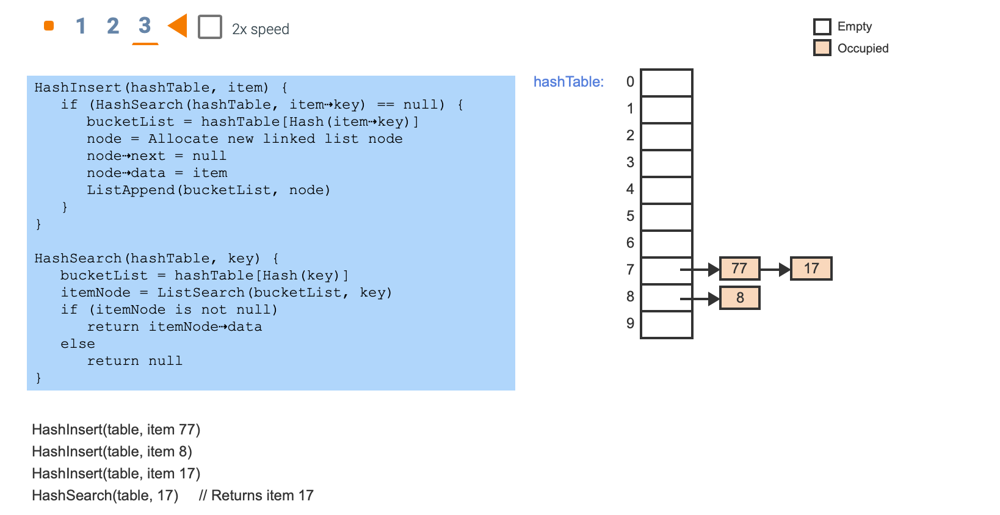
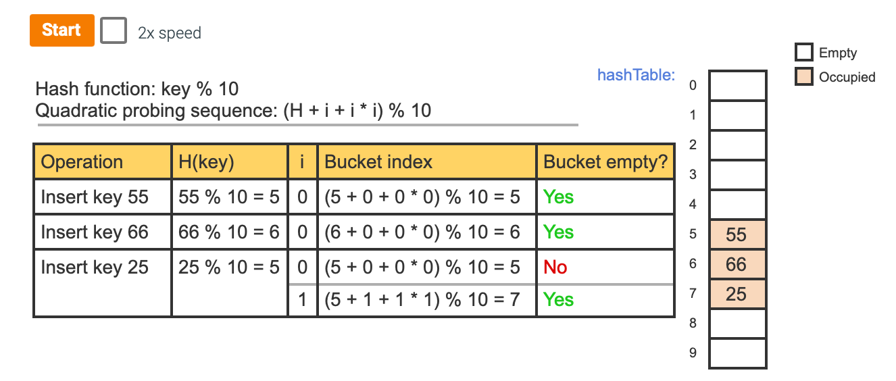
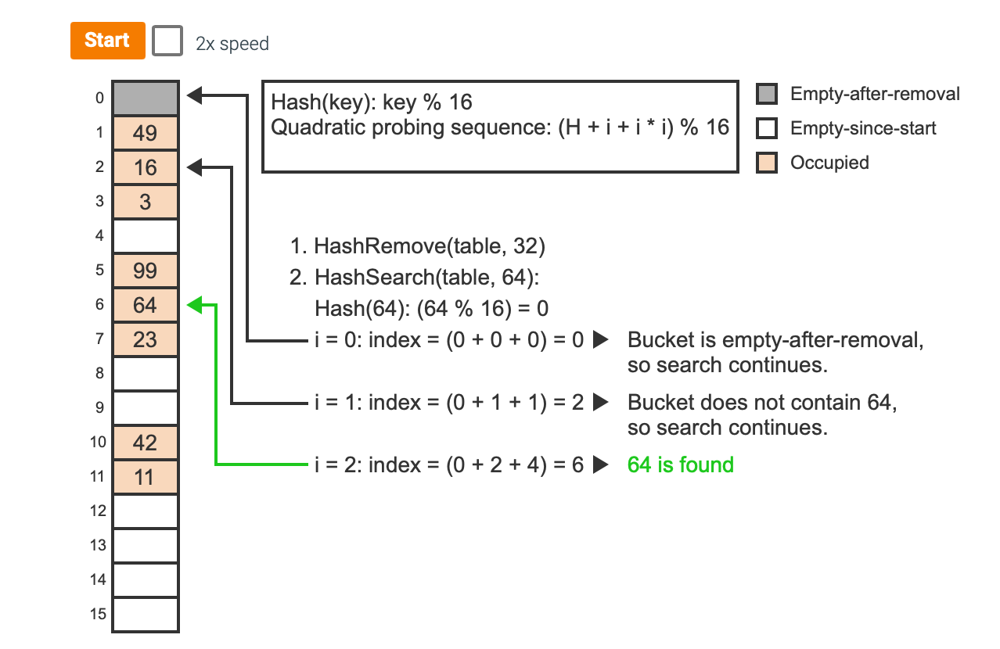
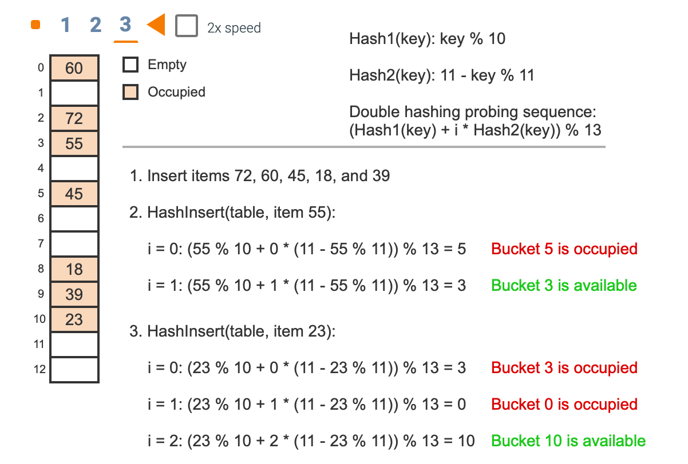

# Module 14 - Transposition and Hash

## Course Module

### Summary

Hash will consider

- Hash function covers most of the buckets / Hash table? Even/Odd, percentage. 
- How many collisions? 

Consider Empty-after-removal (continue) and empty-since-start(stop)

- Linear probing
- Quadratic probing

### Lecture 

- Hashing tends to waste space. 
- As utilization increases, so do collisions
- $>$65% cause problem. Or 80% per Scott A
- 

## ZyBooks

### 10.1 Hash tables

A **hash table** is a data structure that stores **unordered** items by mapping (or hashing) each item to a location in an array (or vector).

A hash table's main advantage is that **searching (or inserting / removing)** an item may require only **O(1)**, in contrast to O(N) for searching a list or to O(log N) for binary search.

In a hash table, an item's **key** is the value used to map to an index. Each hash table array element is called a **bucket**. A **hash function** computes a bucket index from the item's key.

A common hash function uses the **modulo operator %**, which computes the integer remainder when dividing two numbers. 

**Empty cells:** The approach for a hash table algorithm determining whether a cell is empty depends on the implementation. For example, if items are simply non-negative integers, empty can be represented as -1. More commonly, items are each an object with multiple fields (name, age, etc.), in which case each hash table array element may be a pointer. Using pointers, empty can be represented as null.

A **collision** occurs when an item being inserted into a hash table maps to the same bucket as an existing item in the hash table. 

- **Chaining** is a collision resolution technique where each bucket has a list of items (so bucket 5's list would become 55, 75). 

- **Open addressing** is a collision resolution technique where collisions are resolved by looking for an empty bucket elsewhere in the table

### 10.2 Common hash functions

A good hash function minimizes collisions

A **mid-square hash** squares the key, extracts R digits from the result's middle, and returns the remainder of the middle digits divided by hash table size N. Ex: For a hash table with 100 entries and a key of 453, the decimal (base 10) mid-square hash function computes 453 * 453 = 205209, and returns the middle two digits 52. For N buckets, R must be greater than or equal to $⌈log10N⌉$ to index all buckets. The process of squaring and extracting middle digits reduces the likelihood of keys mapping to just a few buckets.

- Key = 453, Buckets = 100, R=2: key^2 = 205209, 52MOD100=52
- Key = 40, Buckets = 100, R=2: key^2 = 1600, 60MOD100=60
- Key = 110, Buckets = 200, R=3: key^2 = 12100, 210MOD200=10

N = 200, R = $ceil(log_2{200}) = 8$

A **multiplicative string hash** repeatedly multiplies the hash value and adds the ASCII (or Unicode) value of each character in the string. A multiplicative hash function for strings starts with a large initial value. For each character, the hash function multiplies the current hash value by a multiplier (often prime) and adds the character's value. Finally, the function returns the remainder of the sum divided by the hash table size N.

Daniel J. Bernstein created a popular version of a multiplicative string hash function that uses an initial value of 5381 and a multiplier of 33. Bernstein's hash function performs well for hashing short English strings.

### 10.3 Chaining

**Chaining** handles hash table collisions by using a list for each bucket, where each list may store multiple items that map to the same bucket. 

### 10.4 Linear probing

A hash table with **linear probing** handles a collision by starting at the key's mapped bucket, and then linearly searches subsequent buckets until an empty bucket is found.

Actually, linear probing distinguishes two types of empty buckets. An **empty-since-start** bucket has been empty since the hash table was created. An **empty-after-removal** bucket had an item removed that caused the bucket to now be empty. The distinction will be important during searches, since searching only stops for empty-since-start, not for empty-after-removal.

### 10.5 Quadratic probing

A hash table with **quadratic probing** handles a collision by starting at the key's mapped bucket, and then quadratically searches subsequent buckets until an empty bucket is found. If an item's mapped bucket is H, the formula$ (H+c1∗i+c2∗i2)mod(tablesize) $is used to determine the item's index in the hash table. c1 and c2 are programmer-defined constants for quadratic probing. Inserting a key uses the formula, starting with i = 0, to repeatedly search the hash table until an empty bucket is found. Each time an empty bucket is not found, i is incremented by 1. Iterating through sequential i values to obtain the desired table index is called the **probing sequence**.

**Search and removal**: The search algorithm uses the probing sequence until the key being searched for is found or an empty-since-start bucket is found. The removal algorithm searches for the key to remove and, if found, marks the bucket as empty-after-removal.

### 10.6 Double hashing

**Double hashing** is an open-addressing collision resolution technique that uses 2 different hash functions to compute bucket indices. Using hash functions h1 and h2, a key's index in the table is computed with the formula $(h1(key)+i∗h2(key))mod(tablesize)$. Inserting a key uses the formula, starting with i = 0, to repeatedly search hash table buckets until an empty bucket is found. Each time an empty bucket is not found, i is incremented by 1. Iterating through sequential i values to obtain the desired table index is called the **probing sequence**.

### 10.7 Direct hashing

A **direct hash function** uses the item's key as the bucket index. Ex: If the key is 937, the index is 937. A hash table with a direct hash function is called a **direct access table**. Given a key, a direct access table **search** algorithm returns the item at index key if the bucket is not empty, and returns null (indicating item not found) if empty.

A direct access table has the advantage of no collisions: Each key is unique (by definition of a key), and each gets a unique bucket, so no collisions can occur. However, a direct access table has two main limitations. 

1. All keys must be non-negative integers, but for some applications keys may be negative.
2. The hash table's **size equals the largest key value plus 1**, which may be very large.

### 10.8 Hashing Algorithms: Cryptography, Password Hashing

**Cryptography** is a field of study focused on transmitting data securely. Secure data transmission commonly starts with **encryption**: alteration of data to hide the original meaning. The counterpart to encryption is **decryption**: reconstruction of original data from encrypted data.

Caesar cipher: Shift x right or left

MD5 produces a 128-bit hash value for any input data. The hash value cannot be used to reconstruct the original data, but can be used to help verify that data isn't corrupt and hasn't been altered.

- Two identical MD5 hash values imply a high likelihood that the data is uncorrupted, but not a guarantee. Different hash values, on the other hand, guarantee that the data is corrupted. 

**Cryptographic hashing**

- A **cryptographic hash function** is a hash function designed specifically for cryptography. Such a function is commonly used for encrypting and decrypting data.

- A **password hashing function** is a cryptographic hashing function that produces a hash value for a password. Databases for online services commonly store a user's password hash as opposed to the actual password. When the user attempts a login, the supplied password is hashed, and the hash is compared against the database's hash value. Because the passwords are not stored, if a database with password hashes is breached, attackers may still have a difficult time determining a user's password.

### 10.9 Bucket sort

**Bucket sort** is a numerical sorting algorithm that distributes numbers into buckets, sorts each bucket with an additional sorting algorithm, and then concatenates buckets together to build the sorted result. A **bucket** is a container for numerical values in a specific range. Ex: All numbers in the range 0 to 49 may be stored in a bucket representing this range. Bucket sort is designed for arrays with non-negative numbers.

### 
