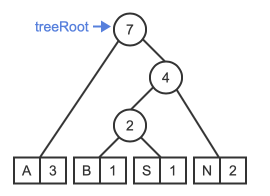
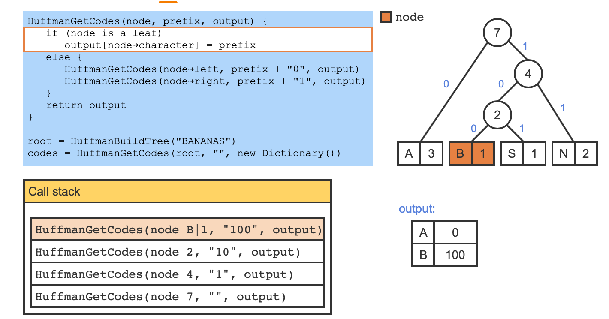

# Module 7 - Graphs and Trees

## 6.5 Graphs: Breadth-first search

```
BFS(startV) {
   Enqueue startV in frontierQueue
   Add startV to discoveredSet

   while ( frontierQueue is not empty ) {
      currentV = Dequeue from frontierQueue
      "Visit" currentV
      for each vertex adjV adjacent to currentV {
         if ( adjV is not in discoveredSet ) {
            Enqueue adjV in frontierQueue
            Add adjV to discoveredSet
         }
      }
   }
}
```


A "**visit**" may mean to print the vertex, append the vertex to a list, compare vertex data to a value and return the vertex if found, etc.

BFS terminates when frontierQueue is empty.

## 6.6 Graphs: Depth-first search

```
DFS(startV) {
   Push startV to stack

   while ( stack is not empty ) {
      currentV = Pop stack
      if ( currentV is not in visitedSet ) {
         "Visit" currentV
         Add currentV to visitedSet
         for each vertex adjV adjacent to currentV
            Push adjV to stack
      }
   }
}
```


DFS terminates when the stack is empty. 

A recursive DFS can be implemented using the **program stack instead of an explicit stack**. 

```
RecursiveDFS(currentV) {
   if ( currentV is not in visitedSet ) {
      Add currentV to visitedSet
      "Visit" currentV
      for each vertex adjV adjacent to currentV {
         RecursiveDFS(adjV)
      }
   }
}
```


## 6.12 Heaps using arrays

**Percolate algorithm**: Following is the pseudocode for the array-based percolate-up and percolate-down functions. The functions operate on an array that represents a max-heap and refer to nodes by array index.

```
MaxHeapPercolateUp(nodeIndex, heapArray) {
   while (nodeIndex > 0) {
      parentIndex = (nodeIndex - 1) / 2
      if (heapArray[nodeIndex] <= heapArray[parentIndex])
         return
      else {
         swap heapArray[nodeIndex] and heapArray[parentIndex]
         nodeIndex = parentIndex
      }
   }
}
```

```
MaxHeapPercolateDown(nodeIndex, heapArray, arraySize) {
   childIndex = 2 * nodeIndex + 1
   value = heapArray[nodeIndex]

   while (childIndex < arraySize) {
      // Find the max among the node and all the node's children
      maxValue = value
      maxIndex = -1
      for (i = 0; i < 2 && i + childIndex < arraySize; i++) {
         if (heapArray[i + childIndex] > maxValue) {
            maxValue = heapArray[i + childIndex]
            maxIndex = i + childIndex
         }
      }

      if (maxValue == value) {
         return
      }
      else {
         swap heapArray[nodeIndex] and heapArray[maxIndex]
         nodeIndex = maxIndex
         childIndex = 2 * nodeIndex + 1
      }
   }
}
```

## 7.1: Binary search trees

Figure 7.1.2: Searching a BST.

```
if (currentNode⇢key == desiredKey) { 
   return currentNode; // The desired node was found
}
else if (desiredKey < currentNode⇢key) {
   // Visit left child, repeat
}
else if (desiredKey > currentNode⇢key) {
   // Visit right child, repeat
}
```

7.2.1: BST recursive search algorithm.

```
BSTSearch(tree, key) {
   return BSTSearchRecursive(tree⇢root, key)
}

BSTSearchRecursive(node, key) {
   if (node is not null) {
      if (key == node⇢key)
         return node
      else if (key < node⇢key)
         return BSTSearchRecursive(node⇢left, key)
      else
         return BSTSearchRecursive(node⇢right, key)
   }
   return null
}
```

Figure 7.2.1: BST get parent algorithm.

```
BSTGetParent(tree, node) {
   return BSTGetParentRecursive(tree⇢root, node)
}

BSTGetParentRecursive(subtreeRoot, node) {
   if (subtreeRoot is null)
      return null

   if (subtreeRoot⇢left == node or 
       subtreeRoot⇢right == node) {
      return subtreeRoot
   }

   if (node⇢key < subtreeRoot⇢key) {
      return BSTGetParentRecursive(subtreeRoot⇢left, node)
   }
   return BSTGetParentRecursive(subtreeRoot⇢right, node)
}
```

Figure 7.2.2: Recursive BST insertion and removal.

```
BSTInsert(tree, node) {
   if (tree⇢root is null)
      tree⇢root = node
   else
      BSTInsertRecursive(tree⇢root, node)
}

BSTInsertRecursive(parent, nodeToInsert) {
   if (nodeToInsert⇢key < parent⇢key) {
      if (parent⇢left is null)
         parent⇢left = nodeToInsert
      else
         BSTInsertRecursive(parent⇢left, nodeToInsert)
   }
   else {
      if (parent⇢right is null)
         parent⇢right = nodeToInsert
      else
         BSTInsertRecursive(parent⇢right, nodeToInsert)
   }
}

BSTRemove(tree, key) {
   node = BSTSearch(tree, key)
   parent = BSTGetParent(tree, node)
   BSTRemoveNode(tree, parent, node)
}

BSTRemoveNode(tree, parent, node) {
   if (node == null)
      return false
        
   // Case 1: Internal node with 2 children
   if (node⇢left != null && node⇢right != null) {
      // Find successor and successor's parent
      succNode = node⇢right
      successorParent = node
      while (succNode⇢left != null) {
         successorParent = succNode
         succNode = succNode⇢left
      }
            
      // Copy the value from the successor node
      node = Copy succNode
            
      // Recursively remove successor
      BSTRemoveNode(tree, successorParent, succNode)
   }

   // Case 2: Root node (with 1 or 0 children)
   else if (node == tree⇢root) {
      if (node⇢left != null)
         tree⇢root = node⇢left
      else
         tree⇢root = node⇢right
   }

   // Case 3: Internal with left child only
   else if (node⇢left != null) {
      // Replace node with node's left child
      if (parent⇢left == node)
         parent⇢left = node⇢left
      else
         parent⇢right = node⇢left
   }

   // Case 4: Internal with right child only OR leaf
   else {
      // Replace node with node's right child
      if (parent⇢left == node)
         parent⇢left = node⇢right
      else
         parent⇢right = node⇢right
   }        

   return true
}
```

BSTRemoveNode makes at most 1 recursive call in the case of removing an internal node with 2 children. For 1 children, just move them up. 

## 7.5 BST height and insertion order

### 7.5.3: BSTGetHeight algorithm.

```
BSTGetHeight(node) {
   if (node is null) {
      return -1
   }
   leftHeight = BSTGetHeight(node⇢left)
   rightHeight = BSTGetHeight(node⇢right)
   return 1 + max(leftHeight, rightHeight)
}
```

## 7.6 BST parent node pointers

Figure 7.6.1: BSTInsert algorithm for BSTs with nodes containing parent pointers.

```
BSTInsert(tree, node) {
   if (tree⇢root == null) {
      tree⇢root = node
      node⇢parent = null
      return
   }

   cur = tree⇢root
   while (cur != null) {
      if (node⇢key < cur⇢key) {
         if (cur⇢left == null) {
            cur⇢left = node
            node⇢parent = cur
            cur = null
         }
         else
            cur = cur⇢left
      }
      else {
         if (cur⇢right == null) {
            cur⇢right = node
            node⇢parent = cur
            cur = null
         }
         else
            cur = cur⇢right
      }
   }
}
```

Figure 7.6.2: BSTReplaceChild algorithm.

```
BSTReplaceChild(parent, currentChild, newChild) {
   if (parent⇢left != currentChild &&
       parent⇢right != currentChild)
      return false

   if (parent⇢left == currentChild)
      parent⇢left = newChild
   else
      parent⇢right = newChild

   if (newChild != null)
      newChild⇢parent = parent
   return true
}
```

Figure 7.6.3: BSTRemoveKey and BSTRemoveNode algorithms for BSTs with nodes containing parent pointers.

```
BSTRemoveKey(tree, key) {
   node = BSTSearch(tree, key)
   BSTRemoveNode(tree, node)
}

BSTRemoveNode(tree, node) {
   if (node == null)
      return							// Continue

   // Case 1: Internal node with 2 children
   if (node⇢left != null && node⇢right != null) {
      // Find successor
      succNode = node⇢right
      while (succNode⇢left)
         succNode = succNode⇢left
            
      // Copy value/data from succNode to node
      node = Copy succNode
            
      // Recursively remove succNode
      BSTRemoveNode(tree, succNode)
   }

   // Case 2: Root node (with 1 or 0 children)
   else if (node == tree⇢root) {
      if (node⇢left != null)
         tree⇢root = node⇢left
      else
         tree⇢root = node⇢right
            
      // Make sure the new root, if non-null, has a null parent
      if (tree⇢root != null)
         tree⇢root⇢parent = null
   }

   // Case 3: Internal with left child only
   else if (node⇢left != null)
      BSTReplaceChild(node⇢parent, node, node⇢left)
   
   // Case 4: Internal with right child only OR leaf
   else
      BSTReplaceChild(node⇢parent, node, node⇢right)
}
```

## 7.8 BST search algorithm

7.8.1: BST search algorithm.

```
BSTSearch(tree, key) {
   cur = tree⇢root
   while (cur is not null) {
      if (key == cur⇢key) {
         return cur // Found
      }
      else if (key < cur⇢key) {
         cur = cur⇢left
      }
      else {
         cur = cur⇢right
      }
   }
   return null // Not found
}
```

## 7.9 BST remove algorithm

Figure 7.9.1: BST remove algorithm.

```
BSTRemove(tree, key) {
   par = null
   cur = tree⇢root
   while (cur is not null) { // Search for node
      if (cur⇢key == key) { // Node found 
         if (cur⇢left is null && cur⇢right is null) { // Remove leaf
            if (par is null) // Node is root
               tree⇢root = null
            else if (par⇢left == cur) 
               par⇢left = null
            else
               par⇢right = null
         }
         else if (cur⇢right is null) {                // Remove node with only left child
            if (par is null) // Node is root
               tree⇢root = cur⇢left
            else if (par⇢left == cur) 
               par⇢left = cur⇢left
            else
               par⇢right = cur⇢left
         }
         else if (cur⇢left is null) {                // Remove node with only right child
            if (par is null) // Node is root
               tree⇢root = cur⇢right
            else if (par⇢left == cur) 
               par⇢left = cur⇢right
            else
               par⇢right = cur⇢right
         }
         else {                                      // Remove node with two children
            // Find successor (leftmost child of right subtree)
            suc = cur⇢right
            while (suc⇢left is not null)
               suc = suc⇢left
            successorData = Create copy of suc's data
            BSTRemove(tree, suc⇢key)     // Remove successor
            Assign cur's data with successorData
         }
         return // Node found and removed
      }
      else if (cur⇢key < key) { // Search right
         par = cur
         cur = cur⇢right
      }
      else {                     // Search left
         par = cur
         cur = cur⇢left
      }
   }
   return // Node not found
}
```

## 7.10 BST inorder traversal

Figure 7.10.1: BST inorder traversal algorithm.

```
BSTPrintInorder(node) {
  if (node is null)
      return                     

  BSTPrintInorder(node⇢left)   
  Print node                     
  BSTPrintInorder(node⇢right)  
}
```

## 7.11 Heaps

## 7.12 Tries

## 7.13 Treaps

## 7.14 Sorting: Introduction

## 7.15 Bubble sort

Figure 7.15.1: Bubble sort algorithm. Because of the nested loops, bubble sort has a runtime of O(N2), on both best and worst. Bubble sort is often considered **impractical** for real-world use because many faster sorting algorithms exist.

```
BubbleSort(numbers, numbersSize) {
   for (i = 0; i < numbersSize - 1; i++) {
      for (j = 0; j < numbersSize - i - 1; j++) {
         if (numbers[j] > numbers[j+1]) {
            temp = numbers[j]
            numbers[j] = numbers[j + 1]
            numbers[j + 1] = temp
         }
      }
   }
}
```

## 7.16 Quicksort

7.16.1: Quicksort partitions data into a low partition with values ≤ pivot and a high partition with values ≥ pivot.

```
Partition(numbers, lowIndex, highIndex) {
   // Pick middle element as pivot
   midpoint = lowIndex + (highIndex - lowIndex) / 2
   pivot = numbers[midpoint]
 
   done = false
   while (!done) {
      // Increment lowIndex while numbers[lowIndex] < pivot
      while (numbers[lowIndex] < pivot) {
         lowIndex += 1
      }
    
      // Decrement highIndex while pivot < numbers[highIndex]
      while (pivot < numbers[highIndex]) {
         highIndex -= 1
      }
    
      // If zero or one elements remain, then all numbers are
      // partitioned. Return highIndex.
      if (lowIndex >= highIndex) {
         done = true
      }
      else {
         // Swap numbers[lowIndex] and numbers[highIndex]
         temp = numbers[lowIndex]
         numbers[lowIndex] = numbers[highIndex]
         numbers[highIndex] = temp
       
         // Update lowIndex and highIndex
         lowIndex += 1
         highIndex -= 1
      }
   }
 
   return highIndex
}
```


```
Quicksort(numbers, lowIndex, highIndex) {
   if (lowIndex >= highIndex) {
      return
   }

   lowEndIndex = Partition(numbers, lowIndex, highIndex)
   Quicksort(numbers, lowIndex, lowEndIndex)
   Quicksort(numbers, lowEndIndex + 1, highIndex)
}
```

Figure 7.16.1: Quicksort algorithm.

```
Partition(numbers, lowIndex, highIndex) {
   // Pick middle element as pivot
   midpoint = lowIndex + (highIndex - lowIndex) / 2
   pivot = numbers[midpoint]
   
   done = false
   while (!done) {
      // Increment lowIndex while numbers[lowIndex] < pivot
      while (numbers[lowIndex] < pivot) {
         lowIndex += 1
      }
      
      // Decrement highIndex while pivot < numbers[highIndex]
      while (pivot < numbers[highIndex]) {
         highIndex -= 1
      }
      
      // If zero or one elements remain, then all numbers are 
      // partitioned. Return highIndex.
      if (lowIndex >= highIndex) {
         done = true
      }
      else {
         // Swap numbers[lowIndex] and numbers[highIndex]
         temp = numbers[lowIndex]
         numbers[lowIndex] = numbers[highIndex]
         numbers[highIndex] = temp
         
         // Update lowIndex and highIndex
         lowIndex += 1
         highIndex -= 1
      }
   }
   
   return highIndex
}

Quicksort(numbers, lowIndex, highIndex) {
   // Base case: If the partition size is 1 or zero 
   // elements, then the partition is already sorted
   if (lowIndex >= highIndex) {
      return
   }
   
   // Partition the data within the array. Value lowEndIndex 
   // returned from partitioning is the index of the low 
   // partition's last element.
   lowEndIndex = Partition(numbers, lowIndex, highIndex)
   
   // Recursively sort low partition (lowIndex to lowEndIndex) 
   // and high partition (lowEndIndex + 1 to highIndex)
   Quicksort(numbers, lowIndex, lowEndIndex)
   Quicksort(numbers, lowEndIndex + 1, highIndex)
}

main() {
   numbers[] = { 10, 2, 78, 4, 45, 32, 7, 11 }
   NUMBERS_SIZE = 8
   i = 0
   
   print("UNSORTED: ")
   for(i = 0; i < NUMBERS_SIZE; ++i) {
      print(numbers[i] + " ")
   }
   printLine()
   
   // Initial call to quicksort
   Quicksort(numbers, 0, NUMBERS_SIZE - 1)
   
   print("SORTED: ")
   for(i = 0; i < NUMBERS_SIZE; ++i) {
      print(numbers[i] + " ")
   }
   printLine()
}
```

## 8.1 Selection sort

Selection sort has the advantage of being easy to code, involving one loop nested within another loop, as shown below.

Figure 8.1.1: Selection sort algorithm.

```
SelectionSort(numbers, numbersSize) {
   i = 0
   j = 0
   indexSmallest = 0
   temp = 0  // Temporary variable for swap
   
   for (i = 0; i < numbersSize - 1; ++i) {
      
      // Find index of smallest remaining element
      indexSmallest = i
      for (j = i + 1; j < numbersSize; ++j) {
         
         if ( numbers[j] < numbers[indexSmallest] ) {
            indexSmallest = j
         }
      }
      
      // Swap numbers[i] and numbers[indexSmallest]
      temp = numbers[i]
      numbers[i] = numbers[indexSmallest]
      numbers[indexSmallest] = temp
   }
}

main() {
   numbers[] = { 10, 2, 78, 4, 45, 32, 7, 11 }
   NUMBERS_SIZE = 8
   i = 0
   
   print("UNSORTED: ")
   for (i = 0; i < NUMBERS_SIZE; ++i) {
      print(numbers[i] + " ")
   }
   printLine()
   
   SelectionSort(numbers, NUMBERS_SIZE)
   
   print("SORTED: ")
   for (i = 0; i < NUMBERS_SIZE; ++i) {
      print(numbers[i] + " ")
   }
   printLine()   
}
```

## 8.2 Quickselect

Figure 8.2.1: Quickselect algorithm.

```
// Selects kth smallest element, where k is 0-based
Quickselect(numbers, first, last, k) {
   if (first >= last)
      return numbers[first]

   lowLastIndex = Partition(numbers, first, last)

   if (k <= lowLastIndex)
      return Quickselect(numbers, first, lowLastIndex, k)
   return Quickselect(numbers, lowLastIndex + 1, last, k)
}
```

## 8.3 Insertion sort

Figure 8.3.1: Insertion sort algorithm.

Initially, the first element (i.e., element at index 0) is assumed to be sorted, so the outer for loop initializes i to 1

```
InsertionSort(numbers, numbersSize) {
   i = 0
   j = 0
   temp = 0  // Temporary variable for swap
   
   for (i = 1; i < numbersSize; ++i) {
      j = i
      // Insert numbers[i] into sorted part
      // stopping once numbers[i] in correct position
      while (j > 0 && numbers[j] < numbers[j - 1]) {
         
         // Swap numbers[j] and numbers[j - 1]
         temp = numbers[j]
         numbers[j] = numbers[j - 1]
         numbers[j - 1] = temp
         --j
      }
   }
}

main() {
   numbers = { 10, 2, 78, 4, 45, 32, 7, 11 }
   NUMBERS_SIZE = 8
   i = 0
   
   print("UNSORTED: ")
   for(i = 0; i < NUMBERS_SIZE; ++i) {
      print(numbers[i] + " ")
   }
   printLine()
   
   InsertionSort(numbers, NUMBERS_SIZE)
   
   print("SORTED: ")
   for(i = 0; i < NUMBERS_SIZE; ++i) {
      print(numbers[i] + " ")
   }
   printLine()
}
```

## 8.4 Shell sort

8.4.3: Interleaved insertion sort.

- InsertionSortInterleaved(list, 9, 0, 3)
- InsertionSortInterleaved(list, 9, 1, 3)
- InsertionSortInterleaved(list, 9, 2, 3)
- InsertionSortInterleaved(list, 9, 0, 1)

```
InsertionSortInterleaved(numbers, numbersSize, startIndex, gap) {
   i = 0
   j = 0
   temp = 0  // Temporary variable for swap

   for (i = startIndex + gap; i < numbersSize; i = i + gap) {
      j = i
      while (j - gap >= startIndex && numbers[j] < numbers[j - gap]) {
         temp = numbers[j]
         numbers[j] = numbers[j - gap]
         numbers[j - gap] = temp
         j = j - gap
      }
   }
}
```

8.4.5: Shell sort algorithm.

- ShellSort(list, 15, (5, 3, 1))

```
ShellSort(numbers, numbersSize, gapValues) {
   for each (gapValue in gapValues) {
      for (i = 0; i < gapValue; i++) {
         InsertionSortInterleaved(numbers, numbersSize, i, gapValue)
      }
   }
}
```

## 8.5 Merge sort

Figure 8.5.1: Merge sort algorithm.

```
Merge(numbers, i, j, k) {
   mergedSize = k - i + 1                // Size of merged partition
   mergePos = 0                          // Position to insert merged number
   leftPos = 0                           // Position of elements in left partition
   rightPos = 0                          // Position of elements in right partition
   mergedNumbers = new int[mergedSize]   // Dynamically allocates temporary array
                                         // for merged numbers
   
   leftPos = i                           // Initialize left partition position
   rightPos = j + 1                      // Initialize right partition position
   
   // Add smallest element from left or right partition to merged numbers
   while (leftPos <= j && rightPos <= k) {
      if (numbers[leftPos] <= numbers[rightPos]) {
         mergedNumbers[mergePos] = numbers[leftPos]
         ++leftPos
      }
      else {
         mergedNumbers[mergePos] = numbers[rightPos]
         ++rightPos
         
      }
      ++mergePos
   }
   
   // If left partition is not empty, add remaining elements to merged numbers
   while (leftPos <= j) {
      mergedNumbers[mergePos] = numbers[leftPos]
      ++leftPos
      ++mergePos
   }
   
   // If right partition is not empty, add remaining elements to merged numbers
   while (rightPos <= k) {
      mergedNumbers[mergePos] = numbers[rightPos]
      ++rightPos
      ++mergePos
   }
   
   // Copy merge number back to numbers
   for (mergePos = 0; mergePos < mergedSize; ++mergePos) {
      numbers[i + mergePos] = mergedNumbers[mergePos]
   }
}

MergeSort(numbers, i, k) {
   j = 0
   
   if (i < k) {
      j = (i + k) / 2  // Find the midpoint in the partition
      
      // Recursively sort left and right partitions
      MergeSort(numbers, i, j)
      MergeSort(numbers, j + 1, k)
      
      // Merge left and right partition in sorted order
      Merge(numbers, i, j, k)
   }
}

main() {
   numbers = { 10, 2, 78, 4, 45, 32, 7, 11 }
   NUMBERS_SIZE = 8
   i = 0
   
   print("UNSORTED: ")
   for(i = 0; i < NUMBERS_SIZE; ++i) {
      print(numbers[i] + " ")
   }
   printLine()
   
   MergeSort(numbers, 0, NUMBERS_SIZE - 1)
   
   print("SORTED: ")
   for(i = 0; i < NUMBERS_SIZE; ++i) {
      print(numbers[i] + " ")
   }
   printLine()
}
```

## 8.6 Heap sort

Figure 8.6.1: Heap sort.

```
Heapsort(numbers, numbersSize) {
   // Heapify numbers array
   for (i = numbersSize / 2 - 1; i >= 0; i--) {
      MaxHeapPercolateDown(i, numbers, numbersSize)
   }

   for (i = numbersSize - 1; i > 0; i--) {
      Swap numbers[0] and numbers[i]
      MaxHeapPercolateDown(0, numbers, i)
   }
}
```

## 8.7 Radix sort

```
RadixSort(array, arraySize) {
   buckets = create array of 10 buckets

   // Find the max length, in number of digits
   maxDigits = RadixGetMaxLength(array, arraySize)
      
   // Start with the least significant digit
   pow10 = 1
   for (digitIndex = 0; digitIndex < maxDigits; digitIndex++) {
      for (i = 0; i < arraySize; i++) {
         bucketIndex = abs(array[i] / pow10) % 10
         Append array[i] to buckets[bucketIndex]
      }
      arrayIndex = 0
      for (i = 0; i < 10; i++) {
         for (j = 0; j < buckets[i].size(); j++)
            array[arrayIndex++] = buckets[i][j]
      }
      pow10 = 10 * pow10
      Clear all buckets
   }
}
```

```
// Returns the maximum length, in number of digits, out of all elements in the array
RadixGetMaxLength(array, arraySize) {
   maxDigits = 0
   for (i = 0; i < arraySize; i++) {
      digitCount = RadixGetLength(array[i])
      if (digitCount > maxDigits)
         maxDigits = digitCount
   }
   return maxDigits
}

// Returns the length, in number of digits, of value
RadixGetLength(value) {
   if (value == 0)
      return 1

   digits = 0
   while (value != 0) {
      digits = digits + 1
      value = value / 10
   }
   return digits
}
```

Figure 8.7.2: RadixSort algorithm (for negative and non-negative integers).

Sort positive and negative separetely. Reverse negative result and merge

```
RadixSort(array, arraySize) {
   buckets = create array of 10 buckets

   // Find the max length, in number of digits
   maxDigits = RadixGetMaxLength(array, arraySize)
        
   pow10 = 1
   for (digitIndex = 0; digitIndex < maxDigits; digitIndex++) {
      for (i = 0; i < arraySize; i++) {
         bucketIndex = GetLowestDigit(array[i] / pow10)
         Append array[i] to buckets[bucketIndex]
      }
      arrayIndex = 0
      for (i = 0; i < 10; i++) {
         for (j = 0; j < buckets[i].size(); j++) {
            array[arrayIndex] = buckets[i][j]
            arrayIndex = arrayIndex + 1
         }
      }
      pow10 = pow10 * 10
      Clear all buckets
   }

   negatives = all negative values from array
   nonNegatives = all non-negative values from array
   Reverse order of negatives
   Concatenate negatives and nonNegatives into array
}
```

## 8.8 Sorting linked lists

```
ListInsertionSortDoublyLinked(list) {
   curNode = list⇢head⇢next
   while (curNode != null) {
      nextNode = curNode⇢next
      searchNode = curNode⇢prev
      while (searchNode != null and searchNode⇢data > curNode⇢data) {
         searchNode = searchNode⇢prev
      }
      // Remove and re-insert curNode
      ListRemove(list, curNode)
      if (searchNode == null) {
         curNode⇢prev = null
         ListPrepend(list, curNode)
      }
      else {
         ListInsertAfter(list, searchNode, curNode)
      }
      // Advance to next node
      curNode = nextNode
   }
}
```

8.8.3: Sorting a singly-linked list with insertion sort.

Need transverse

```
ListInsertionSortSinglyLinked(list) {
   beforeCurrent = list⇢head
   curNode = list⇢head⇢next
   while (curNode != null) {
      next = curNode⇢next
      position = ListFindInsertionPosition(list, curNode⇢data)

      if (position == beforeCurrent)
         beforeCurrent = curNode
      else {
         ListRemoveAfter(list, beforeCurrent)
         if (position == null)
            ListPrepend(list, curNode)
         else // ListInsertAfter is called for nodes that are not already >= or <= all previous nodes. 
            ListInsertAfter(list, position, curNode) 
      }

      curNode = next
   }
}
```

Figure 8.8.1: ListFindInsertionPosition algorithm.

```
ListFindInsertionPosition(list, dataValue) {
   curNodeA = null
   curNodeB = list⇢head
   while (curNodeB != null and dataValue > curNodeB⇢data) {
      curNodeA = curNodeB
      curNodeB = curNodeB⇢next
   }
   return curNodeA
}
```

## 8.11 Huffman compression

8.11.3: Building a character frequency table.

```
BuildCharacterFrequencyTable(inputString) {
   table = new Dictionary()
   for (i = 0; i < inputString⇢length; i++) {
      currentCharacter = inputString[i]
      if (table has key for currentCharacter) {
         table[currentCharacter] = table[currentCharacter] + 1
      }
      else {
         table[currentCharacter] = 1
      }
   }
   return table
}

BuildCharacterFrequencyTable("APPLES AND BANANAS")
```

8.11.7: Building a Huffman tree.

```
HuffmanBuildTree(inputString) {
   // First build the frequency table
   table = BuildCharacterFrequencyTable(inputString)

   // Make a priority queue of nodes
   nodes = new PriorityQueue()
   for ((character, frequency) in table) {
      newLeaf = new LeafNode(frequency, character)
      Enqueue newLeaf into nodes
   }
   // Make parent nodes up to the root
   while (nodes⇢length > 1) {
      // Dequeue 2 lowest-priority nodes
      left = Dequeue(nodes)
      right = Dequeue(nodes)

      // Make a parent for the two nodes
      freqSum = right⇢frequency + left⇢frequency
      parent = new InternalNode(freqSum, left, right)

      // Enqueue parent back into priority queue
      Enqueue parent into nodes
   }
   return Dequeue(nodes)
}

treeRoot = HuffmanBuildTree("BANANAS")
```



8.11.9: Getting Huffman codes.

```
HuffmanGetCodes(node, prefix, output) {
   if (node is a leaf)
      output[node⇢character] = prefix
   else {
      HuffmanGetCodes(node⇢left, prefix + "0", output)
      HuffmanGetCodes(node⇢right, prefix + "1", output)
   }
   return output
}

root = HuffmanBuildTree("BANANAS")
codes = HuffmanGetCodes(root, "", new Dictionary())
```



Figure 8.11.1: HuffmanCompress function.

```
HuffmanCompress(inputString) {
   // Build the Huffman tree
   root = HuffmanBuildTree(inputString)

   // Get the compression codes from the tree
   codes = HuffmanGetCodes(root, "", new Dictionary())
   
   // Build the compressed result
   result = ""
   for c in inputString {
      result += codes[c]
   }
   return result
}
```

Figure 8.11.2: HuffmanDecompress function.

```
HuffmanDecompress(compressedString, treeRoot) {
   node = treeRoot
   result = ""
   for (bit in compressedString) {
      // Go to left or right child based on bit value
      if (bit == 0)
         node = node⇢left
      else
         node = node⇢right

      // If the node is a leaf, add the character to the 
      // decompressed result and go back to the root node
      if (node is a leaf) {
         result += node⇢character
         node = treeRoot
      }
   }
   return result
}
```
