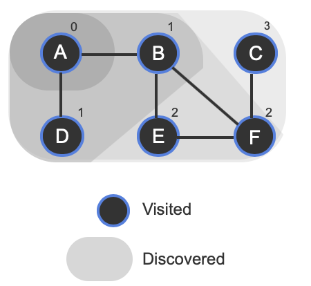
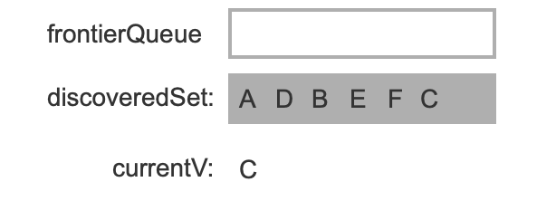
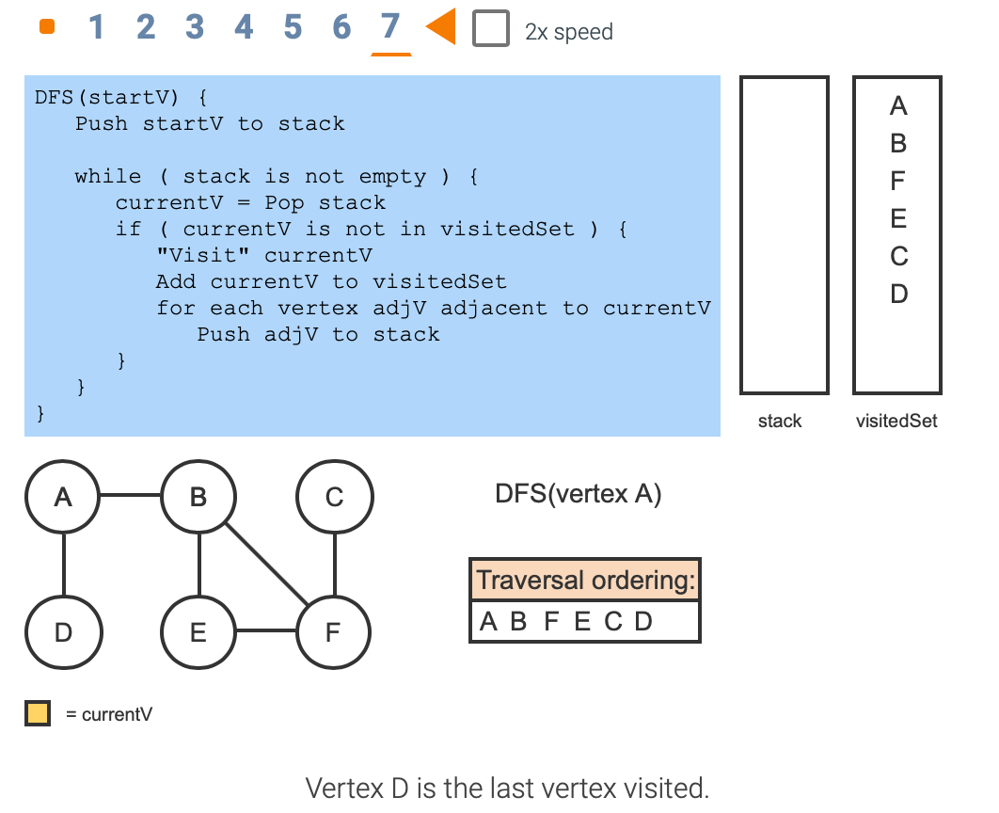

# Module 7 - Graphs and Trees

## 6.5 Graphs: Breadth-first search

```
BFS(startV) {
   Enqueue startV in frontierQueue
   Add startV to discoveredSet

   while ( frontierQueue is not empty ) {
      currentV = Dequeue from frontierQueue
      "Visit" currentV
      for each vertex adjV adjacent to currentV {
         if ( adjV is not in discoveredSet ) {
            Enqueue adjV in frontierQueue
            Add adjV to discoveredSet
         }
      }
   }
}
```



A "**visit**" may mean to print the vertex, append the vertex to a list, compare vertex data to a value and return the vertex if found, etc.

BFS terminates when frontierQueue is empty.

## 6.6 Graphs: Depth-first search

```
DFS(startV) {
   Push startV to stack

   while ( stack is not empty ) {
      currentV = Pop stack
      if ( currentV is not in visitedSet ) {
         "Visit" currentV
         Add currentV to visitedSet
         for each vertex adjV adjacent to currentV
            Push adjV to stack
      }
   }
}
```



DFS terminates when the stack is empty. 

A recursive DFS can be implemented using the **program stack instead of an explicit stack**. 

```
RecursiveDFS(currentV) {
   if ( currentV is not in visitedSet ) {
      Add currentV to visitedSet
      "Visit" currentV
      for each vertex adjV adjacent to currentV {
         RecursiveDFS(adjV)
      }
   }
}
```


## 6.12 Heaps using arrays

**Percolate algorithm**: Following is the pseudocode for the array-based percolate-up and percolate-down functions. The functions operate on an array that represents a max-heap and refer to nodes by array index.

```
MaxHeapPercolateUp(nodeIndex, heapArray) {
   while (nodeIndex > 0) {
      parentIndex = (nodeIndex - 1) / 2
      if (heapArray[nodeIndex] <= heapArray[parentIndex])
         return
      else {
         swap heapArray[nodeIndex] and heapArray[parentIndex]
         nodeIndex = parentIndex
      }
   }
}
```

```
MaxHeapPercolateDown(nodeIndex, heapArray, arraySize) {
   childIndex = 2 * nodeIndex + 1
   value = heapArray[nodeIndex]

   while (childIndex < arraySize) {
      // Find the max among the node and all the node's children
      maxValue = value
      maxIndex = -1
      for (i = 0; i < 2 && i + childIndex < arraySize; i++) {
         if (heapArray[i + childIndex] > maxValue) {
            maxValue = heapArray[i + childIndex]
            maxIndex = i + childIndex
         }
      }

      if (maxValue == value) {
         return
      }
      else {
         swap heapArray[nodeIndex] and heapArray[maxIndex]
         nodeIndex = maxIndex
         childIndex = 2 * nodeIndex + 1
      }
   }
}
```

