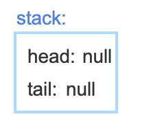
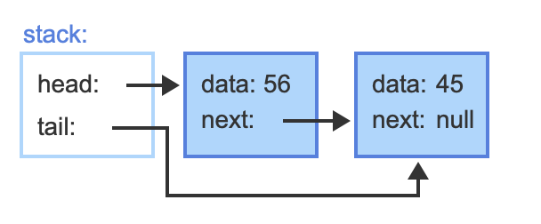

### 1.5 Heuristics

```
Knapsack01(knapsack, itemList, itemListSize) {
   Sort itemList descending by value
   remaining = knapsack⇢maximumWeight
   for (i = 0; i < itemListSize; i++) {
      if (itemList[i]⇢weight <= remaining) {
         Put itemList[i] in knapsack
         remaining = remaining - itemList[i]⇢weight
      }
   }
}
```

### 1.6 Relation between data structures and algorithms

```
DisplayTopFiveSalespersons(allSalespersons) {
   // topSales array has 5 elements
   // Array elements have subitems for name and total sales
   // Array will be sorted from highest total sales to lowest total sales
   topSales = Create array with 5 elements 
   
   // Initialize all array elements with a negative sales total
   for (i = 0; i < topSales⇢length; ++i) {
      topSales[i]⇢name = ""
      topSales[i]⇢salesTotal = -1
   }

   for each salesPerson in allSalespersons {
      // If salesPerson's total sales is greater than the last
      // topSales element, salesPerson is one of the top five so far
      if (salesPerson⇢salesTotal > topSales[topSales⇢length - 1]⇢salesTotal) {

         // Assign the last element in topSales with the current salesperson
         topSales[topSales⇢length - 1]⇢name =  salesPerson⇢name 
         topSales[topSales⇢length - 1]⇢salesTotal =  salesPerson⇢salesTotal 

         // Sort topSales in descending order
         SortDescending(topSales)
      }
   }

   // Display the top five salespersons
   for (i = 0; i < topSales⇢length; ++i) {
      Display topSales[i] 
   }
}
```

### 1.7 Algorithm efficiency

```
FindFirstLessThan(list, listSize, value) {
   for (i = 0; i < listSize; i++) {
      if (list[i] < value)
         return list[i]
   }
   return value // no lesser value found
}
```

```
FindMax(list, listSize) {
   if (listSize >= 1) {
      maximum = list[0]
      i = 1
      while (i < listSize) {
         if (list[i] > maximum) {
            maximum = list[i]
         }
         i = i + 1
      }
      return maximum
   }
}
```

builds and returns a list of even numbers from the input list.

```
GetEvens(list, listSize) {
   i = 0
   evensList = Create new, empty list
   while (i < listSize) {
      if (list[i] % 2 == 0)
         Add list[i] to evensList
      i = i + 1
   }
   return evensList
}
```

### 1.10 O notation

$O(1)$, Constant

```
FindMin(x, y) {
   if (x < y) {
      return x
   }
   else {
      return y
   }
}
```


$O(logN)$, Logarithmic

```
BinarySearch(numbers, N, key) {
   mid = 0
   low = 0
   high = N - 1
   
   while (high >= low) {
      mid = (high + low) / 2
      if (numbers[mid] < key) {
         low = mid + 1
      }
      else if (numbers[mid] > key) {
         high = mid - 1
      }
      else {
         return mid
      }
   }
   
   return -1   // not found
}
```


$O(N)$, Linear

```
LinearSearch(numbers, numbersSize, key) {
  for (i = 0; i < numbersSize; ++i) {
      if (numbers[i] == key) {
         return i
      }
   }
   
   return -1 // not found
}
```


$O(logN)$, Logarithmic

```
MergeSort(numbers, i, k) {
   j = 0
   if (i < k) {
      j = (i + k) / 2              // Find midpoint 
      
      MergeSort(numbers, i, j)     // Sort left part
      MergeSort(numbers, j + 1, k) // Sort right part
      Merge(numbers, i, j, k)      // Merge parts
   }
}
```


$O(N^2)$, Quadratic

```
SelectionSort(numbers, numbersSize) { 
   for (i = 0; i < numbersSize; ++i) {
      indexSmallest = i
      for (j = i + 1; j < numbersSize; ++j) {
         if (numbers[j] < numbers[indexSmallest]) {
            indexSmallest = j
         }
      }
      
      temp = numbers[i]
      numbers[i] = numbers[indexSmallest]
      numbers[indexSmallest] = temp
   }
}
```


$O(c^N)$, Exponential

```
Fibonacci(N) {
  if ((1 == N) || (2 == N)) {
     return 1
  }
  return Fibonacci(N-1) + Fibonacci(N-2)
}
```

### 2.2 Stacks using linked lists

```
StackPush(stack, item) {
   newNode = Allocate new linked list node
   newNode⇢next = null
   newNode⇢data = item

   // Insert as list head (top of stack)
   ListPrepend(stack, newNode)
}

StackPop(stack) {
   headData = stack⇢head⇢data
   ListRemoveAfter(stack, null)
   return headData
}
```

					


### 3.3 Recursive definitions

```
Factorial(N) {
   if (N == 1)
      return 1
   else
      return N * Factorial(N - 1)
}
```

```
CumulativeSum(N) {
   if (N == 0)
      return 0
   else
      return N + CumulativeSum(N - 1)
}
```

```
ReverseList(list, startIndex, endIndex) {
   if (startIndex >= endIndex)
      return
   else {
      Swap elements at startIndex and endIndex
      ReverseList(list, startIndex + 1, endIndex - 1)
   }
}
```

### 3.5 Recursive algorithms

```
FibonacciNumber(termIndex) {
   if (termIndex == 0)
      return 0
   else if (termIndex == 1)
      return 1
   else
      return FibonacciNumber(termIndex - 1) + FibonacciNumber(termIndex - 2)
}
```

```
BinarySearch(numbers, low, high, key) {
   if (low > high)
      return -1

   mid = (low + high) / 2						# / always return float. // might return float like 5//2.  
   if (numbers[mid] < key) {
      return BinarySearch(numbers, mid + 1, high, key)
   }
   else if (numbers[mid] > key) {
      return BinarySearch(numbers, low, mid - 1, key)
   }
   return mid
}
```

### 4.2 Queues using linked lists

```
QueueEnqueue(queue, item) {
   newNode = Allocate new linked list node
   newNode⇢next = null
   newNode⇢data = item

   // Insert node as list tail (end of queue)
   ListAppend(queue, newNode)
}

QueueDequeue(queue) {
   headData = queue⇢head⇢data
   ListRemoveAfter(queue, null)
   return headData
}
```

### 4.5 Array-based lists

```
ArrayListAppend(list, newItem) {
   if (list⇢allocationSize == list⇢length) {
      ArrayListResize(list, list⇢length * 2)
   }
   list⇢array[list⇢length] = newItem
   list⇢length = list⇢length + 1
}

ArrayListResize(list, newAllocationSize) {
   newArray = new array of size newAllocationSize
   Copy all elements from list⇢array to newArray
   list⇢array = newArray
   list⇢allocationSize = newAllocationSize
}
```

```
ArrayListPrepend(list, newItem) {
   if (list⇢allocationSize == list⇢length) {
      ArrayListResize(list, list⇢length * 2)
   }
   for (i = list⇢length; i > 0; i--) {
      list⇢array[i] = list⇢array[i - 1]
   }
   list⇢array[0] = newItem
   list⇢length = list⇢length + 1
}

ArrayListInsertAfter(list, index, newItem) {
   if (list⇢allocationSize == list⇢length) {
      ArrayListResize(list, list⇢length * 2)
   }
   for (i = list⇢length; i > index + 1; i--) {
      list⇢array[i] = list⇢array[i - 1]
   }
   list⇢array[index + 1] = newItem
   list⇢length = list⇢length + 1
}
```

```
ArrayListSearch(list, item) {
   for (i = 0; i < list⇢length; i++) {
      if (list⇢array[i] == item) {
         return i
      }
   }
   return -1 // not found
}
 
ArrayListRemoveAt(list, index) {
   if (index >= 0 && index < list⇢length) {
      for (i = index; i < list⇢length - 1; i++) {
         list⇢array[i] = list⇢array[i + 1]
      }
      list⇢length = list⇢length - 1
   }
}
```

### 4.6: Singly-linked lists

```
ListAppend(list, newNode) {
   if (list⇢head == null) { // List empty
      list⇢head = newNode
      list⇢tail = newNode
   }
   else{
      list⇢tail⇢next = newNode
      list⇢tail = newNode
   }
}
```

```
ListPrepend(list, newNode) {
   if (list⇢head == null) { // list empty
      list⇢head = newNode
      list⇢tail = newNode
   }
   else {
      newNode⇢next = list⇢head
      list⇢head = newNode
   }
}
```

```
ListInsertAfter(list, curNode, newNode) {
   if (list⇢head == null) { // List empty
      list⇢head = newNode
      list⇢tail = newNode
   }
   else if (curNode == list⇢tail) { // Insert after tail
      list⇢tail⇢next = newNode
      list⇢tail = newNode
   }
   else {
      newNode⇢next = curNode⇢next
      curNode⇢next = newNode
   }
}
```

```
ListRemoveAfter(list, curNode) {
   // Special case, remove head
   if (curNode is null && list⇢head is not null) {
      sucNode = list⇢head⇢next
      list⇢head = sucNode

      if (sucNode is null) { // Removed last item
         list⇢tail = null
      }
   }
   else if (curNode⇢next is not null) {
      sucNode = curNode⇢next⇢next
      curNode⇢next = sucNode

      if (sucNode is null) { // Removed tail
         list⇢tail = curNode
      }
   }
}
```

### 4.9 Linked list traversal

```
ListTraverse(list) {
   curNode = list⇢head // Start at head

   while (curNode is not null) { 
      Print curNode's data        
      curNode = curNode⇢next
   }
}
```

Reverse Traversal: Doubly linked list

```
ListTraverseReverse(list) {
   curNode = list⇢tail // Start at tail

   while (curNode is not null) { 
      Print curNode's data        
      curNode = curNode⇢prev
   }
}
```

Search, return node (not data!)

```
ListSearch(list, key) {
   curNode = list⇢head
   while (curNode is not null) {
      if (curNode⇢data == key) {
         return curNode
      }
      curNode = curNode⇢next
   }
   return null
}
```

Recursion

```
ListTraverse(list) {
   ListTraverseRecursive(list⇢head)
}

ListTraverseRecursive(node) {
   if (node is not null) {
      Visit node
      ListTraverseRecursive(node⇢next)
   }
}
```

ListSearch and ListSearchRecursive functions

```
ListSearch(list, key) {
   return ListSearchRecursive(key, list⇢head)
}

ListSearchRecursive(key, node) {
   if (node is not null) {
      if (node⇢data == key) {
         return node
      }
      return ListSearchRecursive(key, node⇢next)
   }
   return null
}
```


```
ListTraverseReverse(list) {
   ListTraverseReverseRecursive(list⇢head)
}

ListTraverseReverseRecursive(node) {
   if (node is not null) {
      ListTraverseReverseRecursive(node⇢next)
      Visit node
   }
}
```

Linked lists: Recursion

```
ListTraverse(list) {
   ListTraverseRecursive(list⇢head)
}

ListTraverseRecursive(node) {
   if (node is not null) {
      Visit node
      ListTraverseRecursive(node⇢next)
   }
}
```

```
ListSearch(list, key) {
   return ListSearchRecursive(key, list⇢head)
}

ListSearchRecursive(key, node) {
   if (node is not null) {
      if (node⇢data == key) {
         return node
      }
      return ListSearchRecursive(key, node⇢next)
   }
   return null
}
```

 the recursive call is made first, the list is traversed in reverse order.

```
ListTraverseReverse(list) {
   ListTraverseReverseRecursive(list⇢head)
}

ListTraverseReverseRecursive(node) {
   if (node is not null) {
      ListTraverseReverseRecursive(node⇢next)
      Visit node
   }
}
```

### 5.1 Doubly-linked lists

```
ListAppend(list, newNode) {
   if (list⇢head == null) { // List empty
      list⇢head = newNode
      list⇢tail = newNode
   }
   else {
      list⇢tail⇢next = newNode
      newNode⇢prev = list⇢tail
      list⇢tail = newNode
   }
}
```

```
ListPrepend(list, newNode) {
   if (list⇢head == null) { // List empty
      list⇢head = newNode
      list⇢tail = newNode
   }
   else {
      newNode⇢next = list⇢head
      list⇢head⇢prev = newNode
      list⇢head = newNode
   }
}
```

```
ListInsertAfter(list, curNode, newNode) {
   if (list⇢head == null) { // List empty
      list⇢head = newNode
      list⇢tail = newNode
   }
   else if (curNode == list⇢tail) { // Insert after tail
      list⇢tail⇢next = newNode
      newNode⇢prev = list⇢tail
      list⇢tail = newNode
   }
   else {
      sucNode = curNode⇢next
      newNode⇢next = sucNode
      newNode⇢prev = curNode
      curNode⇢next = newNode
      sucNode⇢prev = newNode
   }
}
```

```
ListRemove(list, curNode) {
   sucNode = curNode⇢next
   predNode = curNode⇢prev

   if (sucNode is not null) {
      sucNode⇢prev = predNode
   }

   if (predNode is not null) {
      predNode⇢next = sucNode
   }

   if (curNode == list⇢head) { // Removed head
      list⇢head = sucNode
   }

   if (curNode == list⇢tail) { // Removed tail
      list⇢tail = predNode
   }
}
```

#### Singly-linked list with dummy node

```
ListAppend(list, newNode) {
   list⇢tail⇢next = newNode
   list⇢tail = newNode
}


ListPrepend(list, newNode) {
   newNode⇢next = list⇢head⇢next
   list⇢head⇢next = newNode
   if (list⇢head == list⇢tail) { // empty list
      list⇢tail = newNode;
   }
}


ListInsertAfter(list, curNode, newNode) {
   if (curNode == list⇢tail) { // Insert after tail
      list⇢tail⇢next = newNode
      list⇢tail = newNode
   }
   else { 
      newNode⇢next = curNode⇢next
      curNode⇢next = newNode
   }
}


ListRemoveAfter(list, curNode) {
   if (curNode is not null and curNode⇢next is not null) {
      sucNode = curNode⇢next⇢next
      curNode⇢next = sucNode
     
      if (sucNode is null) {
         // Removed tail
         list⇢tail = curNode
      }
   }
}
```

#### Doubly-linked list with dummy node

```
ListAppend(list, newNode) {
   list⇢tail⇢next = newNode
   newNode⇢prev = list⇢tail
   list⇢tail = newNode
}


ListPrepend(list, newNode) {
   firstNode = list⇢head⇢next

   // Set the next and prev pointers for newNode
   newNode⇢next = list⇢head⇢next
   newNode⇢prev = list⇢head

   // Set the dummy node's next pointer
   list⇢head⇢next = newNode

   // Set prev on former first node
   if (firstNode is not null) {
      firstNode⇢prev = newNode
   }
}


ListInsertAfter(list, curNode, newNode) {
   if (curNode == list⇢tail) { // Insert after tail
      list⇢tail⇢next = newNode
      newNode⇢prev = list⇢tail
      list⇢tail = newNode
   }
   else {
      sucNode = curNode⇢next
      newNode⇢next = sucNode
      newNode⇢prev = curNode
      curNode⇢next = newNode
      sucNode⇢prev = newNode
   }
}


ListRemove(list, curNode) {
   if (curNode == list⇢head) {
      // Dummy node cannot be removed
      return
   }

   sucNode = curNode⇢next 
   predNode = curNode⇢prev 
  
   if (sucNode is not null) {
      sucNode⇢prev = predNode   
   }
  
   // Predecessor node is always non-null
   predNode⇢next = sucNode
  
   if (curNode == list⇢tail) { // Removed tail
      list⇢tail = predNode
   }
}

ListInsertAfter(list, curNode, newNode) {
   if (curNode == list⇢tail) {
      // Can't insert after dummy tail
      return
   }
   
   sucNode = curNode⇢next
   newNode⇢next = sucNode
   newNode⇢prev = curNode
   curNode⇢next = newNode
   sucNode⇢prev = newNode
}

ListRemove(list, curNode) {
   if (curNode == list⇢head || curNode == list⇢tail) {
      // Dummy nodes cannot be removed
      return
   }

   sucNode = curNode⇢next 
   predNode = curNode⇢prev 
  
   // Successor node is never null
   sucNode⇢prev = predNode
  
   // Predecessor node is never null
   predNode⇢next = sucNode
}
```

#### Doubly-linked list with 2 dummy nodes.

```
ListAppend(list, newNode) {
   newNode⇢prev = list⇢tail⇢prev
   newNode⇢next = list⇢tail
   list⇢tail⇢prev⇢next = newNode
   list⇢tail⇢prev = newNode
}

ListPrepend(list, newNode) {
   firstNode = list⇢head⇢next
   newNode⇢next = list⇢head⇢next
   newNode⇢prev = list⇢head
   list⇢head⇢next = newNode
   firstNode⇢prev = newNode
}

ListInsertAfter(list, curNode, newNode) {
   if (curNode == list⇢tail) {
      // Can't insert after dummy tail
      return
   }
   
   sucNode = curNode⇢next
   newNode⇢next = sucNode
   newNode⇢prev = curNode
   curNode⇢next = newNode
   sucNode⇢prev = newNode
}

ListRemove(list, curNode) {
   if (curNode == list⇢head || curNode == list⇢tail) {
      // Dummy nodes cannot be removed
      return
   }

   sucNode = curNode⇢next 
   predNode = curNode⇢prev 
  
   // Successor node is never null
   sucNode⇢prev = predNode
  
   // Predecessor node is never null
   predNode⇢next = sucNode
}
```

### 5.5 Circular lists

```
CircularListTraverse(head) {
   if (head is not null) {
      current = head
      do {
         visit current
         current = current⇢next
      } while (current != head)
   }
}
```

```
CircularListTraverseReverse(tail) {
   if (tail is not null) {
      current = tail
      do {
         visit current
         current = current⇢previous
      } while (current != tail)
   }
}
```

### Optional 5.7 Set abstract data type

```
SetRemove(set, key) {
   element = Find element in set with key
   if (element != null) {
      Remove element from set
   }
}
```

```
SetUnion(set1, set2) {
   result = Create new, empty set
   for each (element in set1) {
      Add element to result
   }
   for each (element in set2) {
      Add element to result
   }
   return result
}

SetIntersection(set1, set2) {
   result = Create new, empty set
   for each (element in set1) {
      if (SetSearch(set2, element⇢key) != null) {
         Add element to result
      }
   }
   return result
}

SetDifference(set1, set2) {
   result = Create new, empty set
   for each (element in set1) {
      if (SetSearch(set2, element⇢key) == null) {
         Add element to result
      }
   }
   return result
}
```

```
SetFilter(set, predicate) {
   result = Create a new, empty set
   for each (element in set) {
      if (predicate(element) == true)
         Add element to result
   }
   return result
}

SetMap(set, mapFunction) {
   result = Create new, empty set
   for each (element in set) {
      newElement = mapFunction(element)
      Add newElement to result
   }
   return result
}
```

```
EvenPredicate(element) {
   if (element is even)
      return true
   return false
}

Above90Predicate(element) {
   return (element > 90)
}

OnesDigit(element) {
   return element % 10
}

StringifyElement(element) {
   return (Convert element to string)
}
```
