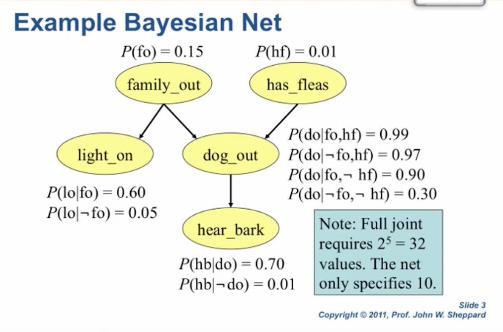
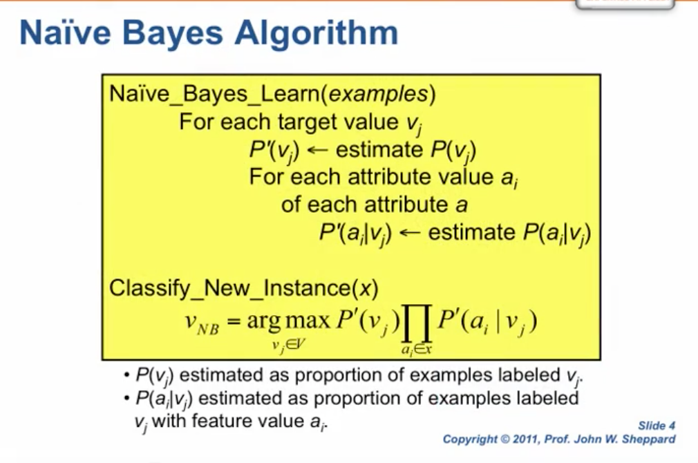
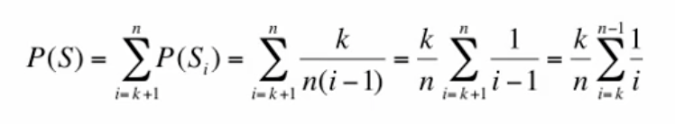
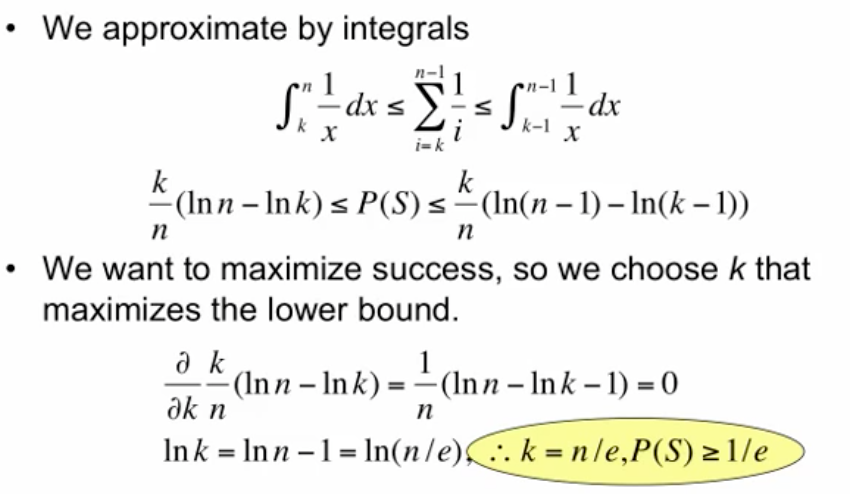

# Lecture

## Probability Review

## Handling Probabilities

## Testing Pseudorandom Numbers

SlAM J. ScI. STAT. COMPUT., Vol. 7, No. 1, January 1986 - AN EXHAUSTIVE ANALYSIS OF MULTIPLICATIVE CONGRUENTIAL RANDOM NUMBER GENERATORS WITH MODULUS 231-1* by GEORGE S. FISHMAN and LOUIS R. MOORE III

## Bayesian Networks

- Def: A Bayesian belief network is a graph in which 
  - Nodes correspond to random variables
  - Directed links connect pairs of nodes and indicate a casual link of influenece
  - Each node has a conditional probability table that quantifies the effects parents of the node have on the node. 
  - The graph is acyclic

- Example: compact ways of representing the joint probability distribution of all 5 variables. Fully represent will need $2^5=32$ values. But network only specifies 10

  

- Naive Bayes Algorithm

  

- Tree-Augmented Naive Bayes
  - For every pair of tests, compute the conditional mutual information (CMI)
  - Assume a complete graph, and weight all edges in the graph using the CMI
  - Finding a MST (maximum spanning tree) for the graph
  - Select one node of the MST to be the root
  - Orient the tree from the root down
  - Compute the conditional probabilities for all test-totes dependencies
  - Re-associate the diagnoses to the tests like naive Bayes. 
- CMI

- Classification with TANs

## The hiring problem

Focuses on analyzing the behavior of an algorithm rather than the complexity of that algorithm.

Worst case analysis

Probabilistic Analysis

Indicator Rrandom Variables

Online hiring problem: Only hire one candidate

- Hiring strategy: select some $k<n$ indicating that we will reject the first $k$ applicants regardless of their score. Hire the $n^{th}$ if no better found
- Analysis:
  - The best candidate find on $i$
  - The algorithm must not pick any candidates in the range $[k+1, i-1]$
  - 
  - 

 

## Algorithm Type

The goal of any algorithm is to solve some computational problems correctly and efficiently.

Deterministic Algorithms: a particular input/output pair is always the same.

Randomized algorithms can be deterministic, or nondeterministic.  The primary difference: the input includes a source for random numbers.

## Stochastic Sampling

The Metropolis-Hastings Algorithm

## Monte Carlo Integration

Markov Processes

- First-order Markov process

- Second-order Markov process

- Discrete Markov Processes

Properties of Markov Chains

- Stationarity
- Irreducibility
- Aperiodicity

- Ergodicity