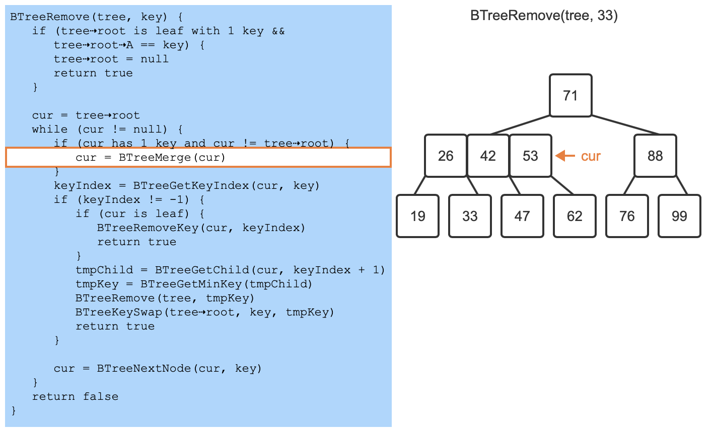

# BST, B tree, 2-3-4, AVL, Red-Black

## ZyBooks

### 9.1 Searching and algorithms

An **algorithm** is a sequence of steps for accomplishing a task. **Linear search** is a search algorithm that starts from the beginning of a list, and checks each element until the search key is found or the end of the list is reached.

### 9.2 Binary search

**Binary search** is a faster algorithm for searching a list if the list's elements are sorted and directly accessible (such as an array). Binary search first checks the middle element of the list. If the search key is found, the algorithm returns the matching location. If the search key is not found, the algorithm repeats the search on the remaining left sublist (if the search key was less than the middle element) or the remaining right sublist (if the search key was greater than the middle element).

**Efficiency**: $⌊log2N⌋+1$

### 9.3 B-trees

A **B-tree** with order K is a tree where nodes can have up to K-1 keys and up to K children. An internal node **must** have one more children than keys. Each child of an internal node can have a different number of keys than the parent internal node.

The **order** is the maximum number of children a node can have.

Ex: In a B-tree with order 4, a node can have 1, 2, or 3 keys, and up to 4 children. B-trees have the following properties:

- All keys in a B-tree must be distinct.
- All leaf nodes must be at the same level.
- An internal node with N keys must have N+1 children. 
- Keys in a node are stored in **sorted** order from smallest to largest.
- Each key in a B-tree internal node has one left subtree and one right subtree. All left subtree keys are **<** that key, and all right subtree keys are **>** that key. => **No equal**

A valid order 5 B-tree: 


A **2-3-4 tree** is an order 4 B-tree.

The keys in a 2-3-4 tree node are labeled as A, B and C. The child nodes of a 2-3-4 tree internal node are labeled as left, middle1, middle2, and right. If a node contains 1 key, then keys B and C, as well as children middle2 and right, are not used. If a node contains 2 keys, then key C, as well as the right child, are not used. A 2-3-4 tree node containing exactly 3 keys is said to be **full**, and uses all keys and children.

A node with 1 key is called a **2-node**. A node with 2 keys is called a **3-node**. A node with 3 keys is called a **4-node**.

### 9.4 2-3-4 tree search algorithm

Table 9.4.1: 2-3-4 tree child node to choose based on search key.

| Condition                                  | Child node to search |
| ------------------------------------------ | -------------------- |
| key < node's A key                         | left                 |
| node has only 1 key or key < node's B key  | middle1              |
| node has only 2 keys or key < node's C key | middle2              |
| none of the above                          | right                |

### 9.5 2-3-4 tree insert algorithm

Given a new key, a 2-3-4 tree **insert** operation inserts the new key in the proper location such that all 2-3-4 tree properties are preserved. New keys are **always inserted into leaf nodes** in a 2-3-4 tree. Insertion returns the leaf node where the key was inserted, or null if the key was already in the tree.

An important operation during insertion is the **split** operation, which is done on every full node encountered during insertion traversal. The split operation **moves the middle key from a child node into the child's parent node.** The first and last keys in the child node are moved into two separate nodes. The split operation returns the parent node that received the middle key from the child.

Example: Split a full root node(1 become 3, increase 2 nodes), and full non-root node 


Table 9.5.1: **2-3-4 tree non-full-leaf insertion cases.**

| Condition                                             | Outcome                                                      |
| ----------------------------------------------------- | ------------------------------------------------------------ |
| New key equals an existing key in node                | No insertion takes place, and the node is not altered.       |
| New key is < node's first key                         | Existing keys in node are shifted right, and the new key becomes node's first key. |
| Node has only 1 key or new key is < node's middle key | Node's middle key , if present, becomes last key, and new key becomes node's middle key. |
| None of the above                                     | New key becomes node's last key.                             |

The **preemptive split** insertion scheme always splits any full node encountered during insertion traversal. The preemptive split insertion scheme ensures that any time a full node is split, the parent node has room to accommodate the middle value from the child.

### 9.6 2-3-4 tree rotations and fusion

**Rotation concepts**

Removing an item from a 2-3-4 tree may require rearranging keys to maintain tree properties. A **rotation** is a rearrangement of keys between 3 nodes that maintains all 2-3-4 tree properties in the process. The 2-3-4 tree removal algorithm uses rotations to transfer keys between sibling nodes. 

A **right rotation**: on a node causes the node to lose one key and the node's right sibling to gain one key. 

Move the right key into node as left key, and move down the left key in root to middle 1 left key. 


A **left rotation** on a node causes the node to lose one key and the node's left sibling to gain one key.


A node being rotated must have at least 2 keys, and the right adjacent sibling must have no more than 2 keys.

A **fusion** is a combination of 3 keys: 2 from adjacent sibling nodes that have 1 key each, and a third from the parent of the siblings. Fusion is the inverse operation of a split. The key taken from the parent node must be the key that is between the 2 adjacent siblings. The parent node must have at least 2 keys, with the exception of the root.

Fusion of the root node is a special case that happens only when the root and the root's 2 children each have 1 key. In this case, the 3 keys from the 3 nodes are combined into a single node that becomes the new root node.

**Root fusion**


**Non-root fusion**


### 9.7 2-3-4 tree removal

**Merge algorithm**

A B-Tree **merge** operates on a node with 1 key and increases the node's keys to 2 or 3 using either a rotation or fusion. A node's 2 adjacent siblings are checked first during a merge, and if either has 2 or more keys, a key is transferred via a rotation. Such a rotation increases the number of keys in the merged node from 1 to 2. If all adjacent siblings of the node being merged have 1 key, then fusion is used to increase the number of keys in the node from 1 to 3. The merge operation can be performed on any node that has 1 key and a non-null parent node with at least 2 keys.


**Utility functions for removal**

Several utility functions are used in a B-tree remove operation.

- `BTreeGetMinKey` returns the minimum key in a subtree.
- `BTreeGetChild` returns a pointer to a node's left, middle1, middle2, or right child, if the childIndex argument is 0, 1, 2, or 3, respectively.
- `BTreeNextNode` returns the child of a node that would be visited next in the traversal to search for the specified key.
- `BTreeKeySwap` swaps one key with another in a subtree. The replacement key must be known to be a key that can be used as a replacement without violating any of the 2-3-4 tree rules.

**Remove algorithm**

Given a key, a 2-3-4 tree **remove** operation removes the first-found matching key, restructuring the tree to preserve all 2-3-4 tree rules. Each successful removal results in a key being removed from a leaf node. 

Two cases are possible when removing a key, the first being that the key resides in a leaf node, and the second being that the key resides in an internal node.

The **preemptive merge** removal scheme involves increasing the number of keys in all single-key, non-root nodes encountered during traversal. The merging always happens before any key removal is attempted. **Preemptive merging ensures that any leaf node encountered during removal will have 2 or more keys,** allowing a key to be removed from the leaf node without violating the 2-3-4 tree rules.

To remove a key from an internal node, the key to be removed is replaced with the minimum key in the right child subtree (known as the key's successor), or the maximum key in the leftmost child subtree. First, the key chosen for replacement is stored in a temporary variable, then the chosen key is removed recursively, and lastly the temporary key replaces the key to be removed.

**9.7.4: BTreeRemove algorithm: leaf case.**





**9.7.5: BTreeRemove algorithm: non-leaf case.**


### 9.8 AVL: A balanced tree

#### Balanced BST

An **AVL tree** is a **BST(make sure it is BST!)** with a height balance property and specific operations to rebalance the tree when a node is inserted or removed. This section discusses the balance property; another section discusses the operations. A BST is **height balanced** if for any node, the heights of the node's left and right subtrees differ by only 0 or 1. 

A node's **balance factor** is the left subtree height minus the right subtree height, which is 1, 0, or -1 in an AVL tree. 

Recall that a tree (or subtree) with just one node has height 0. For calculating a balance factor, a non-existent left or right child's subtree's height is said to be -1.


Minimizing binary tree height yields fastest searches, insertions, and removals. 

maintaining a minimum height tree requires extensive tree rearrangements. In contrast, an AVL tree only requires a few local rotations (discussed in a later section), so is more computationally efficient, but doesn't guarantee a minimum height. However, theoreticians have shown that an AVL tree's worst case **height is no worse than about 1.5x the minimum binary tree height**, so **the height is still $O(log N)$** where N is the number of nodes. Furthermore, experiments show that AVL tree heights in practice are much closer to the minimum.

### 9.9 AVL rotations


#### Algorithms supporting AVL trees

The `AVLTreeUpdateHeight` algorithm updates a node's height value by taking the maximum of the child subtree heights and adding 1. 

The `AVLTreeSetChild` algorithm sets a node as the parent's left or right child, updates the child's parent pointer, and updates the parent node's height. 

The `AVLTreeReplaceChild` algorithm replaces one of a node's existing child pointers with a new value, utilizing `AVLTreeSetChild` to perform the replacement.

The `AVLTreeGetBalance` algorithm computes a node's balance factor by subtracting the right subtree height from the left subtree height.

9.9.7: Right rotation algorithm.


#### AVL tree balancing

When an AVL tree node has a balance factor of 2 or -2, which **only occurs after an insertion or removal**, the node must be rebalanced via rotations. The `AVLTreeRebalance` algorithm updates the height value at a node, computes the balance factor, and rotates if the balance factor is 2 or -2.

### 9.10 AVL insertions

Rotation


Double Rotation


4 modes


And rotations for 4 modes


An AVL tree insertion involves **searching** for the insert location, **inserting** the new node, **updating** balance factors, and **rebalancing**.

2 examples: Phone book


AVL tree has X levels, the first X-1 levels might not be full. 

AVL tree doesn't guarantee minimum height, as levels are not guaranteed to be kept full. The worst case will be 1.5x min height, So it is still $O(logn)$but not floor$(logn)$ (which is for the min height)

The node passed to AVLTreeInsert must be a leaf node.

#### AVL insertion algorithm complexity

The AVL insertion algorithm traverses the tree from the root to a leaf node to find the insertion point, then traverses back up to the root to rebalance. One node is visited per level, and at most 2 rotations are needed for a single node. Each rotation is an O(1) operation. Therefore, the runtime complexity of insertion is O(log N).

Because a fixed number of temporary pointers are needed for the AVL insertion algorithm, including any rotations, the space complexity is O(1).

### 9.11 AVL removals

#### Removing nodes in AVL trees

Given a key, an AVL tree **remove** operation removes the first-found matching node, restructuring the tree to preserve all AVL tree requirements. Removal begins by removing the node using the standard BST removal algorithm. After removing a node, all ancestors of the removed node, from the nodes' parent up to the root, are rebalanced. A node is rebalanced by first computing the node's balance factor, then performing rotations if the balance factor is 2 or -2.


### 9.12 Red-black tree: A balanced tree

A **red-black tree** is a **BST** with two node types, namely red and black, and supporting operations that ensure the tree is balanced when a node is inserted or removed. The below red-black tree's requirements ensure that a tree with N nodes will have a height of O(log N).

- Every node is colored either red or black.
- The root node is black.
- A red node's children cannot be red.
- A null child is considered to be a black leaf node. 
- All paths from a node to any null leaf descendant node must have the same number of black nodes.


### 9.13 Red-black tree: Rotations

A rotation is a local rearrangement of a BST that maintains the BST ordering property while rebalancing the tree. Rotations are used during the insert and remove operations on a red-black tree to ensure that red-black tree requirements hold. Rotating is said to be done "at" a node. A left rotation at a node causes the node's right child to take the node's place in the tree. A right rotation at a node causes the node's left child to take the node's place in the tree.

#### Left rotation algorithm

A rotation requires altering up to 3 child subtree pointers. A left rotation at a node requires the node's right child to be non-null. Two utility functions are used for red-black tree rotations. The `RBTreeSetChild` utility function sets a node's left child, if the whichChild parameter is "left", or right child, if the whichChild parameter is "right", and updates the child's parent pointer. The `RBTreeReplaceChild` utility function replaces a node's left or right child pointer with a new value.

Figure 9.13.1: RBTreeSetChild utility function.

```
RBTreeSetChild(parent, whichChild, child) {
   if (whichChild != "left" && whichChild != "right")
      return false

   if (whichChild == "left")
      parent⇢left = child
   else
      parent⇢right = child
   if (child != null)
      child⇢parent = parent
   return true
}
```

Figure 9.13.2: RBTreeReplaceChild utility function.

```
RBTreeReplaceChild(parent, currentChild, newChild) {
   if (parent⇢left == currentChild)
      return RBTreeSetChild(parent, "left", newChild)
   else if (parent⇢right == currentChild)
      return RBTreeSetChild(parent, "right", newChild)
   return false
}
```

The `RBTreeRotateLeft` function performs a left rotation at the specified node by updating the right child's left child to point to the node, and updating the node's right child to point to the right child's former left child. If non-null, the node's parent has the child pointer changed from node to the node's right child. Otherwise, if the node's parent is null, then the tree's root pointer is updated to point to the node's right child.

Figure 9.13.3: RBTreeRotateLeft pseudocode.

```
RBTreeRotateLeft(tree, node) {
   rightLeftChild = node⇢right⇢left
   if (node⇢parent != null)
      RBTreeReplaceChild(node⇢parent, node, node⇢right)
   else { // node is root
      tree⇢root = node⇢right
      tree⇢root⇢parent = null
   }
   RBTreeSetChild(node⇢right, "left", node)
   RBTreeSetChild(node, "right", rightLeftChild)
}
```

9.13.4: RBTreeRotateRight algorithm.

```
RBTreeRotateRight(tree, node) {
   leftRightChild = node⇢left⇢right
   if (node⇢parent != null)
      RBTreeReplaceChild(node⇢parent, node, node⇢left)
   else { // node is root
      tree⇢root = node⇢left
      tree⇢root⇢parent = null
   }
   RBTreeSetChild(node⇢left, "right", node)
   RBTreeSetChild(node, "left", leftRightChild)
}
```


### 9.14 Red-black tree: Insertion

Given a new node, a red-black tree **insert** operation inserts the new node in the proper location such that all red-black tree requirements still hold after the insertion completes.

Red-black tree insertion begins by calling `BSTInsert` to insert the node using the BST insertion rules. The newly inserted node is colored red and then a balance operation is performed on this node.

Figure 9.14.1: RBTreeInsert algorithm.

```
RBTreeInsert(tree, node) {
   BSTInsert(tree, node)
   node⇢color = red
   RBTreeBalance(tree, node)
}
```

The red-black re-balance operation consists of the steps below. 

1. Assign `parent` with `node`'s parent, `uncle` with `node`'s uncle, which is a sibling of `parent`, and `grandparent` with `node`'s grandparent.
2. If `node` is the tree's root, then color `node` black and return.
3. If `parent` is black, then return without any alterations.
4. If `parent` and `uncle` are both red, then color `parent` and `uncle` black, color `grandparent` red, recursively balance `grandparent`, then return.
5. If `node` is `parent`'s right child and `parent` is `grandparent`'s left child, then rotate left at `parent`, update `node` and `parent` to point to `parent` and `grandparent`, respectively, and goto step 7.
6. If `node` is `parent`'s left child and `parent` is `grandparent`'s right child, then rotate right at `parent`, update `node` and `parent` to point to `parent` and `grandparent`, respectively, and goto step 7.
7. Color `parent` black and `grandparent` red.
8. If `node` is `parent`'s left child, then rotate right at `grandparent`, otherwise rotate left at `grandparent`.


The RBTreeBalance function uses the RBTreeGetGrandparent and RBTreeGetUncle utility functions to determine a node's grandparent and uncle, respectively.

Figure 9.14.2: RBTreeGetGrandparent and RBTreeGetUncle utility functions.

```
RBTreeGetGrandparent(node) {
   if (node⇢parent == null)
      return null
   return node⇢parent⇢parent
}

RBTreeGetUncle(node) {
   grandparent = null
   if (node⇢parent != null)
      grandparent = node⇢parent⇢parent
   if (grandparent == null)
      return null
   if (grandparent⇢left == node⇢parent)
      return grandparent⇢right
   else
      return grandparent⇢left
}
```

9.14.1: RBTreeBalance algorithm.

```
RBTreeBalance(tree, node) {
   if (node⇢parent == null) {
      node⇢color = black
      return
   }
   if (node⇢parent⇢color == black)
      return
   parent = node⇢parent
   grandparent = RBTreeGetGrandparent(node)
   uncle = RBTreeGetUncle(node)
   if (uncle != null && uncle⇢color == red) {
      parent⇢color = uncle⇢color = black
      grandparent⇢color = red
      RBTreeBalance(tree, grandparent)
      return
   }
   if (node == parent⇢right &&
       parent == grandparent⇢left) {
      RBTreeRotateLeft(tree, parent)
      node = parent
      parent = node⇢parent
   }
   else if (node == parent⇢left &&
            parent == grandparent⇢right) {
      RBTreeRotateRight(tree, parent)
      node = parent
      parent = node⇢parent
   }
   parent⇢color = black
   grandparent⇢color = red
   if (node == parent⇢left)
      RBTreeRotateRight(tree, grandparent)
   else
      RBTreeRotateLeft(tree, grandparent)
}
```

### 9.15 Red-black tree: Removal

#### Removal overview

Given a key, a red-black tree **remove** operation removes the first-found matching node, restructuring the tree to preserve all red-black tree requirements. First, the node to remove is found using `BSTSearch`. If the node is found, RBTreeRemoveNode is called to remove the node.

Figure 9.15.1: RBTreeRemove algorithm.

```
RBTreeRemove(tree, key) {
   node = BSTSearch(tree, key)
   if (node != null)
      RBTreeRemoveNode(tree, node)
}
```

The RBTreeRemove algorithm consists of the following steps: 

1. If the node has 2 children, copy the node's predecessor to a temporary value, recursively remove the predecessor from the tree, replace the node's key with the temporary value, and return.
2. If the node is black, call `RBTreePrepareForRemoval` to restructure the tree in preparation for the node's removal. 
3. Remove the node using the standard BST `BSTRemove` algorithm.

Figure 9.15.2: RBTreeRemoveNode algorithm.

```
RBTreeRemoveNode(tree, node) {
   if (node⇢left != null && node⇢right != null) {
      predecessorNode = RBTreeGetPredecessor(node)        
      predecessorKey = predecessorNode⇢key
      RBTreeRemoveNode(tree, predecessorNode)
      node⇢key = predecessorKey
      return
   }

   if (node⇢color == black)
      RBTreePrepareForRemoval(node)
   BSTRemove(tree, node⇢key)
}
```

Figure 9.15.3: RBTreeGetPredecessor utility function.

```
RBTreeGetPredecessor(node) {
   node = node⇢left
   while (node⇢right != null) {
      node = node⇢right
   }
   return node
}
```

#### Removal utility functions

Utility functions help simplify red-black tree removal code. The `RBTreeGetSibling` function returns the sibling of a node. The `RBTreeIsNonNullAndRed` function returns true only if a node is non-null and red, false otherwise. The `RBTreeIsNullOrBlack`function returns true if a node is null or black, false otherwise. The `RBTreeAreBothChildrenBlack` function returns true only if both of a node's children are black. Each utility function considers a null node to be a black node.

Figure 9.15.4: RBTreeGetSibling algorithm.

```
RBTreeGetSibling(node) {
   if (node⇢parent != null) {
      if (node == node⇢parent⇢left)
         return node⇢parent⇢right
      return node⇢parent⇢left
   }
   return null
}
```

Figure 9.15.5: RBTreeIsNonNullAndRed algorithm.

```
RBTreeIsNonNullAndRed(node) {
   if (node == null)
      return false
   return (node⇢color == red)
}
```

Figure 9.15.6: RBTreeIsNullOrBlack algorithm.

```
RBTreeIsNullOrBlack(node) {
   if (node == null)
      return true
   return (node⇢color == black)
}
```

Figure 9.15.7: RBTreeAreBothChildrenBlack algorithm.

```
RBTreeAreBothChildrenBlack(node) {
   if (node⇢left != null && node⇢left⇢color == red)
      return false
   if (node⇢right != null && node⇢right⇢color == red)
      return false
   return true
}
```

#### Prepare-for-removal algorithm overview

Preparation for removing a black node requires altering the number of black nodes along paths to preserve the black-path-length property. The `RBTreePrepareForRemoval` algorithm uses 6 utility functions that analyze the tree and make appropriate alterations when each of the 6 cases is encountered. The utility functions return true if the case is encountered, and false otherwise. If case 1, 3, or 4 is encountered, `RBTreePrepareForRemoval` will return after calling the utility function. If case 2, 5, or 6 is encountered, additional cases must be checked.

Figure 9.15.8: RBTreePrepareForRemoval pseudocode.

```
RBTreePrepareForRemoval(tree, node) {
   if (RBTreeTryCase1(tree,node))
      return

   sibling = RBTreeGetSibling(node)
   if (RBTreeTryCase2(tree, node, sibling))
      sibling = RBTreeGetSibling(node)
   if (RBTreeTryCase3(tree, node, sibling))
      return
   if (RBTreeTryCase4(tree, node, sibling))
      return
   if (RBTreeTryCase5(tree, node, sibling))
      sibling = RBTreeGetSibling(node)
   if (RBTreeTryCase6(tree, node, sibling))
      sibling = RBTreeGetSibling(node)

   sibling⇢color = node⇢parent⇢color
   node⇢parent⇢color = black
   if (node == node⇢parent⇢left) {
      sibling⇢right⇢color = black
      RBTreeRotateLeft(tree, node⇢parent)
   }
   else {
      sibling⇢left⇢color = black
      RBTreeRotateRight(tree, node⇢parent)
   }
}
```

### Prepare-for-removal algorithm cases

Preparation for removing a node first checks for each of the six cases, performing the operations below.

1. If the node is red or the node's parent is null, then return.
2. If the node has a red sibling, then color the parent red and the sibling black. If the node is the parent's left child then rotate left at the parent, otherwise rotate right at the parent. Continue to the next step.
3. If the node's parent is black and both children of the node's sibling are black, then color the sibling red, recursively call on the node's parent, and return.
4. If the node's parent is red and both children of the node's sibling are black, then color the parent black, color the sibling red, then return.
5. If the sibling's left child is red, the sibling's right child is black, and the node is the left child of the parent, then color the sibling red and the left child of the sibling black. Then rotate right at the sibling and continue to the next step.
6. If the sibling's left child is black, the sibling's right child is red, and the node is the right child of the parent, then color the sibling red and the right child of the sibling black. Then rotate left at the sibling and continue to the next step.
7. Color the sibling the same color as the parent and color the parent black.
8. If the node is the parent's left child, then color the sibling's right child black and rotate left at the parent. Otherwise color the sibling's left child black and rotate right at the parent.

Table 9.15.1: Prepare-for-removal algorithm case descriptions.

| Case # | Condition                                                    | Action if condition is true                                  | Process additional cases after action? |
| ------ | ------------------------------------------------------------ | ------------------------------------------------------------ | -------------------------------------- |
| 1      | Node is red or node's parent is null.                        | None.                                                        | No                                     |
| 2      | Sibling node is red.                                         | Color parent red and sibling black. If node is left child of parent, rotate left at parent node, otherwise rotate right at parent node. | Yes                                    |
| 3      | Parent is black and both of sibling's children are black.    | Color sibling red and call removal preparation function on parent. | No                                     |
| 4      | Parent is red and both of sibling's children are black.      | Color parent black and sibling red.                          | No                                     |
| 5      | Sibling's left child is red, sibling's right child is black, and node is left child of parent. | Color sibling red and sibling's left child black. Rotate right at sibling. | Yes                                    |
| 6      | Sibling's left child is black, sibling's right child is red, and node is right child of parent. | Color sibling red and sibling's right child black. Rotate left at sibling. | Yes                                    |

Table 9.15.2: Prepare-for-removal algorithm case code.

Case 1

```
RBTreeTryCase1(tree, node) {
   if (node⇢color == red || node⇢parent == null)
      return true
   else
      return false // not case 1
}
```

Case 2

```
RBTreeTryCase2(tree, node, sibling) {
   if (sibling⇢color == red) {
      node⇢parent⇢color = red
      sibling⇢color = black
      if (node == node⇢parent⇢left)
         RBTreeRotateLeft(tree, node⇢parent)
      else
         RBTreeRotateRight(tree, node⇢parent)
      return true
   }
   return false // not case 2
}
```

Case 3

```
RBTreeTryCase3(tree, node, sibling) {
   if (node⇢parent⇢color == black &&
       RBTreeAreBothChildrenBlack(sibling)) {
      sibling⇢color = red
      RBTreePrepareForRemoval(tree, node⇢parent)
      return true
   }
   return false // not case 3
}
```

Case 4

```
RBTreeTryCase4(tree, node, sibling) {
   if (node⇢parent⇢color == red &&
       RBTreeAreBothChildrenBlack(sibling)) {
      node⇢parent⇢color = black
      sibling⇢color = red
      return true
   }
   return false // not case 4
}
```


Case 5

```
RBTreeTryCase5(tree, node, sibling) {
   if (RBTreeIsNonNullAndRed(sibling-⇢left) &&
       RBTreeIsNullOrBlack(sibling⇢right) &&
       node == nodeparent⇢left) {
      sibling⇢color = red
      sibling⇢left⇢color = black
      RBTreeRotateRight(tree, sibling)
      return true
   }
   return false // not case 5
}
```

Case 6

```
RBTreeTryCase6(tree, node, sibling) {
   if (RBTreeIsNullOrBlack(sibling⇢left) &&
       RBTreeIsNonNullAndRed(sibling⇢right) &&
       node == node⇢parent⇢right) {
      sibling⇢color = red
      sibling⇢right⇢color = black
      RBTreeRotateLeft(tree, sibling)
      return true
   }
   return false // not case 6
}
```


9.15.5: Removal preparation for a node can encounter more than 1 case.

```
RBTreePrepareForRemoval(tree, node) {
   if (RBTreeTryCase1(tree,node)) {
      return
   }
   sibling = RBTreeGetSibling(node)
   if (RBTreeTryCase2(tree, node, sibling))
      sibling = RBTreeGetSibling(node)
   if (RBTreeTryCase3(tree, node, sibling))
      return
   if (RBTreeTryCase4(tree, node, sibling))
      return
   if (RBTreeTryCase5(tree, node, sibling))
      sibling = RBTreeGetSibling(node)
   if (RBTreeTryCase6(tree, node, sibling))
      sibling = RBTreeGetSibling(node)
   .
   .
   .
```


